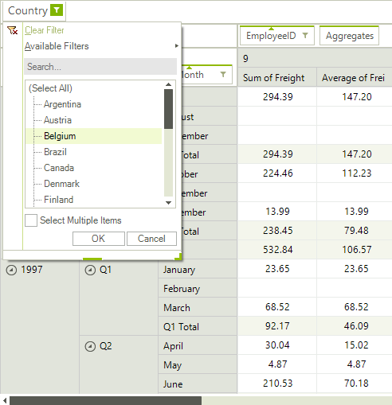
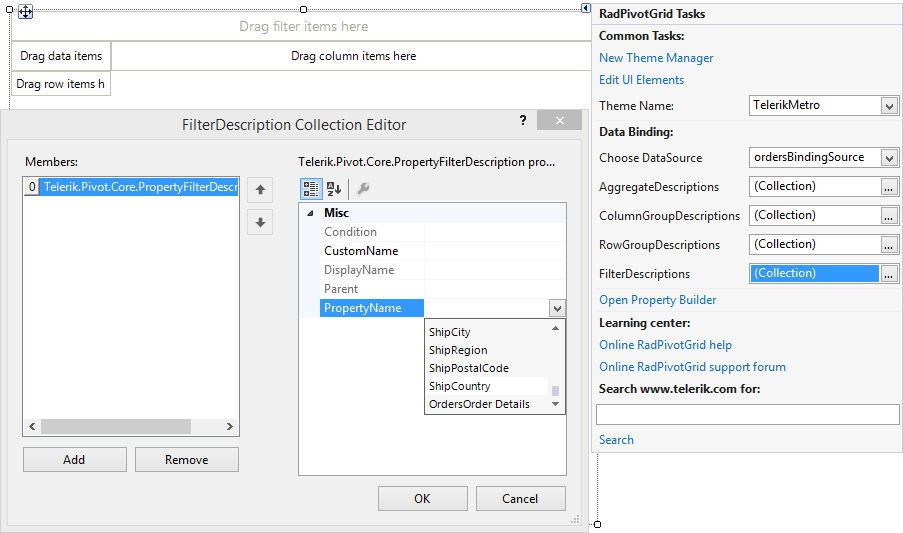

# Report Filters

__RadPivotGrid__ allows you to add filter conditions which describe which items from the data source should be included in the report. These filters are called __Report Filters__. Report filtering occurs before the aggregated information is calculated. This type of filtering is useful when you would like to see a report which concerns only records that share a common property, for example a sales report only for a specified country. <br>

The report filters are displayed as descriptor elements in the report filters area. This area is hidden by default and in order to show it, you need to set the following property:

{{source=..\SamplesCS\PivotGrid\Filtering\PivotGridReportFiltering.cs region=ShowFilterArea}} 
{{source=..\SamplesVB\PivotGrid\Filtering\PivotGridReportFiltering.vb region=ShowFilterArea}} 

````C#
this.radPivotGrid1.ShowFilterArea = true;

````
````VB.NET
Me.radPivotGrid1.ShowFilterArea = True

````

{{endregion}}

The end-user can add/remove report filters by dragging a field to the report filters area or by using the [RadPivotFieldList]().  Additionally, the filter menu opened by the filter button on the filter descriptor elements allows applying different filter conditions. This can be achieved by either selecting/deselecting items from the list box or by using one of the well-known filtering functions (Equals, Contains, Between, etc.).

## Adding a report filter description

Report filter descriptions are stored in the FilterDescriptions collection of RadPivotGrid. You can edit the contents of the collection at design time, using the Smart tag of RadPivotGrid.<br>

The contents of the FilterDescriptions collection can also be edited at runtime using code. The __FilterDescriptions__ collection consists of __PropertyFilterDescription__ instances which specify the field on which a filter is applied.

{{source=..\SamplesCS\PivotGrid\Filtering\PivotGridReportFiltering.cs region=PropertyFilterDescription}} 
{{source=..\SamplesVB\PivotGrid\Filtering\PivotGridReportFiltering.vb region=PropertyFilterDescription}} 

````C#
PropertyFilterDescription description = new PropertyFilterDescription(); 
ComparisonCondition condition = new ComparisonCondition();
condition.Condition = Comparison.Equals;
condition.Than = "UK";
description.PropertyName = "ShipCountry";
description.Condition = condition;
description.CustomName = "Country";
this.radPivotGrid1.FilterDescriptions.Add(description);

````
````VB.NET
Dim description As New PropertyFilterDescription()
Dim condition As New ComparisonCondition()
condition.Condition = Telerik.Pivot.Core.Filtering.Comparison.Equals
condition.Than = "UK"
description.PropertyName = "ShipCountry"
description.Condition = condition
description.CustomName = "Country"
Me.radPivotGrid1.FilterDescriptions.Add(description)

````

{{endregion}}

The __Condition__ property of the __PropertyFilterDescription__ holds the currently applied condition. It can be set with a __ComparisonCondition__ instance as shown above or a __SetCondition__ which allows you to include/exclude specific values:

{{source=..\SamplesCS\PivotGrid\Filtering\PivotGridReportFiltering.cs region=SetCondition}} 
{{source=..\SamplesVB\PivotGrid\Filtering\PivotGridReportFiltering.vb region=SetCondition}} 

````C#
SetCondition setCondition = new SetCondition();
setCondition.Comparison = SetComparison.Includes;
setCondition.Items.Add("UK");
setCondition.Items.Add("Canada");
setCondition.Items.Add("USA");

````
````VB.NET
Dim setCondition As New SetCondition()
setCondition.Comparison = SetComparison.Includes
setCondition.Items.Add("UK")
setCondition.Items.Add("Canada")
setCondition.Items.Add("USA")

````

{{endregion}}