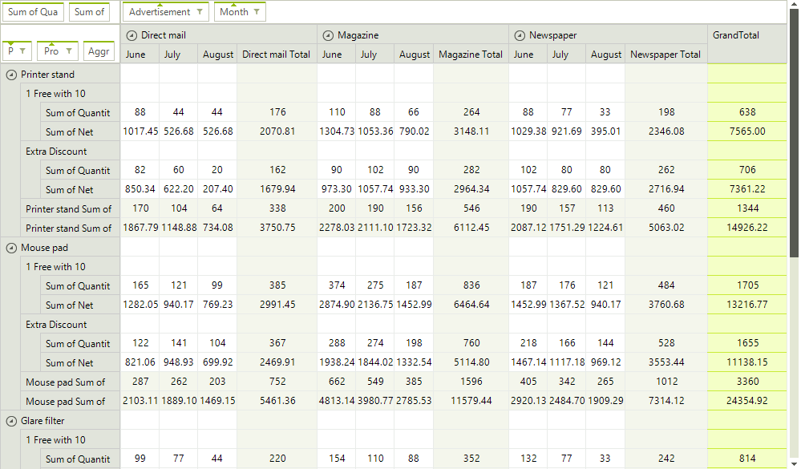
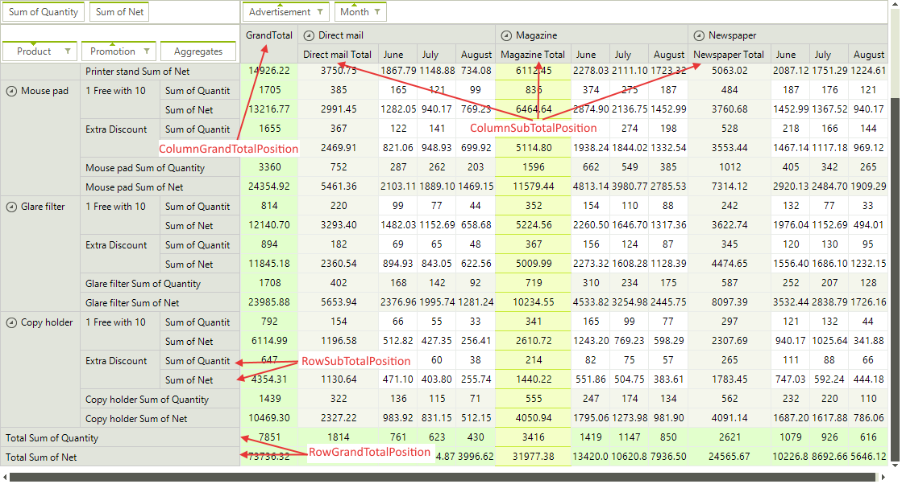

# Layout Settings


## 

RadPivotGrid supports two types of layouts - __Tabular__ and __Compact__. 
          The Tabular layout displays each field in a separate rectangle - for row descriptors in a separate column, 
          and for columns descriptors in a separate row. The Compact layout nests the field descriptors in one common 
          rectangle to save up space which can be useful in the cases where a large number of fields is being used.
        

You can control the layout type of the column and row headers via the following properties:#_[C#] _

	


{{source=..\SamplesCS\PivotGrid\PivotGridLayoutSettings.cs region=LayoutType}} 
{{source=..\SamplesVB\PivotGrid\PivotGridLayoutSettings.vb region=LayoutType}} 

````C#
            this.radPivotGrid1.ColumnHeadersLayout = Telerik.WinControls.UI.PivotLayout.Tabular;
            this.radPivotGrid1.RowHeadersLayout = Telerik.WinControls.UI.PivotLayout.Compact;
````
````VB.NET
        Me.RadPivotGrid1.ColumnHeadersLayout = Telerik.WinControls.UI.PivotLayout.Tabular
        Me.RadPivotGrid1.RowHeadersLayout = Telerik.WinControls.UI.PivotLayout.Compact
        '
````

{{endregion}} 




You can also control where SubTotals and GrandTotals are displayed:#_[C#] _

	


{{source=..\SamplesCS\PivotGrid\PivotGridLayoutSettings.cs region=Totals}} 
{{source=..\SamplesVB\PivotGrid\PivotGridLayoutSettings.vb region=Totals}} 

````C#
            this.radPivotGrid1.ColumnGrandTotalsPosition = Telerik.WinControls.UI.TotalsPos.First;
            this.radPivotGrid1.RowGrandTotalsPosition = Telerik.WinControls.UI.TotalsPos.Last;
            this.radPivotGrid1.ColumnsSubTotalsPosition = Telerik.WinControls.UI.TotalsPos.First;
            this.radPivotGrid1.RowsSubTotalsPosition = Telerik.WinControls.UI.TotalsPos.Last;
````
````VB.NET
        Me.RadPivotGrid1.ColumnGrandTotalsPosition = Telerik.WinControls.UI.TotalsPos.First
        Me.RadPivotGrid1.RowGrandTotalsPosition = Telerik.WinControls.UI.TotalsPos.Last
        Me.RadPivotGrid1.ColumnsSubTotalsPosition = Telerik.WinControls.UI.TotalsPos.First
        Me.RadPivotGrid1.RowsSubTotalsPosition = Telerik.WinControls.UI.TotalsPos.Last
        '
````

{{endregion}} 




When you have added more than one aggregate description, there are special header cells for each aggregate. To control whether these cells  are displayed in the column headers area or in the row headers area, and also set the level of the aggregate descriptions in the group tree, you can use the following properties:#_[C#] _

	


{{source=..\SamplesCS\PivotGrid\PivotGridLayoutSettings.cs region=Aggregates}} 
{{source=..\SamplesVB\PivotGrid\PivotGridLayoutSettings.vb region=Aggregates}} 

````C#
            this.radPivotGrid1.AggregatesPosition = Telerik.Pivot.Core.PivotAxis.Columns;
            this.radPivotGrid1.AggregatesLevel = 1;
````
````VB.NET
        Me.RadPivotGrid1.AggregatesPosition = Telerik.Pivot.Core.PivotAxis.Columns
        Me.RadPivotGrid1.AggregatesLevel = 1
        '
````

{{endregion}} 


