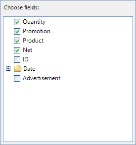
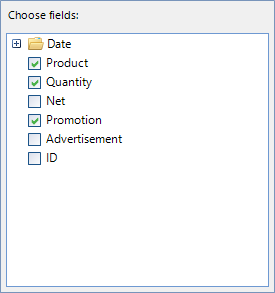
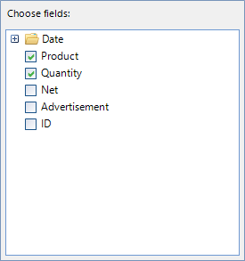
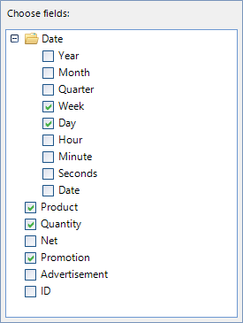

# Customizing RadPivotFieldList

## Visual Field Manipulation

__RadPivotFieldList__ internally contains a __RadTreeView__ built with nodes coming from the data source object as fields. The tree can be easily accessed and its elements modified.

| Before Sorting | After Sorting |
| ------ | ------ |
|||

#### Sorting the Nodes

{{source=..\SamplesCS\PivotGrid\PivotFieldList\PivotGridFieldListCustomizations.cs region=SortTree}} 
{{source=..\SamplesVB\PivotGrid\PivotFieldList\PivotGridFieldListCustomizations.vb region=SortTree}}
````C#
this.radPivotFieldList1.FieldsControl.SortOrder = System.Windows.Forms.SortOrder.Ascending;

````
````VB.NET
Me.RadPivotFieldList1.FieldsControl.SortOrder = System.Windows.Forms.SortOrder.Descending

```` 


{{endregion}}

| Before Hiding | After Hiding |
| ------ | ------ |
|||

#### Hiding Nodes

The nodes in the pivot field list are built dynamically so in order to hide a particular node and persist the changes we would need to handle the __UpdateCompleted__ event.

{{source=..\SamplesCS\PivotGrid\PivotFieldList\PivotGridFieldListCustomizations.cs region=SubscribeToUpdateCompleted}} 
{{source=..\SamplesVB\PivotGrid\PivotFieldList\PivotGridFieldListCustomizations.vb region=SubscribeToUpdateCompleted}}
````C#
this.radPivotGrid1.UpdateCompleted += radPivotGrid1_UpdateCompleted;

````
````VB.NET
AddHandler Me.RadPivotGrid1.UpdateCompleted, AddressOf RadPivotGrid1_UpdateCompleted

```` 


{{endregion}}

{{source=..\SamplesCS\PivotGrid\PivotFieldList\PivotGridFieldListCustomizations.cs region=HandleUpdateCompleted}} 
{{source=..\SamplesVB\PivotGrid\PivotFieldList\PivotGridFieldListCustomizations.vb region=HandleUpdateCompleted}}
````C#
private void radPivotGrid1_UpdateCompleted(object sender, EventArgs e)
{
    RadTreeNode promotionField = this.radPivotFieldList1.FieldsControl.Nodes.Where(n => n.Text == "Promotion").FirstOrDefault();
    if (promotionField != null)
    {
        promotionField.Visible = false;
    }
}

````
````VB.NET
Private Sub RadPivotGrid1_UpdateCompleted(sender As Object, e As EventArgs)
    Dim promotionField As RadTreeNode = Me.RadPivotFieldList1.FieldsControl.Nodes.Where(Function(n) n.Text = "Promotion").FirstOrDefault()
    If promotionField IsNot Nothing Then
        promotionField.Visible = False
    End If
End Sub

```` 


{{endregion}}

## Remove Fields Logically

In the case of a [LocalSourceDataProvider]() object used to populate the items in __RadPivotGrid__, the nodes can be manipulated by handling the __AddingContainerNode__ and __GetDescriptionsDataAsyncCompleted__ events.

#### Setup the Providers

{{source=..\SamplesCS\PivotGrid\PivotFieldList\PivotGridFieldListCustomizations.cs region=SetupProviders}} 
{{source=..\SamplesVB\PivotGrid\PivotFieldList\PivotGridFieldListCustomizations.vb region=SetupProviders}}
````C#
this.provider = new LocalDataSourceProvider() { ItemsSource = this.orders };
LocalDataSourceFieldDescriptionsProvider descriptionProvider = new LocalDataSourceFieldDescriptionsProvider();
descriptionProvider.AddingContainerNode += descriptionProvider_AddingContainerNode;
descriptionProvider.GetDescriptionsDataAsyncCompleted += descriptionProvider_GetDescriptionsDataAsyncCompleted;
this.provider.FieldDescriptionsProvider = descriptionProvider;

````
````VB.NET
Me.provider = New LocalDataSourceProvider() With {.ItemsSource = orders}
Dim descriptionProvider As LocalDataSourceFieldDescriptionsProvider = New LocalDataSourceFieldDescriptionsProvider()
AddHandler descriptionProvider.AddingContainerNode, AddressOf descriptionProvider_AddingContainerNode
AddHandler descriptionProvider.GetDescriptionsDataAsyncCompleted, AddressOf descriptionProvider_GetDescriptionsDataAsyncCompleted
Me.provider.FieldDescriptionsProvider = descriptionProvider

```` 


{{endregion}}

| Before Canceling | After Canceling |
| ------ | ------ |
|||

#### Cancel Adding a Particular Node

{{source=..\SamplesCS\PivotGrid\PivotFieldList\PivotGridFieldListCustomizations.cs region=HandleAddingContainerNode}} 
{{source=..\SamplesVB\PivotGrid\PivotFieldList\PivotGridFieldListCustomizations.vb region=HandleAddingContainerNode}}
````C#
private void descriptionProvider_AddingContainerNode(object sender, ContainerNodeEventArgs e)
{
    if (e.ContainerNode.Name == "Promotion")
    {
        e.Cancel = true;
    }
}

````
````VB.NET
Private Sub descriptionProvider_AddingContainerNode(sender As Object, e As ContainerNodeEventArgs)
    If e.ContainerNode.Name = "Promotion" Then
        e.Cancel = True
    End If
End Sub

```` 


{{endregion}}

| Before Removing | After Removing |
| ------ | ------ |
|||

#### Remove a Child Date Node

{{source=..\SamplesCS\PivotGrid\PivotFieldList\PivotGridFieldListCustomizations.cs region=HandleGetDescriptionsDataAsyncCompleted}} 
{{source=..\SamplesVB\PivotGrid\PivotFieldList\PivotGridFieldListCustomizations.vb region=HandleGetDescriptionsDataAsyncCompleted}}
````C#
private void descriptionProvider_GetDescriptionsDataAsyncCompleted(object sender, GetDescriptionsDataCompletedEventArgs e)
{
    ContainerNode dateNode = e.DescriptionsData.RootFieldInfo.Children.Where(n => n.Name == "Date").FirstOrDefault();
    if (dateNode != null)
    {
        FieldInfoNode yearNode = dateNode.Children.Where(n => n.Name == "Date.Year").FirstOrDefault() as FieldInfoNode;
        if (yearNode != null)
        {
            dateNode.Children.Remove(yearNode);
        }
    }
}

````
````VB.NET
Private Sub descriptionProvider_GetDescriptionsDataAsyncCompleted(sender As Object, e As GetDescriptionsDataCompletedEventArgs)
    Dim dateNode As ContainerNode = e.DescriptionsData.RootFieldInfo.Children.Where(Function(n) n.Name = "Date").FirstOrDefault()
    If dateNode IsNot Nothing Then
        Dim yearNode As FieldInfoNode = TryCast(dateNode.Children.Where(Function(n) n.Name = "Date.Year").FirstOrDefault(), FieldInfoNode)
        If yearNode IsNot Nothing Then
            dateNode.Children.Remove(yearNode)
        End If
    End If
End Sub

```` 


{{endregion}}