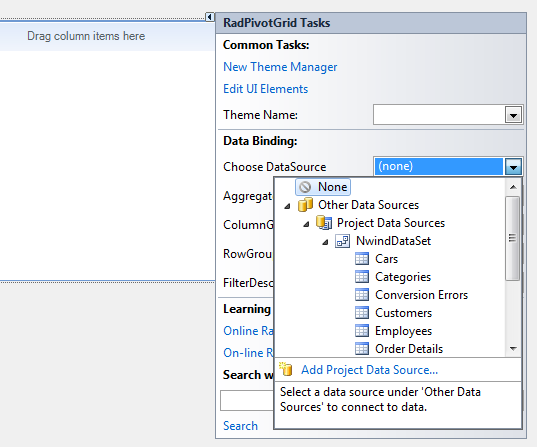
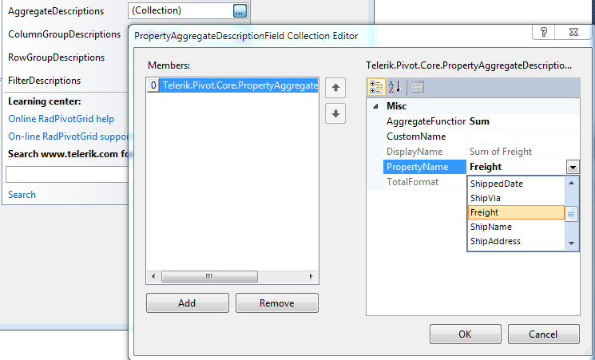
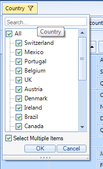

# Design time data binding

You can add RadPivotGrid to your form from the toolbox of Visual Studio. The next thing you would do is assign it with some data. RadPivotGrid supports the standard binding functionality known to you from other WinForms controls. You can use its DataSource property to create or use existing data source. This property can be found both in the Smart Tag menu of RadPivotGrid and in Visual Studio’s Properties window.

## Adding aggregate and group descriptors

To define how your data will be displayed, you should edit the ColumnGroupDescriptions RowGroupDescriptions and AggregateDescriptions collections. Again, you can do this from the Smart Tag menu of RadPivotGrid. When you edit these collections, a standard Collection Editor dialog will open. You can choose the field name as well as some other properties depending on the type of the descriptor you are adding.
        

## Adding report filters

Report filters are added via the same Smart Tag menu by editing the FilterDescriptors collection. However, the filter area is hidden by default and to show it, you should set the __ShowFilterArea__ property of RadPivotGrid to true. This will show Report filters area described above and you will be able to select or deselect which records to participate in the report.
        

## Use case scenario

For the purposes of this sample we will use the Northwind database but we will create a 
          custom table adapter which selects from the __Employees, Orders, Order Details and Products__
          tables in order to get data that would fit displaying in RadPivotGrid. To do this, select
         * Add -> TableAdapter* from the context menu in the DataSet designer and complete the steps of the wizard. 
          Here is how the SELECT command of our custom table adapter looks like:
        
            SELECT        Employees.FirstName, [Order Details].Quantity, Products.ProductName, Orders.ShipCity, Orders.ShipCountry
            FROM            (((Employees INNER JOIN
            Orders ON Employees.EmployeeID = Orders.EmployeeID) INNER JOIN
            [Order Details] ON Orders.OrderID = [Order Details].OrderID) INNER JOIN
            Products ON [Order Details].ProductID = Products.ProductID)
        

And this is how the fields of our custom TableAdapter are arranged:

Now let’s say we want to see a statistic of how much of each product has each employee sold. Additionally, we want to allow those who preview the statistics to filter the results by country. To do this, we take the following steps:

1. Add a RadPivotGrid to the form

1. Select the table adapter we have just created as a DataSource

1. Add an aggregate descriptor for the field Quantity

1. Add a column group descriptor for the field FirstName

1. Add a row group descriptor for the field ProductName

1. Set the ShowFilterArea property to true and add a filter descriptor for the field ShipCountry

1. Run the project

The result is shown on the following picture:
