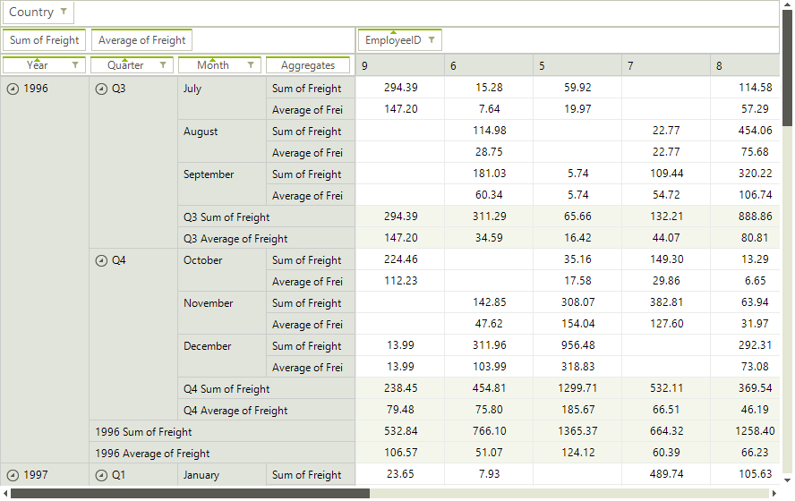

# Using the DataSource property

## 

Similarly to other WinForms data controls, RadPivotGrid can be populated with data by setting its DataSource 
	        and DataMember properties. However, you also need to add the appropriate descriptions in order to define the 
	        structure of the data that is going to be displayed. More information about the different types of descriptions 
	        can be found in the  [Using LocalDataSourceProvider article]()

#### __[C#] __

{{source=..\SamplesCS\PivotGrid\PopulatingWithData\PivotGridUsingTheDataSourceProperty.cs region=FillWithData}}
	            this.radPivotGrid1.RowGroupDescriptions.Add(new DateTimeGroupDescription() { PropertyName = "OrderDate", Step = DateTimeStep.Year, GroupComparer = new GroupNameComparer() });
	            this.radPivotGrid1.RowGroupDescriptions.Add(new DateTimeGroupDescription() { PropertyName = "OrderDate", Step = DateTimeStep.Quarter, GroupComparer = new GroupNameComparer() });
	            this.radPivotGrid1.RowGroupDescriptions.Add(new DateTimeGroupDescription() { PropertyName = "OrderDate", Step = DateTimeStep.Month, GroupComparer = new GroupNameComparer() });
	
	            this.radPivotGrid1.ColumnGroupDescriptions.Add(new PropertyGroupDescription() { PropertyName = "EmployeeID", GroupComparer = new GrandTotalComparer() });
	
	            this.radPivotGrid1.AggregateDescriptions.Add(new PropertyAggregateDescription() { PropertyName = "Freight", AggregateFunction = AggregateFunctions.Sum });
	            this.radPivotGrid1.AggregateDescriptions.Add(new PropertyAggregateDescription() { PropertyName = "Freight", AggregateFunction = AggregateFunctions.Average });
	
	            this.radPivotGrid1.FilterDescriptions.Add(new PropertyFilterDescription() { PropertyName = "ShipCountry", CustomName = "Country" });
	
	            NwindDataSet dataset = new NwindDataSet();
	            SamplesCS.DataSources.NwindDataSetTableAdapters.OrdersTableAdapter adapter = new SamplesCS.DataSources.NwindDataSetTableAdapters.OrdersTableAdapter();
	            adapter.Fill(dataset.Orders);
	
	            this.radPivotGrid1.DataSource = dataset;
	            this.radPivotGrid1.DataMember = "Orders";
	{{endregion}}

#### __[VB.NET] __

{{source=..\SamplesVB\PivotGrid\PopulatingWithData\PivotGridUsingTheDataSourceProperty.vb region=FillWithData}}
	        Me.RadPivotGrid1.RowGroupDescriptions.Add(New DateTimeGroupDescription() With { _
	         .PropertyName = "OrderDate", _
	         .[Step] = DateTimeStep.Year, _
	         .GroupComparer = New GroupNameComparer() _
	        })
	        Me.RadPivotGrid1.RowGroupDescriptions.Add(New DateTimeGroupDescription() With { _
	         .PropertyName = "OrderDate", _
	         .[Step] = DateTimeStep.Quarter, _
	         .GroupComparer = New GroupNameComparer() _
	        })
	        Me.RadPivotGrid1.RowGroupDescriptions.Add(New DateTimeGroupDescription() With { _
	         .PropertyName = "OrderDate", _
	         .[Step] = DateTimeStep.Month, _
	         .GroupComparer = New GroupNameComparer() _
	        })
	
	        Me.RadPivotGrid1.ColumnGroupDescriptions.Add(New PropertyGroupDescription() With { _
	         .PropertyName = "EmployeeID", _
	         .GroupComparer = New GrandTotalComparer() _
	        })
	
	        Me.RadPivotGrid1.AggregateDescriptions.Add(New PropertyAggregateDescription() With { _
	         .PropertyName = "Freight", _
	         .AggregateFunction = AggregateFunctions.Sum _
	        })
	        Me.RadPivotGrid1.AggregateDescriptions.Add(New PropertyAggregateDescription() With { _
	         .PropertyName = "Freight", _
	         .AggregateFunction = AggregateFunctions.Average _
	        })
	
	        Me.RadPivotGrid1.FilterDescriptions.Add(New PropertyFilterDescription() With { _
	         .PropertyName = "ShipCountry", _
	         .CustomName = "Country" _
	        })
	
	        Dim dataset As New NwindDataSet()
	        Dim adapter As New NwindDataSetTableAdapters.OrdersTableAdapter()
	        adapter.Fill(dataset.Orders)
	
	        Me.RadPivotGrid1.DataSource = dataset
	        Me.RadPivotGrid1.DataMember = "Orders"
	        '#End Region
	    End Sub
	End Class

>When you set the DataSource and DataMember properties, RadPivotGrid 
		  will automatically prepare a LocalDataSourceProvider and use it internally.
