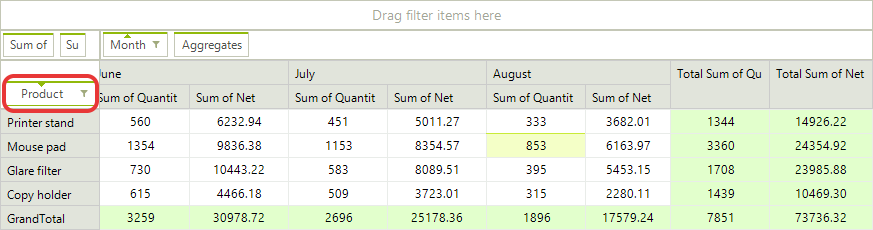
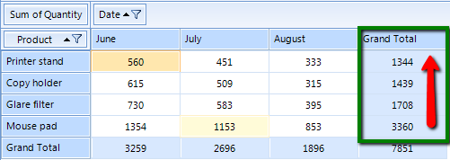
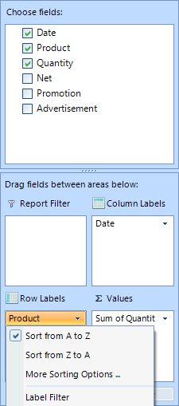
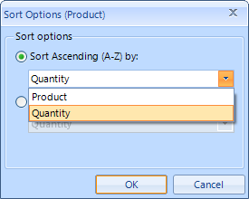

# Sorting


>note With the current release of RadPivotGrid sorting is available only for LocalDataSourceProvider.
>


## Understanding Sorting Mechanism

RadPivotGrid provides different sorting options. You can sort your RowGroupDescriptions and ColumnGroupDescriptions ascending (from A to Z) and descending (from Z to A) based on the names of the properties they are showing or based on the aggregated description. We will explain this with a simple RadPivotGrid:<br>

The RowGroupDescription in this RadPivotGrid is the Product field. By default the sorting of the columns is ascending (from A to Z) based on the headers: Copy holder, Glare filter, Mouse pad, Printer stand. You can easily change the sorting of the Product description and set it to descending (from Z to A). One of the ways to achieve this is to simply click the “Product” element. This will lead to the result below. The row headers are reordered based on their names.<br>

You can also apply sorting based on some of the PropertyAggregateDescription you are using. In the example above you can apply sorting of the Product names in ascending (from A to Z) or descending (from Z to A) format based on the Total Sum of Quantity (green rectangle). Here is the new view of RadPivotGrid when the Product RowGroupDescription is sorted in descending order based on the Total Sum of Quantity:<>br

>note The sorting is set on the ColumnGroupDescriptions or RowGroupDescriptions. You cannot set sorting on the AggregateDescriptions, but you can sort the columns or rows based on the aggregated values.
>

## Applying sort rules

The sorting can be applied in the code behind or at runtime with the help of RadPivotFieldList.

* Sorting based on the GroupName (header) can be Ascending (from A to Z) or Descending (from Z to A). The default value is Ascending, but you can change it by using SortOrder property:

{{source=..\SamplesCS\PivotGrid\PivotGridSorting.cs region=SortByGroupName}} 
{{source=..\SamplesVB\PivotGrid\PivotGridSorting.vb region=SortByGroupName}} 

````C#
PropertyGroupDescription propGroupDescription = (PropertyGroupDescription)this.radPivotGrid1.RowGroupDescriptions[0];
propGroupDescription.SortOrder = Telerik.Pivot.Core.SortOrder.Descending;
this.radPivotGrid1.ReloadData();

````
````VB.NET
Dim propGroupDescription As PropertyGroupDescription = DirectCast(Me.radPivotGrid1.RowGroupDescriptions(0), PropertyGroupDescription)
propGroupDescription.SortOrder = Telerik.Pivot.Core.SortOrder.Descending
Me.radPivotGrid1.ReloadData()

````

{{endregion}}

* Sorting based on the GrandTotals can be Ascending or Descending. To set such sort mechanism you have to use the SortOrder and GroupComparer properties:

{{source=..\SamplesCS\PivotGrid\PivotGridSorting.cs region=SortGrandTotals}} 
{{source=..\SamplesVB\PivotGrid\PivotGridSorting.vb region=SortGrandTotals}} 

````C#
PropertyGroupDescription propGroupDescription = (PropertyGroupDescription)this.radPivotGrid1.RowGroupDescriptions[0];
propGroupDescription.SortOrder = Telerik.Pivot.Core.SortOrder.Descending;
propGroupDescription.GroupComparer = new GrandTotalComparer() { AggregateIndex = 0 };
this.radPivotGrid1.ReloadData();

````
````VB.NET
Dim propGroupDescription As PropertyGroupDescription = DirectCast(Me.radPivotGrid1.RowGroupDescriptions(0), PropertyGroupDescription)
propGroupDescription.SortOrder = Telerik.Pivot.Core.SortOrder.Descending
propGroupDescription.GroupComparer = New GrandTotalComparer() With { _
 .AggregateIndex = 0 _
}
Me.radPivotGrid1.ReloadData()

````

{{endregion}}

>note The AggregateIndex property is set based on the count of your aggregate descriptions. If you have two aggregates the first one will have AggregateIndex = 0 and the second - AggregateIndex = 1.
>

## Changing the Sorting at runtime

RadPivotFieldList gives you the ability to change the sorting of a description at runtime. When you click on a Row Label or a Column Label field, a new popup opens with several sorting options. If you want to save the current sorting, but only change its order (for example the above RadPivotGrid is sorted based on the Total Sum of Quantity in Descending order, and you want to change it to Ascending) you can use the first two options which are doing exactly this - just changing the SortOrder: <br>

If you want to change the property based on which the sort is applied, then you can use the third option - More Sorting Options. A new dialog will be opened in which you can choose Ascending or Descending order of the sort. When you click the dropdown button you'll see a full list of the possible sorting basis: <br>
