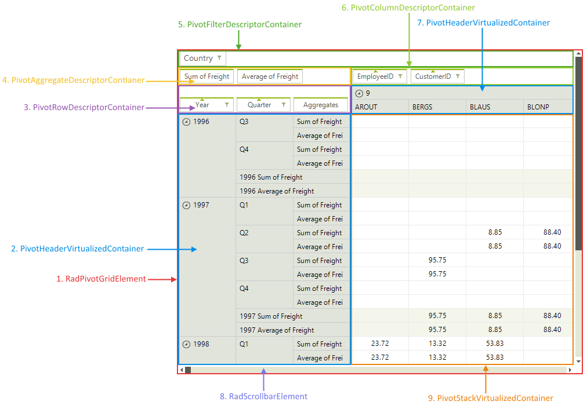

# Structure

## 

RadPivotGrid consists of several different areas and visual elements which have specific purposes and functionality. The structure of RadPivotGrid is described on the following picture.
        

RadPivotGrid groups the records in the assigned data source according to column descriptors and row 
          descriptors which are displayed in the __Column descriptors area__ and
          __Row descriptors area__. What you see
          in the __Column headers__ and __Row headers__ areas
          are the group names. Each cell in the Data cells area
          displays the aggregated result of all records that belong to both groups defined by the row and 
          column of the cell. The aggregate descriptors are displayed in the __Aggregates area__. 
          In the __Report filters area__ you can add fields by which you can filter the 
          displayed results. For example, if you need to see a report of the sales only in the USA, then you can 
          add the Country field to the __Report filters area__ and select USA from its filter menu.
        
