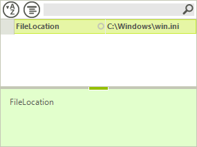
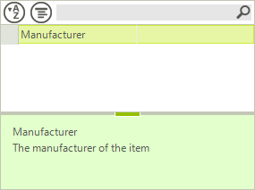
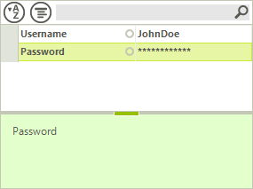
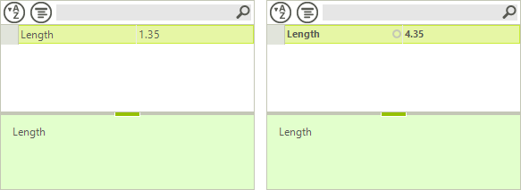
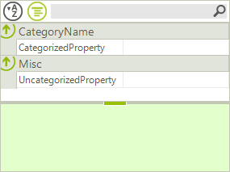
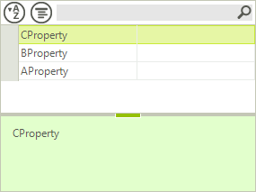

# Attributes

This article contains a list of some of the more important and more commonly used attributes used with RadPropertyGrid.
      

## EditorAttribute

With the editor attribute you can specify __UITypeEditor__ as well as __BaseInputEditor__ (since Q1 2013) to be used for a given property.
        

#### __[C#]__

{{source=..\SamplesCS\PropertyGrid\PropertyGridAttributes.cs region=EditorAttribute}}
	        [Editor(typeof(PropertyGridBrowseEditor), typeof(BaseInputEditor))] 
	        public string FileLocation { get; set; }
	{{endregion}}

#### __[VB.NET]__

{{source=..\SamplesVB\PropertyGrid\PropertyGridAttributes.vb region=EditorAttribute}}
	    <Editor(GetType(PropertyGridBrowseEditor), GetType(BaseInputEditor))> _
	    Public Property FileLocation() As String
	        Get
	            Return m_FileLocation
	        End Get
	        Set(value As String)
	            m_FileLocation = value
	        End Set
	    End Property
	    Private m_FileLocation As String
	{{endregion}}

## RadRangeAttribute 

The range attribute allows you to set a minimum and maximum value to be used for a property that is edited with a RadSpinEditor.
        

#### __[C#]__

{{source=..\SamplesCS\PropertyGrid\PropertyGridAttributes.cs region=RadRangeAttribute}}
	        [RadRange(1, 5)]
	        public byte DoorsCount { get; set; }
	{{endregion}}

#### __[VB.NET]__

{{source=..\SamplesVB\PropertyGrid\PropertyGridAttributes.vb region=RadRangeAttribute}}
	    <RadRange(1, 5)> _
	    Public Property DoorsCount() As Byte
	        Get
	            Return m_DoorsCount
	        End Get
	        Set(value As Byte)
	            m_DoorsCount = value
	        End Set
	    End Property
	    Private m_DoorsCount As Byte
	{{endregion}}

## BrowsableAttribute  

Determines whether the property will be included in the collection of properties RadPropertyGridSHows.
        

#### __[C#]__

{{source=..\SamplesCS\PropertyGrid\PropertyGridAttributes.cs region=BrowsableAttribute}}
	        [Browsable(false)]
	        public int MyHiddenProperty { get; set; }
	        public int MyBrowsableProperty { get; set; }
	{{endregion}}

#### __[VB.NET]__

{{source=..\SamplesVB\PropertyGrid\PropertyGridAttributes.vb region=BrowsableAttribute}}
	    <Browsable(False)> _
	    Public Property MyHiddenProperty() As Integer
	        Get
	            Return m_MyHiddenProperty
	        End Get
	        Set(value As Integer)
	            m_MyHiddenProperty = value
	        End Set
	    End Property
	    Private m_MyHiddenProperty As Integer
	    Public Property MyBrowsableProperty() As Integer
	        Get
	            Return m_MyBrowsableProperty
	        End Get
	        Set(value As Integer)
	            m_MyBrowsableProperty = value
	        End Set
	    End Property
	    Private m_MyBrowsableProperty As Integer
	{{endregion}}

## ReadOnlyAttribute   

Determines whether a property can be edited in RadPropertyGrid or not.
        

#### __[C#]__

{{source=..\SamplesCS\PropertyGrid\PropertyGridAttributes.cs region=ReadOnlyAttribute}}
	        [ReadOnly(true)]
	        public int Count { get; set; }
	{{endregion}}

#### __[VB.NET]__

{{source=..\SamplesVB\PropertyGrid\PropertyGridAttributes.vb region=ReadOnlyAttribute}}
	    <[ReadOnly](True)> _
	    Public Property Count() As Integer
	        Get
	            Return m_Count
	        End Get
	        Set(value As Integer)
	            m_Count = value
	        End Set
	    End Property
	    Private m_Count As Integer
	{{endregion}}

## DisplayNameAttribute

Determines the text that will be show for a given property. You can also alter the text for a property by setting its Label.
        

#### __[C#]__

{{source=..\SamplesCS\PropertyGrid\PropertyGridAttributes.cs region=DisplayNameAttribute}}
	        [DisplayName("PropertyNameInGerman")]
	        public double PropertyName { get; set; }
	{{endregion}}

#### __[VB.NET]__

{{source=..\SamplesVB\PropertyGrid\PropertyGridAttributes.vb region=DisplayNameAttribute}}
	    <DisplayName("PropertyNameInGerman")> _
	    Public Property PropertyName() As Double
	        Get
	            Return m_PropertyName
	        End Get
	        Set(value As Double)
	            m_PropertyName = value
	        End Set
	    End Property
	    Private m_PropertyName As Double
	{{endregion}}

## DescriptionAttribute

Defines the text that is displayed for a given property in the help bar of RadPropertyGrid.
        

#### __[C#]__

{{source=..\SamplesCS\PropertyGrid\PropertyGridAttributes.cs region=DescriptionAttribute}}
	        [Description("The manufacturer of the item")] 
	        public string Manufacturer { get; set; }
	{{endregion}}

#### __[VB.NET]__

{{source=..\SamplesVB\PropertyGrid\PropertyGridAttributes.vb region=DescriptionAttribute}}
	    <Description("The manufacturer of the item")> _
	    Public Property Manufacturer() As String
	        Get
	            Return m_Manufacturer
	        End Get
	        Set(value As String)
	            m_Manufacturer = value
	        End Set
	    End Property
	    Private m_Manufacturer As String
	{{endregion}}

## PasswordPropertyTextAttribute

Determines whether a text property will be edited as a password.
        

#### __[C#]__

{{source=..\SamplesCS\PropertyGrid\PropertyGridAttributes.cs region=PasswordPropertyTextAttribute}}
	        public string Username { get; set; }
	        [PasswordPropertyText(true)]
	        public string Password { get; set; }
	{{endregion}}

#### __[VB.NET]__

{{source=..\SamplesVB\PropertyGrid\PropertyGridAttributes.vb region=PasswordPropertyTextAttribute}}
	    Public Property Username() As String
	        Get
	            Return m_Username
	        End Get
	        Set(value As String)
	            m_Username = value
	        End Set
	    End Property
	    Private m_Username As String
	    <PasswordPropertyText(True)> _
	    Public Property Password() As String
	        Get
	            Return m_Password
	        End Get
	        Set(value As String)
	            m_Password = value
	        End Set
	    End Property
	    Private m_Password As String
	{{endregion}}

## DefaultValueAttribute

Defines the default value to which the property will reset. When the property value is set to something different that the default value, 
          it will be marked as modified.
        

#### __[C#]__

{{source=..\SamplesCS\PropertyGrid\PropertyGridAttributes.cs region=DefaultValueAttribute}}
	        [DefaultValue(1.35)]
	        public double Length { get; set; }
	{{endregion}}

#### __[VB.NET]__

{{source=..\SamplesVB\PropertyGrid\PropertyGridAttributes.vb region=DefaultValueAttribute}}
	    <DefaultValue(1.35)> _
	    Public Property Length() As Decimal
	        Get
	            Return m_Length
	        End Get
	        Set(value As Decimal)
	            m_Length = value
	        End Set
	    End Property
	    Private m_Length As Decimal
	{{endregion}}

## CategoryAttribute

Defines the category to which the property will be grouped when properties are shown categorized. Any property that does not 
          have this attribute will be categorized in the Misc category.
        

#### __[C#]__

{{source=..\SamplesCS\PropertyGrid\PropertyGridAttributes.cs region=CategoryAttribute}}
	        [Category("CategoryName")]
	        public string CategorizedProperty { get; set; }
	        public string UncategorizedProperty { get; set; }
	{{endregion}}

#### __[VB.NET]__

{{source=..\SamplesVB\PropertyGrid\PropertyGridAttributes.vb region=CategoryAttribute}}
	    <Category("CategoryName")> _
	    Public Property CategorizedProperty() As String
	        Get
	            Return m_CategorizedProperty
	        End Get
	        Set(value As String)
	            m_CategorizedProperty = value
	        End Set
	    End Property
	    Private m_CategorizedProperty As String
	    Public Property UncategorizedProperty() As String
	        Get
	            Return m_UncategorizedProperty
	        End Get
	        Set(value As String)
	            m_UncategorizedProperty = value
	        End Set
	    End Property
	    Private m_UncategorizedProperty As String
	{{endregion}}

## RadSortOrderAttribute

Defines the order in which items would be ordered when no other ordering is applied (Alphabetical or Categorical alphabetical).
      The order can also be manipulated through the SortOrder property of PropertyGridItem. Setting the property would override the value from 
      the attribute.
        

#### __[C#]__

{{source=..\SamplesCS\PropertyGrid\PropertyGridAttributes.cs region=RadSortOrderAttribute}}
	        [RadSortOrder(2)]
	        public string AProperty { get; set; }
	        [RadSortOrder(1)]
	        public string BProperty { get; set; }
	        [RadSortOrder(0)]
	        public string CProperty { get; set; }
	{{endregion}}

#### __[VB.NET]__

{{source=..\SamplesVB\PropertyGrid\PropertyGridAttributes.vb region=RadSortOrderAttribute}}
	    <RadSortOrder(2)> _
	    Public Property AProperty() As String
	        Get
	            Return m_AProperty
	        End Get
	        Set(value As String)
	            m_AProperty = value
	        End Set
	    End Property
	    Private m_AProperty As String
	    <RadSortOrder(1)> _
	    Public Property BProperty() As String
	        Get
	            Return m_BProperty
	        End Get
	        Set(value As String)
	            m_BProperty = value
	        End Set
	    End Property
	    Private m_BProperty As String
	    <RadSortOrder(0)> _
	    Public Property CProperty() As String
	        Get
	            Return m_CProperty
	        End Get
	        Set(value As String)
	            m_CProperty = value
	        End Set
	    End Property
	    Private m_CProperty As String
	{{endregion}}

