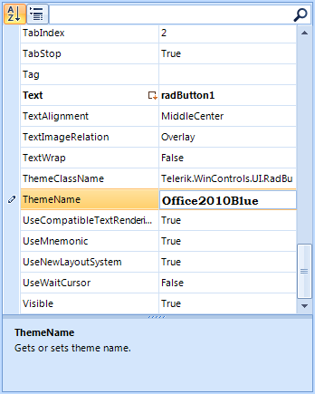

# Customizing editor behavior

## 

The appearance and behavior of property grid editors can be changed programmatically.
        	This can be done in the __EditorInitialized__ event. __EditorInitialized__
        	is fired when the editor is created and initialized with a predefined set of properties.
        

The following sample demonstrates how to change the default font of __PropertyGridTextBoxEditor__:
        

#### __[C#] Customize editor__

{{region CustomizeEditor}}
	        void radPropertyGrid1_EditorInitialized(object sender, Telerik.WinControls.UI.PropertyGridItemEditorInitializedEventArgs e)
	        {
	            PropertyGridTextBoxEditor editor = e.Editor as PropertyGridTextBoxEditor;
	
	            if (editor != null)
	            {
	                ((RadTextBoxElement)editor.EditorElement).Font = new Font(FontFamily.Families[12], 10, FontStyle.Bold);
	            }
	
	        }
	{{endregion}}

#### __[VB.NET] Customize editor__

{{region CustomizeEditor}}
	    Private Sub radPropertyGrid1_EditorInitialized(ByVal sender As Object, ByVal e As PropertyGridItemEditorInitializedEventArgs)
	        Dim editor As PropertyGridTextBoxEditor = TryCast(e.Editor, PropertyGridTextBoxEditor)
	
	        If Not editor Is Nothing Then
	            CType(editor.EditorElement, RadTextBoxElement).Font = New Font(FontFamily.Families(12), 10, FontStyle.Bold)
	        End If
	    End Sub
	{{endregion}}

