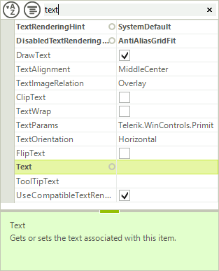

# Filtering

## 

Just like the grouping and sorting functionality, filtering is possible both through the text box of the toolbar,
        	or programmatically by populating the __FilterDescriptors__ collection of RadPropertyGrid. 
        	For the first option, just enable the toolbar by setting __ToolBarxVisible__ to 
        	*true* and type the desired search string in the text box:
        

To add filters programmatically, first make sure that the __EnableFiltering__ property
         	is set to *true* and then, define the desired __FilterDescriptor__
         	and add it to the control __FilterDescriptors__ collection.
        

You can filter by the following criteria’s: 

* __Name__ - the property name.

* __Value__ - the property value.

* __Category__ - assigned from the __Category__ attrubute name.

* __FormattedValue__ - the value of the property converted to string.

* __Label__ - by default this is identical to the property name, unless
        				changed by setting the __Label__ property of the item.

* __Description__ - this is determined by the property __Description__ attribute/

* __OriginalValue__ - the value used when the property is initialized.

#### __[C#] Adding a filter descriptor__

{{region Filtering}}
	            FilterDescriptor filter = new FilterDescriptor("Name", FilterOperator.Contains, "size");
	            radPropertyGrid1.FilterDescriptors.Add(filter);
	{{endregion}}

#### __[VB.NET] Adding a filter descriptor__

{{region Filtering}}
	        Dim filter = New FilterDescriptor("Name", FilterOperator.Contains, "size")
	        RadPropertyGrid1.FilterDescriptors.Add(filter)
	{{endregion}}

