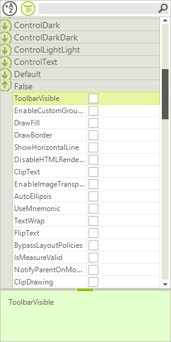

# Grouping

**RadPropertyGrid** allow you to group the displayed items in two ways. The first one is the predefined grouping capability, which groups the properties according to their __Category__ attribute and the second one is by programatically defining __GroupDescriptors__.

The predefined grouping can be called by the end user by clicking the group button in the tool bar, or programmatically by setting the __PropertySort__ property to __Categorized__ or __CategorizedAlphabetical__. There are few possibilities here:

* __PropertySort = Categorized__: Groups the properties according to their __Category__ attribute and shows them in the order they are enlisted in the object.

* __PropertySort = CategorizedAlphabetical__: Groups the properties according to their __Category__ attribute and shows them in alphabetical order.

Additionally, you can tune the sort order by setting the __SortOrder__ property. Here is an example of descending alphabetical category sorting:

>caption Figure 1: Default Groups


#### Setting Default Groups

{{source=..\SamplesCS\PropertyGrid\Features\PropertyGridGrouping.cs region=PropertySort}} 
{{source=..\SamplesVB\PropertyGrid\Features\PropertyGridGrouping.vb region=PropertySort}} 

````C#
radPropertyGrid1.PropertySort = PropertySort.CategorizedAlphabetical;
radPropertyGrid1.SortOrder = SortOrder.Descending;

````
````VB.NET
RadPropertyGrid1.PropertySort = PropertySort.CategorizedAlphabetical
RadPropertyGrid1.SortOrder = SortOrder.Descending

````

{{endregion}}

To add your own groups programatically, make sure that the __EnableGrouping__ property is set to *true* and add the desired __GroupDescriptor__ to the __GroupDescriptors__ collection of the control.

You can group by the following criteria’s: 

* __Name__: The property name.

* __Value__: The property value.

* __Category__: Assigned from the __Category__ attrubute name.

* __FormattedValue__: The value of the property converted to string.

* __Label__: By default this is identical to the property name, unless changed by setting the __Label__ property of the item.

* __Description__: This is determined by the property __Description__ attribute/

* __OriginalValue__: The value used when the property is initialized.

Here is an example of grouping by the formatted value:

>caption Figure 2: Group Descriptor

 

#### Adding a Group Descriptor

{{source=..\SamplesCS\PropertyGrid\Features\PropertyGridGrouping.cs region=GroupDescriptor}} 
{{source=..\SamplesVB\PropertyGrid\Features\PropertyGridGrouping.vb region=GroupDescriptor}} 

````C#
radPropertyGrid1.EnableGrouping = true;
GroupDescriptor group = new GroupDescriptor(new SortDescriptor[] { new SortDescriptor("FormattedValue", ListSortDirection.Ascending) });
radPropertyGrid1.GroupDescriptors.Add(group);

````
````VB.NET
RadPropertyGrid1.EnableGrouping = True
Dim group = New GroupDescriptor(New SortDescriptor() {New SortDescriptor("FormattedValue", ListSortDirection.Ascending)})
RadPropertyGrid1.GroupDescriptors.Add(group)

````

{{endregion}}

# See Also

* [Filtering]()
* [Custom Grouping]()
* [Sorting]()
* [Editors]()