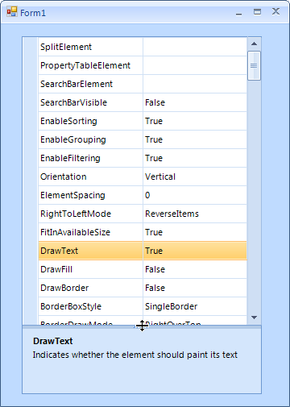

# Help bar


## 

RadPropertyGrid offers a help bar which reads and displays the name and content of the property __Description__ attribute. The help bar can be enabled by setting the __HelpVisible__ property to *true*:

#### Enabling the help bar

{{source=..\SamplesCS\PropertyGrid\Features\PropertyGridHelpBar.cs region=helpVisible}} 
{{source=..\SamplesVB\PropertyGrid\Features\PropertyGridHelpBar.vb region=helpVisible}} 

````C#
radPropertyGrid1.HelpVisible = true;

````
````VB.NET
RadPropertyGrid1.HelpVisible = True

````

{{endregion}} 



By double clicking over the size grip above the help section, the help section is being collapsed or expanded. Additionally, by using the size grip, the end—user can resize the help section.
        
