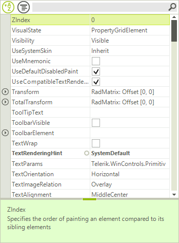

# Sorting

## 

The sorting capabilities can be controlled either by using the predefined sorting options in the 
        	__PropertySort__ property together with the 
        	__SortOrder__ property, or you can use your own sorting by adding a predefined
        	__SortDescriptor__ to the __SortDescriptor__ collection of RadPropertyGrid.
        	The first code snippet demonstrates how to sort the items programmatically in a descending order:
        

#### __[C#] Default sorting__

{{region Sorting}}
	            radPropertyGrid1.PropertySort = PropertySort.Alphabetical;
	            radPropertyGrid1.SortOrder = SortOrder.Descending;
	{{endregion}}

#### __[VB.NET] Default sorting__

{{region Sorting}}
	        RadPropertyGrid1.PropertySort = PropertySort.Alphabetical
	        RadPropertyGrid1.SortOrder = SortOrder.Descending
	{{endregion}}

Another way to sort the items is to create a __SortDescriptor__ and add it to the
        	__SortDescriptors__ collection of the control. Additionally, to enable sorting with sort descriptors,
        	you have to set the __EnableSorting__ property to *true*.
        

You can sort by the following criteria’s:      

* __Name__ - the property name.

* __Value__ - the property value.

* __Category__ - assigned from the __Category__ attrubute name.

* __FormattedValue__ - the value of the property converted to string.

* __Label__ - by default this is identical to the property name, unless
        				changed by setting the __Label__ property of the item.

* __Description__ - this is determined by the property __Description__ attribute/

* __OriginalValue__ - the value used when the property is initialized.

Here is an example of sorting the items by their value in ascending order:
        

#### __[C#] Sorting with SortDescriptors__

{{region SortDescriptor}}
	            radPropertyGrid1.EnableSorting = true;
	            SortDescriptor sort = new SortDescriptor("FormattedValue", ListSortDirection.Ascending);
	            radPropertyGrid1.SortDescriptors.Add(sort);
	{{endregion}}

#### __[VB.NET] Sorting with SortDescriptors__

{{region SortDescriptor}}
	        RadPropertyGrid1.EnableSorting = True
	        Dim sort = New SortDescriptor("FormattedValue", ListSortDirection.Ascending)
	        RadPropertyGrid1.SortDescriptors.Add(sort)
	{{endregion}}

