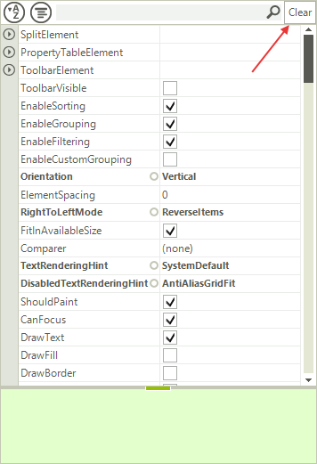

# ToolBar

## 

RadPropertyGrid offers a toolbar with out of the box functionality, which appears on the top of the control.
        	This toolbar contains predefined functions to sort the items, to group the items or to filter them by a 
        	string entered in the text box. You can enable this tool bar by setting the __ToolBarVisible__
        	property to *true*:
        

#### __[C#] Enabling the tool bar__

{{region ToolbarVisible}}
	            radPropertyGrid1.ToolbarVisible = true;
	{{endregion}}

#### __[VB.NET] Enabling the tool bar__

{{region ToolbarVisible}}
	        RadPropertyGrid1.ToolbarVisible = True
	{{endregion}}

You can set the predefined filter operator and property by making use of the following properties:
        

#### __[C#] Customizing default filtering__

{{region FilterProperties}}
	            radPropertyGrid1.PropertyGridElement.ToolbarElement.FilterOperator = FilterOperator.Contains;
	            radPropertyGrid1.PropertyGridElement.ToolbarElement.FilterPropertyName = "Name";
	{{endregion}}

#### __[VB.NET] Customizing default filtering__

{{region FilterProperties}}
	        RadPropertyGrid1.PropertyGridElement.ToolbarElement.FilterOperator = FilterOperator.Contains
	        RadPropertyGrid1.PropertyGridElement.ToolbarElement.FilterPropertyName = "Name"
	{{endregion}}

The toolbar consists of a __StackLayoutPanel__, which allow you to easily add additional elements 
			or modify the existing once. You can access the existing items as follows:
		

#### __[C#] Accessing toolbar elements__

{{region accessingItems}}
	            RadTextBoxElement filterTextBox = radPropertyGrid1.PropertyGridElement.ToolbarElement.SearchTextBoxElement;
	            RadToggleButtonElement sortButton = radPropertyGrid1.PropertyGridElement.ToolbarElement.AlphabeticalToggleButton;
	            RadToggleButtonElement groupButton = radPropertyGrid1.PropertyGridElement.ToolbarElement.CategorizedToggleButton;
	{{endregion}}

#### __[VB.NET] Accessing toolbar elements__

{{region accessingItems}}
	        Dim filterTextBox As RadTextBoxElement = RadPropertyGrid1.PropertyGridElement.ToolbarElement.SearchTextBoxElement
	        Dim sortButton As RadToggleButtonElement = RadPropertyGrid1.PropertyGridElement.ToolbarElement.AlphabeticalToggleButton
	        Dim groupButton As RadToggleButtonElement = RadPropertyGrid1.PropertyGridElement.ToolbarElement.CategorizedToggleButton
	{{endregion}}

If you want to add a new element in the toolbar, just add it to the __Children__ 
			collection of __ToolbarElement__:
		

#### __[C#] Add element to toolbar__

{{region addElement}}
	            RadButtonElement clearFiltering = new RadButtonElement();
	            clearFiltering.Text = "Clear";
	            clearFiltering.MinSize = new System.Drawing.Size(25, 22);
	            clearFiltering.StretchHorizontally = false;
	            radPropertyGrid1.PropertyGridElement.ToolbarElement.Children.Add(clearFiltering);
	{{endregion}}

#### __[VB.NET] Add element to toolbar__

{{region addElement}}
	        Dim clearFiltering As New RadButtonElement()
	        clearFiltering.Text = "Clear"
	        clearFiltering.MinSize = New System.Drawing.Size(25, 22)
	        clearFiltering.StretchHorizontally = False
	        RadPropertyGrid1.PropertyGridElement.ToolbarElement.Children.Add(clearFiltering)
	{{endregion}}

