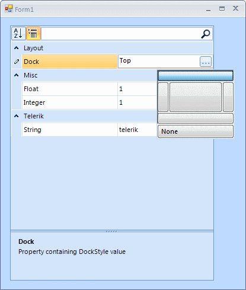

# RadPropertyStore - adding custom properties

## 

To get started with the RadPropertyStore follow these three steps:

* Create a new instance of the RadPropertyStore.

* Fill it with PropertyStoreItems.

* Set it as SelectedObject of RadPropertyGrid.

#### __[C#] Using RadPropertyStore__

{{source=..\SamplesCS\PropertyGrid\PropertyGridRadPropertyStore.cs region=RadPropertyStore}}
	            PropertyStoreItem intItem = new PropertyStoreItem(typeof(int), "Integer", 1);
	            PropertyStoreItem floatItem = new PropertyStoreItem(typeof(float), "Float", 1f, "Property storing a floating point value.");
	            PropertyStoreItem stringItem = new PropertyStoreItem(typeof(string), "String", "telerik", "Property storing a string value", "Telerik");
	            PropertyStoreItem dockItem = new PropertyStoreItem(typeof(DockStyle), "Dock", DockStyle.Top, "Property containing DockStyle value", "Layout", false);
	
	            RadPropertyStore store = new RadPropertyStore();
	            store.Add(intItem);
	            store.Add(floatItem);
	            store.Add(stringItem);
	            store.Add(dockItem);
	
	            this.radPropertyGrid1.SelectedObject = store;
	{{endregion}}

#### __[VB.NET] Using RadPropertyStore__

{{source=..\SamplesVB\PropertyGrid\PropertyGridRadPropertyStore.vb region=RadPropertyStore}}
	        Dim intItem As New PropertyStoreItem(GetType(Integer), "Integer", 1)
	        Dim floatItem As New PropertyStoreItem(GetType(Single), "Float", 1.0F, "Property storing a floating point value.")
	        Dim stringItem As New PropertyStoreItem(GetType(String), "String", "telerik", "Property storing a string value", "Telerik")
	        Dim dockItem As New PropertyStoreItem(GetType(DockStyle), "Dock", DockStyle.Top, "Property containing DockStyle value", "Layout", False)
	
	        Dim store As New RadPropertyStore
	        store.Add(intItem)
	        store.Add(floatItem)
	        store.Add(stringItem)
	        store.Add(dockItem)
	
	        Me.RadPropertyGrid1.SelectedObject = store
	{{endregion}}

You can then use the RadPropertyGrid to edit the PropertyStoreItems values as if they
        	were properties of an object. You can also change the value of a given property in the 
        	RadPropertyStore and the change will be reflected immediately in the RadPropertyGrid.
        	Additionally you can also add or remove items from the RadPropertyStore during runtime
        	and again all changes will be reflected in the RadGridView.
        

#### __[C#] Add/Remove/Edit PropertyStoreItems through code__

{{source=..\SamplesCS\PropertyGrid\PropertyGridRadPropertyStore.cs region=modifyStore}}
	            store["Integer"].Value = 100;
	            store["Dock"].Value = DockStyle.Fill;
	            store.RemoveAt(store.Count - 1);
	            store.Add(typeof(bool), "Boolean", true);
	{{endregion}}

#### __[VB.NET] Add/Remove/Edit PropertyStoreItems through code__

{{source=..\SamplesVB\PropertyGrid\PropertyGridRadPropertyStore.vb region=modifyStore}}
	        store("Integer").Value = 100
	        store("Dock").Value = DockStyle.Fill
	        store.RemoveAt(store.Count - 1)
	        store.Add(GetType(Boolean), "Boolean", True)
	{{endregion}}

You have to provide a value of the same type as the PropertyStoreItem or a value that can be 
        	converted through the TypeConverter of the type of the property. Otherwise the value would 
        	not be stored in the item.
        

# See Also[How to implement a TypeConverter](http://msdn.microsoft.com/en-us/library/ayybcxe5.aspx)
