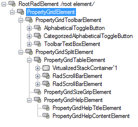
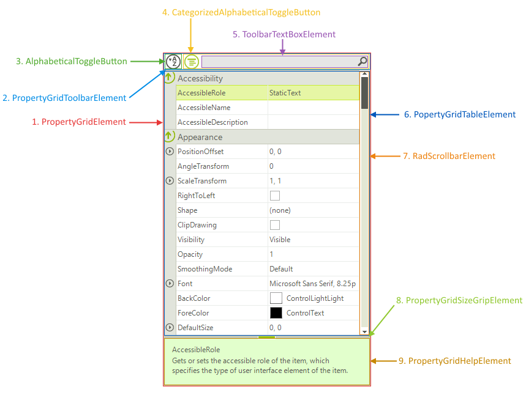

# Structure

This article describes the inner structure and organization of the elements which build the **RadPropertyGrid** control.

Like all Telerik WinForms controls **RadPropertyGrid** is build upon [Telerik Presentation Framework (TPF)](). **TPF** consists of various elements (such as primitives and layouts) that are the building blocks of the controls.

>caption Figure 1: RadPropertyGrid`s Element Hierarchy

>caption Figure 2: RadPropertyGrid`s Structure

* **PropertyGridElement**: Represents the main element of the control.
  * **PropertyGridToolbarElement**: Represents the toolbar.
	  * **AlphabeticalToggleButton**: Sorts the property grid items.
	  * **CategorizedAlphabeticalToggleButton**: Groups the property grid items.
	  * **ToolbarTextBoxElement**: Search textbox element.
  * **PropertyGridTableElement**: Container element of the property grid items.
      * **RadScrollbarElement**: Allows scrolling of the items.
  * **PropertyGridSizeGripElement**: Element allows sizing of the description pane.
  * **PropertyGridHelpElement**: Element providing a description of the currently selected item.
        
# See Also

* [Design Time]()
* [Getting Started]()