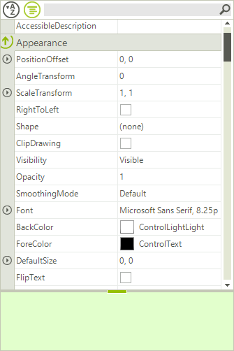

# Touch Support

## 

RadPropertyGrid supports scrolling operations via touch interface. Simply drag the screen to the desired position in order to performs scrolling:

As you can see on the following image, the control is scrolled down.

# See Also

 * [Windows Touch Gestures](http://msdn.microsoft.com/en-us/library/windows/desktop/dd940543(v=vs.85).aspx)
