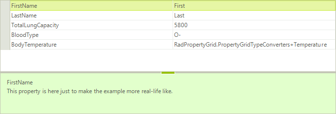
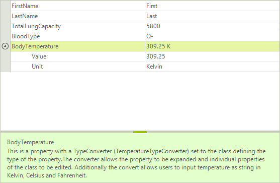
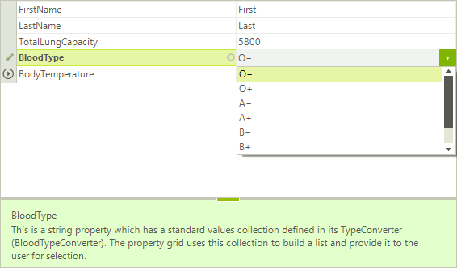
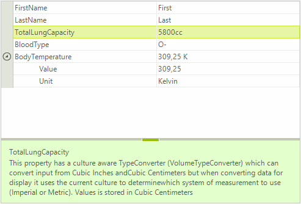

# Type Converters

__RadPropertyGrid__ is commonly used to visualize custom object’s properties and values. A  common case is when a certain property is of custom type, or there is no predefined editor for the specific type. In this situation the control will only display the type as a string. This article demonstrates how you can modify the way a property is being displayed and edited by using custom TypeConverters.
A [Type Converter]( https://msdn.microsoft.com/en-us/library/ayybcxe5.aspx) is used to convert values between data types. Here are the four main methods that are usually used when implementing a custom __Type Converter__.

* Override the __CanConvertFrom__ method that specifies which type the converter can convert from.

* Override the __ConvertFrom__ method that implements the conversion.

* Override the __CanConvertTo__ method that specifies which type the converter can convert to. 

* Override the __ConvertTo__ method that implements the conversion. 

Consider the __RadPropertyGrid__ is populated with a __Patient__ object contacting the following properties:

{{source=..\SamplesCS\PropertyGrid\PropertyGridTypeConverters.cs region=PopulateData}} 
{{source=..\SamplesVB\PropertyGrid\PropertyGridTypeConverters.vb region=PopulateData}} 

````C#
        
        public PropertyGridTypeConverters()
        {
            InitializeComponent();
            
            Patient patient = new Patient();
            patient.BloodType = "O-";
            patient.BodyTemperature = new Temperature() { Value = 309.25, Unit = TemperatureUnit.Kelvin };
            patient.FirstName = "First";
            patient.LastName = "Last";
            patient.TotalLungCapacity = 5800d;
            
            this.radPropertyGrid1.SelectedObject = patient;
        }
        
        public class Patient
        {
            [Description("This property is here just to make the example more real-life like.")]
            public string FirstName { get; set; }
            
            [Description("This property is here just to make the example more real-life like.")]
            public string LastName { get; set; }
            
            public double TotalLungCapacity { get; set; }
            
            public string BloodType { get; set; }
            
            public Temperature BodyTemperature { get; set; }
        }
        
        public class Temperature
        {
            public double Value { get; set; }
            
            public TemperatureUnit Unit { get; set; }
        }
        
        public enum TemperatureUnit
        {
            Kelvin,
            Celsius,
            Fahrenheit
        }
````
````VB.NET

    Public Sub New()
        InitializeComponent()

        Dim patient As New Patient()
        patient.BloodType = "O-"
        patient.BodyTemperature = New Temperature() With { _
             .Value = 309.25, _
            .Unit = TemperatureUnit.Kelvin _
        }
        patient.FirstName = "First"
        patient.LastName = "Last"
        patient.TotalLungCapacity = 5800.0

        Me.RadPropertyGrid1.SelectedObject = patient
    End Sub

    Public Class Patient
        <Description("This property is here just to make the example more real-life like.")> _
        Public Property FirstName() As String
            Get
                Return m_FirstName
            End Get
            Set(value As String)
                m_FirstName = value
            End Set
        End Property
        Private m_FirstName As String

        <Description("This property is here just to make the example more real-life like.")> _
        Public Property LastName() As String
            Get
                Return m_LastName
            End Get
            Set(value As String)
                m_LastName = value
            End Set
        End Property
        Private m_LastName As String

        Public Property TotalLungCapacity() As Double
            Get
                Return m_TotalLungCapacity
            End Get
            Set(value As Double)
                m_TotalLungCapacity = value
            End Set
        End Property
        Private m_TotalLungCapacity As Double

        Public Property BloodType() As String
            Get
                Return m_BloodType
            End Get
            Set(value As String)
                m_BloodType = value
            End Set
        End Property
        Private m_BloodType As String

        Public Property BodyTemperature() As Temperature
            Get
                Return m_BodyTemperature
            End Get
            Set(value As Temperature)
                m_BodyTemperature = value
            End Set
        End Property
        Private m_BodyTemperature As Temperature
    End Class

    Public Class Temperature
        Public Property Value() As Double
            Get
                Return m_Value
            End Get
            Set(value As Double)
                m_Value = value
            End Set
        End Property
        Private m_Value As Double

        Public Property Unit() As TemperatureUnit
            Get
                Return m_Unit
            End Get
            Set(value As TemperatureUnit)
                m_Unit = value
            End Set
        End Property
        Private m_Unit As TemperatureUnit
    End Class

    Public Enum TemperatureUnit
        Kelvin
        Celsius
        Fahrenheit
    End Enum
````

{{endregion}}

You will notice that the __BodyTemperature__ property displays the property type:<br>

In order to visualize the __BodyTemperature__ value with a custom formatted string you need to implement a __TypeConverter__ which should convert the *Temperature* value to the desired string.

## Display nested properties with ExpandableObjectConverter

As the __BodyTemperature__ property is of complex type composed of two properties, we will use a custom type converter derived from the [ExpandableObjectConverter](https://msdn.microsoft.com/en-us/library/system.componentmodel.expandableobjectconverter%28v=vs.110%29.aspx):

{{source=..\SamplesCS\PropertyGrid\PropertyGridTypeConverters.cs region=TemperatureTypeConverter}} 
{{source=..\SamplesVB\PropertyGrid\PropertyGridTypeConverters.vb region=TemperatureTypeConverter}} 

````C#
        
        public class TemperatureTypeConverter : ExpandableObjectConverter
        {
            public override bool CanConvertFrom(ITypeDescriptorContext context, Type sourceType)
            {
                if (sourceType == typeof(string))
                {
                    return true;
                }
                
                return base.CanConvertFrom(context, sourceType);
            }
            
            public override bool CanConvertTo(ITypeDescriptorContext context, Type destinationType)
            {
                if (destinationType == typeof(string))
                {
                    return true;
                }
                
                return base.CanConvertTo(context, destinationType);
            }
            
            public override object ConvertTo(ITypeDescriptorContext context,
                System.Globalization.CultureInfo culture, object value, Type destinationType)
            {
                if (destinationType != typeof(string))
                {
                    return base.ConvertTo(context, culture, value, destinationType);
                }
                
                Temperature temp = value as Temperature;
                
                if (temp == null)
                {
                    return string.Empty;
                }
                
                return string.Format("{0} {1}", temp.Value, temp.Unit.ToString().Substring(0, 1));
            }
            
            public override object ConvertFrom(ITypeDescriptorContext context,
                System.Globalization.CultureInfo culture, object value)
            {
                string stringValue = value as string;
                
                if (stringValue == null)
                {
                    return base.ConvertFrom(context, culture, value);
                }
                
                string number = "";
                
                for (int i = 0; i < stringValue.Length; i++)
                {
                    char c = stringValue[i];
                    
                    if (char.IsNumber(c))
                    {
                        number += stringValue[i];
                    }
                    
                    if (c == ',' || c == '.')
                    {
                        number += culture.NumberFormat.NumberDecimalSeparator;
                    }
                }
                
                TemperatureUnit unit = TemperatureUnit.Kelvin;
                
                if (stringValue.ToUpper().Contains("K"))
                {
                    unit = TemperatureUnit.Kelvin;
                }
                else if (stringValue.ToUpper().Contains("F"))
                {
                    unit = TemperatureUnit.Fahrenheit;
                }
                else if (stringValue.ToUpper().Contains("C"))
                {
                    unit = TemperatureUnit.Celsius;
                }
                else
                {
                    PropertyGridItem item = context as PropertyGridItem;
                    
                    if (item != null)
                    {
                        Temperature oldTemp = item.Value as Temperature;
                        
                        if (oldTemp != null)
                        {
                            unit = oldTemp.Unit;
                        }
                    }
                }
                
                return new Temperature() { Value = double.Parse(number), Unit = unit };
            }
        }
````
````VB.NET

    Public Class TemperatureTypeConverter
        Inherits ExpandableObjectConverter
        Public Overrides Function CanConvertFrom(context As ITypeDescriptorContext, sourceType As Type) As Boolean
            If sourceType = GetType(String) Then
                Return True
            End If

            Return MyBase.CanConvertFrom(context, sourceType)
        End Function

        Public Overrides Function CanConvertTo(context As ITypeDescriptorContext, destinationType As Type) As Boolean
            If destinationType = GetType(String) Then
                Return True
            End If

            Return MyBase.CanConvertTo(context, destinationType)
        End Function

        Public Overrides Function ConvertTo(context As ITypeDescriptorContext, culture As System.Globalization.CultureInfo, value As Object, destinationType As Type) As Object
            If destinationType <> GetType(String) Then
                Return MyBase.ConvertTo(context, culture, value, destinationType)
            End If

            Dim temp As Temperature = TryCast(value, Temperature)

            If temp Is Nothing Then
                Return String.Empty
            End If

            Return String.Format("{0} {1}", temp.Value, temp.Unit.ToString().Substring(0, 1))
        End Function

        Public Overrides Function ConvertFrom(context As ITypeDescriptorContext, culture As System.Globalization.CultureInfo, value As Object) As Object
            Dim stringValue As String = TryCast(value, String)

            If stringValue Is Nothing Then
                Return MyBase.ConvertFrom(context, culture, value)
            End If

            Dim number As String = ""

            For i As Integer = 0 To stringValue.Length - 1
                Dim c As Char = stringValue(i)

                If Char.IsNumber(c) Then
                    number += stringValue(i)
                End If

                If c = ","c OrElse c = "."c Then
                    number += culture.NumberFormat.NumberDecimalSeparator
                End If
            Next

            Dim unit As TemperatureUnit = TemperatureUnit.Kelvin

            If stringValue.ToUpper().Contains("K") Then
                unit = TemperatureUnit.Kelvin
            ElseIf stringValue.ToUpper().Contains("F") Then
                unit = TemperatureUnit.Fahrenheit
            ElseIf stringValue.ToUpper().Contains("C") Then
                unit = TemperatureUnit.Celsius
            Else
                Dim item As PropertyGridItem = TryCast(context, PropertyGridItem)

                If item IsNot Nothing Then
                    Dim oldTemp As Temperature = TryCast(item.Value, Temperature)

                    If oldTemp IsNot Nothing Then
                        unit = oldTemp.Unit
                    End If
                End If
            End If

            Return New Temperature() With { _
                 .Value = Double.Parse(number), _
                 .Unit = unit _
            }
        End Function
    End Class
````

{{endregion}}

Apply a __TypeConverterAttribute__ that indicates the type of your type converter. The result is illustrated on the screenshot below:

{{source=..\SamplesCS\PropertyGrid\PropertyGridTypeConverters.cs region=ApplyTemparatureAttribute}} 
{{source=..\SamplesVB\PropertyGrid\PropertyGridTypeConverters.vb region=ApplyTemparatureAttribute}} 

````C#
                         
            [Description("This is a property with a TypeConverter (TemperatureTypeConverter) set to the class defining the type of the property." +
                         "The converter allows the property to be expanded and individual properties of the class to be edited. " +
                         "Additionally the convert allows users to input temperature as string in Kelvin, Celsius and Fahrenheit.")]
            [TypeConverter(typeof(TemperatureTypeConverter))]
            public Temperature BodyTemperature { get; set; }
````
````VB.NET

        <Description("This is a property with a TypeConverter (TemperatureTypeConverter) set to the class defining the type of the property." + "The converter allows the property to be expanded and individual properties of the class to be edited. " + "Additionally the convert allows users to input temperature as string in Kelvin, Celsius and Fahrenheit.")> _
        <TypeConverter(GetType(TemperatureTypeConverter))> _
        Public Property BodyTemperature() As Temperature
            Get
                Return m_BodyTemperature
            End Get
            Set(value As Temperature)
                m_BodyTemperature = value
            End Set
        End Property
        Private m_BodyTemperature As Temperature
````

{{endregion}}



## Display a predefined list of values for a property with TypeConverter 

The __BloodType__ property is a string property which allows entering any string, even if it is not a valid blood type. To handle this case we can create a __TypeConverter__. In it we will override the __GetStandardValuesSupported__ method, which indicates whether the object supports a standard set of values that can be picked from a predefined list. Then we will override the __GetStandardValuesExclusive__ method which indicates whether the collection of standard values is exclusive or the user is allowed to add custom values. Lastly, in the __GetStandardValues__ method we should specify the predefined list. The property grid uses this collection to build a list and  provide it to the user for selection.

{{source=..\SamplesCS\PropertyGrid\PropertyGridTypeConverters.cs region=BloodTypeConverter}} 
{{source=..\SamplesVB\PropertyGrid\PropertyGridTypeConverters.vb region=BloodTypeConverter}} 

````C#
        
        public class BloodTypeConverter : TypeConverter
        {
            public override bool GetStandardValuesSupported(ITypeDescriptorContext context)
            {
                return true;
            }
            
            public override bool GetStandardValuesExclusive(ITypeDescriptorContext context)
            {
                return true;
            }
            
            public override StandardValuesCollection GetStandardValues(ITypeDescriptorContext context)
            {
                return new StandardValuesCollection(new string[] { "O−", "O+", "A−", "A+", "B−", "B+", "AB−", "AB+" });
            }
        }
````
````VB.NET

    Public Class BloodTypeConverter
        Inherits TypeConverter
        Public Overrides Function GetStandardValuesSupported(context As ITypeDescriptorContext) As Boolean
            Return True
        End Function

        Public Overrides Function GetStandardValuesExclusive(context As ITypeDescriptorContext) As Boolean
            Return True
        End Function

        Public Overrides Function GetStandardValues(context As ITypeDescriptorContext) As StandardValuesCollection
            Return New StandardValuesCollection(New String() {"O−", "O+", "A−", "A+", "B−", "B+", _
                "AB−", "AB+"})
        End Function
    End Class
````

{{endregion}}

After applying the __TypeConverterAttribute__, when you try to modify the __BloodType__ property __RadPropertyGrid__ will display a drop down list editor with the predefined set of values:

{{source=..\SamplesCS\PropertyGrid\PropertyGridTypeConverters.cs region=ApplyBloodTypeAttribute}} 
{{source=..\SamplesVB\PropertyGrid\PropertyGridTypeConverters.vb region=ApplyBloodTypeAttribute}} 

````C#
            
            [TypeConverter(typeof(BloodTypeConverter)),
            Description("This is a string property which has a standard values collection defined in its TypeConverter (BloodTypeConverter)." +
                        " The property grid uses this collection to build a list and provide it to the user for selection.")]
            public string BloodType { get; set; }
````
````VB.NET

        <TypeConverter(GetType(BloodTypeConverter)), Description("This is a string property which has a standard values collection defined in its TypeConverter (BloodTypeConverter)." + " The property grid uses this collection to build a list and provide it to the user for selection.")> _
        Public Property BloodType() As String
            Get
                Return m_BloodType
            End Get
            Set(value As String)
                m_BloodType = value
            End Set
        End Property
        Private m_BloodType As String
````

{{endregion}}



## Culture aware TypeConverter

This example demonstrates how to apply a culture aware __TypeConverter__ to the __TotalLungCapacity__ property which can convert input from Cubic Inches and Cubic Centimeters but when converting data for display it uses the current culture to determine which system of measurement to use (Imperial or Metric). The value is stored in Cubic Centimeters.

{{source=..\SamplesCS\PropertyGrid\PropertyGridTypeConverters.cs region=VolumeTypeConverter}} 
{{source=..\SamplesVB\PropertyGrid\PropertyGridTypeConverters.vb region=VolumeTypeConverter}} 

````C#
        
        public class VolumeTypeConverter : TypeConverter
        {
            private const double CubicInchesToCubicCentimeters = 16.387064d;
            private const double CubicCentimetersToCubicInches = 0.0610237441d;
            
            public override bool CanConvertFrom(ITypeDescriptorContext context, Type sourceType)
            {
                if (sourceType == typeof(string))
                {
                    return true;
                }
                
                return base.CanConvertFrom(context, sourceType);
            }
            
            public override bool CanConvertTo(ITypeDescriptorContext context, Type destinationType)
            {
                if (destinationType == typeof(string))
                {
                    return true;
                }
                
                return base.CanConvertTo(context, destinationType);
            }
            
            public override object ConvertFrom(ITypeDescriptorContext context, CultureInfo culture, object value)
            {
                if (!(value is string))
                {
                    return base.ConvertFrom(context, culture, value);
                }
                
                string val = (string)value;
                
                string measure = val.Substring(val.Length - 2, 2).ToLower();
                string dispValue = val.Substring(0, val.Length - 2);
                double disp = double.Parse(dispValue);
                
                if (measure.ToLower() == "cc")
                {
                    return disp;
                }
                else
                {
                    return disp * CubicInchesToCubicCentimeters;
                }
            }
            
            public override object ConvertTo(ITypeDescriptorContext context, CultureInfo culture, object value, Type destinationType)
            {
                if (!(destinationType == typeof(string)))
                {
                    return base.ConvertTo(context, culture, value, destinationType);
                }
                
                RegionInfo regionInfo = new RegionInfo(culture.LCID);
                bool metric = regionInfo.IsMetric;
                
                if (metric)
                {
                    return string.Format("{0:F0}cc", value);
                }
                else
                {
                    double cubicInches = (double)value * CubicCentimetersToCubicInches;
                    
                    return string.Format("{0:F0}ci", cubicInches);
                }
            }
        }
````
````VB.NET

    Public Class VolumeTypeConverter
        Inherits TypeConverter
        Private Const CubicInchesToCubicCentimeters As Double = 16.387064
        Private Const CubicCentimetersToCubicInches As Double = 0.0610237441

        Public Overrides Function CanConvertFrom(context As ITypeDescriptorContext, sourceType As Type) As Boolean
            If sourceType = GetType(String) Then
                Return True
            End If

            Return MyBase.CanConvertFrom(context, sourceType)
        End Function

        Public Overrides Function CanConvertTo(context As ITypeDescriptorContext, destinationType As Type) As Boolean
            If destinationType = GetType(String) Then
                Return True
            End If

            Return MyBase.CanConvertTo(context, destinationType)
        End Function

        Public Overrides Function ConvertFrom(context As ITypeDescriptorContext, culture As CultureInfo, value As Object) As Object
            If Not (TypeOf value Is String) Then
                Return MyBase.ConvertFrom(context, culture, value)
            End If

            Dim val As String = DirectCast(value, String)

            Dim measure As String = val.Substring(val.Length - 2, 2).ToLower()
            Dim dispValue As String = val.Substring(0, val.Length - 2)
            Dim disp As Double = Double.Parse(dispValue)

            If measure.ToLower() = "cc" Then
                Return disp
            Else
                Return disp * CubicInchesToCubicCentimeters
            End If
        End Function

        Public Overrides Function ConvertTo(context As ITypeDescriptorContext, culture As CultureInfo, value As Object, destinationType As Type) As Object
            If Not (destinationType = GetType(String)) Then
                Return MyBase.ConvertTo(context, culture, value, destinationType)
            End If

            Dim regionInfo As New RegionInfo(culture.LCID)
            Dim metric As Boolean = regionInfo.IsMetric

            If metric Then
                Return String.Format("{0:F0}cc", value)
            Else
                Dim cubicInches As Double = CDbl(value) * CubicCentimetersToCubicInches

                Return String.Format("{0:F0}ci", cubicInches)
            End If
        End Function
    End Class
````

{{endregion}}

Do not forget to apply the __TypeConverterAttribute__. Additionally, we will specify the editor to be __PropertyGridTextBoxEditor__.

{{source=..\SamplesCS\PropertyGrid\PropertyGridTypeConverters.cs region=ApplyVolumeTypeAttribute}} 
{{source=..\SamplesVB\PropertyGrid\PropertyGridTypeConverters.vb region=ApplyVolumeTypeAttribute}} 

````C#
            
            [TypeConverter(typeof(VolumeTypeConverter)),
            Editor(typeof(PropertyGridTextBoxEditor), typeof(BaseInputEditor)),
            Description("This property has a culture aware TypeConverter (VolumeTypeConverter) which can convert input from Cubic Inches and" +
                        "Cubic Centimeters but when converting data for display it uses the current culture to determine" +
                        "which system of measurement to use (Imperial or Metric). Values is stored in Cubic Centimeters")]
            public double TotalLungCapacity { get; set; }
````
````VB.NET

        <TypeConverter(GetType(VolumeTypeConverter)), Editor(GetType(PropertyGridTextBoxEditor), GetType(BaseInputEditor)), Description("This property has a culture aware TypeConverter (VolumeTypeConverter) which can convert input from Cubic Inches and" + "Cubic Centimeters but when converting data for display it uses the current culture to determine" + "which system of measurement to use (Imperial or Metric). Values is stored in Cubic Centimeters")> _
        Public Property TotalLungCapacity() As Double
            Get
                Return m_TotalLungCapacity
            End Get
            Set(value As Double)
                m_TotalLungCapacity = value
            End Set
        End Property
        Private m_TotalLungCapacity As Double
````

{{endregion}}

