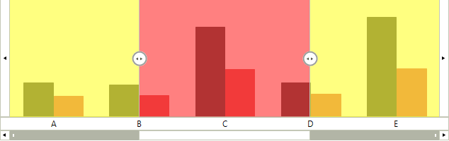
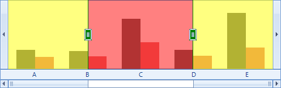
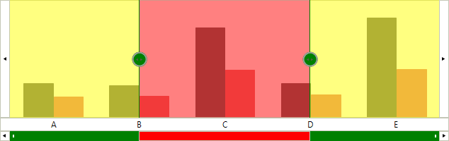

# Customizing RadRangeSelector 

Each of the control's elements can be accessed and customized. Once you access the desired elements, you can tweak its properties in order to modify it. In this tutorial, we will take a look at code snippets, demonstrating how to access and modify different parts of the control:

## Customize hover elements

The following code snippet demonstrates how to access and customize the Range and Hover elements through element tree:

{{source=..\SamplesCS\RangeSelector\CustomizingRadRangeSelector.cs region=CustomizeHover}} 
{{source=..\SamplesVB\RangeSelector\CustomizingRadRangeSelector.vb region=CustomizeHover}} 

````C#
void chartElement_SeriesInitialized(object sender, SeriesInitializedEventArgs e)
{
    e.Series.BackColor = Color.Lime;
    e.Series.BorderColor = Color.Red;
}

````
````VB.NET
Private Sub chartElement_SeriesInitialized(sender As Object, e As SeriesInitializedEventArgs)
    e.Series.BackColor = Color.Lime
    e.Series.BorderColor = Color.Red
End Sub

````

{{endregion}}



## Customize thumbs

{{source=..\SamplesCS\RangeSelector\CustomizingRadRangeSelector.cs region=CustomizeThumb}} 
{{source=..\SamplesVB\RangeSelector\CustomizingRadRangeSelector.vb region=CustomizeThumb}} 

````C#
void chartElement_SeriesInitialized(object sender, SeriesInitializedEventArgs e)
{
    e.Series.BackColor = Color.Lime;
    e.Series.BorderColor = Color.Red;
}

````
````VB.NET
Private Sub chartElement_SeriesInitialized(sender As Object, e As SeriesInitializedEventArgs)
    e.Series.BackColor = Color.Lime
    e.Series.BorderColor = Color.Red
End Sub

````

{{endregion}}



## Customize scroll event

This scroll element appears only when associated element implements IRangeSelectorElement interface.

{{source=..\SamplesCS\RangeSelector\CustomizingRadRangeSelector.cs region=CustomizeScroll}} 
{{source=..\SamplesVB\RangeSelector\CustomizingRadRangeSelector.vb region=CustomizeScroll}} 

````C#
void chartElement_SeriesInitialized(object sender, SeriesInitializedEventArgs e)
{
    e.Series.BackColor = Color.Lime;
    e.Series.BorderColor = Color.Red;
}

````
````VB.NET
Private Sub chartElement_SeriesInitialized(sender As Object, e As SeriesInitializedEventArgs)
    e.Series.BackColor = Color.Lime
    e.Series.BorderColor = Color.Red
End Sub

````

{{endregion}}



## Customize scales

The scales are created dynamically according to the associated element and its look and feel can be customized through the __ScaleInitializing__ event.

{{source=..\SamplesCS\RangeSelector\CustomizingRadRangeSelector.cs region=CustomizeScales}} 
````C#
Me.radRangeSelector1.RangeSelectorElement.ScrollSelectorElement.LeftTopThumb.BackColor = Color.Green
Me.radRangeSelector1.RangeSelectorElement.ScrollSelectorElement.LeftTopThumb.GradientStyle = Telerik.WinControls.GradientStyles.Solid
Me.radRangeSelector1.RangeSelectorElement.ScrollSelectorElement.BottomRightThumb.BackColor = Color.Green
Me.radRangeSelector1.RangeSelectorElement.ScrollSelectorElement.BottomRightThumb.GradientStyle = Telerik.WinControls.GradientStyles.Solid
Me.radRangeSelector1.RangeSelectorElement.ScrollSelectorElement.Range.BackColor = Color.Green
Me.radRangeSelector1.RangeSelectorElement.ScrollSelectorElement.Range.GradientStyle = Telerik.WinControls.GradientStyles.Solid
Me.radRangeSelector1.RangeSelectorElement.ScrollSelectorElement.SellectionRange.BackColor = Color.Red

````
````VB.NET
this.radRangeSelector1.ScaleInitializing += new ScaleInitializingEventHandler(radRangeSelector1_ScaleInitializing);

````

{{endregion}}


## Customize ChartElement

In order to customize the chart that is drawn into __RadRangeSelector__ when it is associated with __RadChartView__, the associated element should be accessed. The following code snippet demonstrates how this can be achieved.

{{source=..\SamplesCS\RangeSelector\CustomizingRadRangeSelector.cs region=CustomizeChartElement}} 
{{source=..\SamplesVB\RangeSelector\CustomizingRadRangeSelector.vb region=CustomizeChartElement}} 

````C#
RangeSelectorViewElement chartElement = this.radRangeSelector1.RangeSelectorElement.AssociatedElement as RangeSelectorViewElement;
chartElement.SeriesInitialized += new SeriesInitializedEventHandler(chartElement_SeriesInitialized);

````
````VB.NET
Dim chartElement As RangeSelectorViewElement = TryCast(Me.radRangeSelector1.RangeSelectorElement.AssociatedElement, RangeSelectorViewElement)

````

{{endregion}}


{{source=..\SamplesCS\RangeSelector\CustomizingRadRangeSelector.cs region=CustomizeChartElement1}} 
{{source=..\SamplesVB\RangeSelector\CustomizingRadRangeSelector.vb region=CustomizeChartElement1}} 

````C#
void chartElement_SeriesInitialized(object sender, SeriesInitializedEventArgs e)
{
    e.Series.BackColor = Color.Lime;
    e.Series.BorderColor = Color.Red;
}

````
````VB.NET
Private Sub chartElement_SeriesInitialized(sender As Object, e As SeriesInitializedEventArgs)
    e.Series.BackColor = Color.Lime
    e.Series.BorderColor = Color.Red
End Sub

````

{{endregion}}

