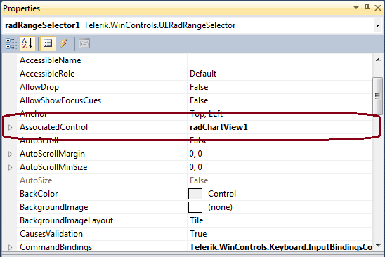
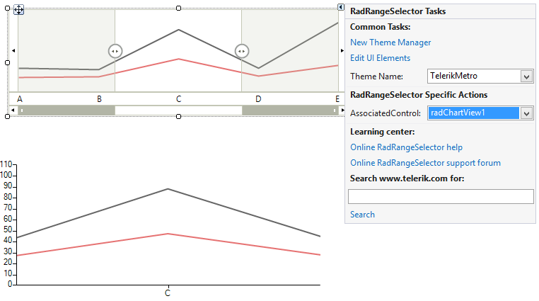

# Getting Started

This tutorial demonstrates how to use __RadRangeSelector__ to get a fine grain view of the data represented in __RadChartView__.

1\. Place a __RadRangeSelector__ and __RadChartView__ controls on a form.

2\. Setup your __RadChartView__ with some data.

3\. Associate the __RadChartView__ control to __RadRangeSelector__ by setting its __AssociatedControl__ property. You can do that by one of the following ways:

* Set in code:

{{source=..\SamplesCS\RangeSelector\RangeSelectorGettingStarted.cs region=set associatedControl}} 
{{source=..\SamplesVB\RangeSelector\RangeSelectorGettingStarted.vb region=set associatedControl}} 

````C#
this.radRangeSelector1.AssociatedControl = this.radChartView1;

````
````VB.NET
Me.radRangeSelector1.AssociatedControl = Me.radChartView1

````

{{endregion}}

* Set in Property Builder at design time:<br>

* Set it by using the control’s SmartTag at design time:<br>

4\. Press F5 to run the project.<br>