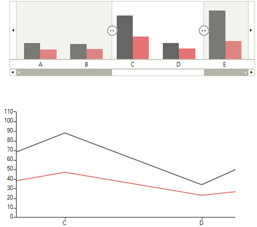
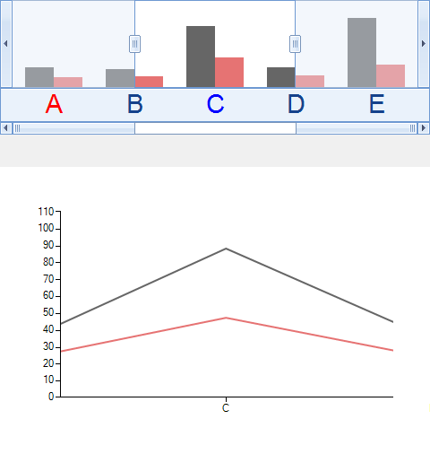

# Integration with RadChartView 

__RadChartView__ has full __RadRangeSelector__ integration support, through implementation of the __IRangeSelectorControl__
        and __IRangeSelectorElement__ interfaces by __RadChartView__ and __RangeSelectorViewElement__ classes respectively.
      

>__RangeSelectorViewElement__ supports only Cartesian series.
        

__RangeSelectorViewElement__ extends the __RadChartElement__, draws the chart into
        __RadRangeSelector__ and generates the scales according to its Axes collection.
        By accessing the __RangeSelectorViewElement__ you can take advantage of some additional controlling
        mechanisms like __SeriesInitializing__,  __SeriesInitialized__ and
        __LabelInitializng__ events. With the first two events you can control the series that should draw into
        RadRangeSelector and their types, while with the __LabelInitializng__ event, you can control the labels that
        are going to be drawn on the scales.
      

## Scale customization

Here is how to access the __RangeSelectorViewElement__ and change the series types:
        

#### __[C#] __

{{region ScaleCustomization1}}
	            RangeSelectorViewElement chartElement = this.radRangeSelector1.RangeSelectorElement.AssociatedElement as RangeSelectorViewElement;
	            chartElement.SeriesInitializing += new SeriesInitializingEventHandler(chartElement_SeriesInitializing);
	{{endregion}}

#### __[VB.NET] __

{{region ScaleCustomization1}}
	            Dim chartElement As RangeSelectorViewElement = TryCast(Me.radRangeSelector1.RangeSelectorElement.AssociatedElement, RangeSelectorViewElement)
	            AddHandler chartElement.SeriesInitializing, AddressOf chartElement_SeriesInitializing
	            '#End Region
	        End Sub
	
	#Region "ScaleCustomization2"
	        Private Sub chartElement_SeriesInitializing(sender As Object, e As SeriesInitializingEventArgs)
	            e.SeriesType = GetType(BarSeries)
	        End Sub
	#End Region
	
	#Region "LabelCustomization1"
	        Private f As New Font("Arial", 22)
	        Private Sub chartElement_LabelInitializing(sender As Object, e As LabelInitializingEventArgs)
	            e.LabelElement.Font = f
	
	            If e.LabelElement.Text = "C" Then
	                e.LabelElement.ForeColor = Color.Blue
	            End If
	            If e.LabelElement.Text = "A" Then
	                e.LabelElement.ForeColor = Color.Red
	            End If
	        End Sub
	#End Region
	
	#Region "LabelCustomization3"
	        Private Sub radRangeSelector1_ScaleInitializing(sender As Object, e As ScaleInitializingEventArgs)
	            Dim chartScaleElement As RangeSelectorChartScaleContainerElement = TryCast(e.ScaleElement, RangeSelectorChartScaleContainerElement)
	            chartScaleElement.LabelsOffset = 0
	            chartScaleElement.ShowAllLabels = False
	        End Sub
	#End Region
	
	
	    End Class
	End Namespace

#### __[C#] __

{{region ScaleCustomization2}}
	        void chartElement_SeriesInitializing(object sender, SeriesInitializingEventArgs e)
	        {
	            e.SeriesType = typeof(BarSeries);
	        }
	{{endregion}}

#### __[VB.NET] __

{{region ScaleCustomization2}}
	        Private Sub chartElement_SeriesInitializing(sender As Object, e As SeriesInitializingEventArgs)
	            e.SeriesType = GetType(BarSeries)
	        End Sub
	#End Region
	
	#Region "LabelCustomization1"
	        Private f As New Font("Arial", 22)
	        Private Sub chartElement_LabelInitializing(sender As Object, e As LabelInitializingEventArgs)
	            e.LabelElement.Font = f
	
	            If e.LabelElement.Text = "C" Then
	                e.LabelElement.ForeColor = Color.Blue
	            End If
	            If e.LabelElement.Text = "A" Then
	                e.LabelElement.ForeColor = Color.Red
	            End If
	        End Sub
	#End Region
	
	#Region "LabelCustomization3"
	        Private Sub radRangeSelector1_ScaleInitializing(sender As Object, e As ScaleInitializingEventArgs)
	            Dim chartScaleElement As RangeSelectorChartScaleContainerElement = TryCast(e.ScaleElement, RangeSelectorChartScaleContainerElement)
	            chartScaleElement.LabelsOffset = 0
	            chartScaleElement.ShowAllLabels = False
	        End Sub
	#End Region
	
	
	    End Class
	End Namespace

As you can see, the RadChartView shows a LineSeries, while in RadRangeSelector, we have changed it to BarSeries

## Labels customization

Here is how to access and modify the labels in RadRangeSelector

#### __[C#] __

{{region LabelCustomization}}
	            RangeSelectorViewElement chartElement = this.radRangeSelector1.RangeSelectorElement.AssociatedElement as RangeSelectorViewElement;
	            chartElement.LabelInitializing += new LabelInitializingEventHandler(chartElement_LabelInitializing);
	{{endregion}}

#### __[VB.NET] __

{{region LabelCustomization}}
	            Dim chartElement As RangeSelectorViewElement = TryCast(Me.radRangeSelector1.RangeSelectorElement.AssociatedElement, RangeSelectorViewElement)
	            AddHandler chartElement.LabelInitializing, AddressOf chartElement_LabelInitializing
	            '#End Region
	
	            '#Region "EnablePanAndZoomSynchronization"
	            DirectCast(Me.radRangeSelector1.RangeSelectorElement.AssociatedElement, RangeSelectorViewElement).EnablePanAndZoomSynchronization = False
	            '#End Region
	
	            '#Region "LabelCustomization2"
	            AddHandler Me.radRangeSelector1.ScaleInitializing, AddressOf radRangeSelector1_ScaleInitializing
	            '#End Region
	        End Sub
	
	        Private Sub ScaleCustomization()
	            '#Region "ScaleCustomization1"
	            Dim chartElement As RangeSelectorViewElement = TryCast(Me.radRangeSelector1.RangeSelectorElement.AssociatedElement, RangeSelectorViewElement)
	            AddHandler chartElement.SeriesInitializing, AddressOf chartElement_SeriesInitializing
	            '#End Region
	        End Sub
	
	#Region "ScaleCustomization2"
	        Private Sub chartElement_SeriesInitializing(sender As Object, e As SeriesInitializingEventArgs)
	            e.SeriesType = GetType(BarSeries)
	        End Sub
	#End Region
	
	#Region "LabelCustomization1"
	        Private f As New Font("Arial", 22)
	        Private Sub chartElement_LabelInitializing(sender As Object, e As LabelInitializingEventArgs)
	            e.LabelElement.Font = f
	
	            If e.LabelElement.Text = "C" Then
	                e.LabelElement.ForeColor = Color.Blue
	            End If
	            If e.LabelElement.Text = "A" Then
	                e.LabelElement.ForeColor = Color.Red
	            End If
	        End Sub
	#End Region
	
	#Region "LabelCustomization3"
	        Private Sub radRangeSelector1_ScaleInitializing(sender As Object, e As ScaleInitializingEventArgs)
	            Dim chartScaleElement As RangeSelectorChartScaleContainerElement = TryCast(e.ScaleElement, RangeSelectorChartScaleContainerElement)
	            chartScaleElement.LabelsOffset = 0
	            chartScaleElement.ShowAllLabels = False
	        End Sub
	#End Region
	
	
	    End Class
	End Namespace

#### __[C#] __

{{region LabelCustomization1}}
	        Font f = new Font("Arial", 22);
	        void chartElement_LabelInitializing(object sender, LabelInitializingEventArgs e)
	        {
	            e.LabelElement.Font = f;
	
	            if (e.LabelElement.Text == "C")
	            {
	                e.LabelElement.ForeColor = Color.Blue;
	            }
	            if (e.LabelElement.Text == "A")
	            {
	                e.LabelElement.ForeColor = Color.Red;
	            }
	        }
	{{endregion}}

#### __[VB.NET] __

{{region LabelCustomization1}}
	        Private f As New Font("Arial", 22)
	        Private Sub chartElement_LabelInitializing(sender As Object, e As LabelInitializingEventArgs)
	            e.LabelElement.Font = f
	
	            If e.LabelElement.Text = "C" Then
	                e.LabelElement.ForeColor = Color.Blue
	            End If
	            If e.LabelElement.Text = "A" Then
	                e.LabelElement.ForeColor = Color.Red
	            End If
	        End Sub
	#End Region
	
	#Region "LabelCustomization3"
	        Private Sub radRangeSelector1_ScaleInitializing(sender As Object, e As ScaleInitializingEventArgs)
	            Dim chartScaleElement As RangeSelectorChartScaleContainerElement = TryCast(e.ScaleElement, RangeSelectorChartScaleContainerElement)
	            chartScaleElement.LabelsOffset = 0
	            chartScaleElement.ShowAllLabels = False
	        End Sub
	#End Region
	
	
	    End Class
	End Namespace

Also, the generated from RangeSelectorViewElement scales (__RangeSelectorChartScaleContainerElement__) have embedded logic that
          prevents overlapping of labels and the following properties can be used to control it:
        

* __ShowAllLabels__ – by default the control will hide the overlapping labels. If you want to show all labels, just set this property back to true.
            

* __LabelsOffset__ – this property defines the minimum space (in pixels) between the labels when ShowAllLabels is false. Default value of this property is 5 pixels.
            

The easiest way to access these properties is in the ScaleInitializing event of RandRangeSelector
        

#### __[C#] __

{{region LabelCustomization2}}
	            this.radRangeSelector1.ScaleInitializing += new ScaleInitializingEventHandler(radRangeSelector1_ScaleInitializing);
	{{endregion}}

#### __[VB.NET] __

{{region LabelCustomization2}}
	            AddHandler Me.radRangeSelector1.ScaleInitializing, AddressOf radRangeSelector1_ScaleInitializing
	            '#End Region
	        End Sub
	
	        Private Sub ScaleCustomization()
	            '#Region "ScaleCustomization1"
	            Dim chartElement As RangeSelectorViewElement = TryCast(Me.radRangeSelector1.RangeSelectorElement.AssociatedElement, RangeSelectorViewElement)
	            AddHandler chartElement.SeriesInitializing, AddressOf chartElement_SeriesInitializing
	            '#End Region
	        End Sub
	
	#Region "ScaleCustomization2"
	        Private Sub chartElement_SeriesInitializing(sender As Object, e As SeriesInitializingEventArgs)
	            e.SeriesType = GetType(BarSeries)
	        End Sub
	#End Region
	
	#Region "LabelCustomization1"
	        Private f As New Font("Arial", 22)
	        Private Sub chartElement_LabelInitializing(sender As Object, e As LabelInitializingEventArgs)
	            e.LabelElement.Font = f
	
	            If e.LabelElement.Text = "C" Then
	                e.LabelElement.ForeColor = Color.Blue
	            End If
	            If e.LabelElement.Text = "A" Then
	                e.LabelElement.ForeColor = Color.Red
	            End If
	        End Sub
	#End Region
	
	#Region "LabelCustomization3"
	        Private Sub radRangeSelector1_ScaleInitializing(sender As Object, e As ScaleInitializingEventArgs)
	            Dim chartScaleElement As RangeSelectorChartScaleContainerElement = TryCast(e.ScaleElement, RangeSelectorChartScaleContainerElement)
	            chartScaleElement.LabelsOffset = 0
	            chartScaleElement.ShowAllLabels = False
	        End Sub
	#End Region
	
	
	    End Class
	End Namespace

#### __[C#] __

{{region LabelCustomization3}}
	        void radRangeSelector1_ScaleInitializing(object sender, ScaleInitializingEventArgs e)
	        {
	            RangeSelectorChartScaleContainerElement chartScaleElement = e.ScaleElement as RangeSelectorChartScaleContainerElement;
	            chartScaleElement.LabelsOffset = 0;
	            chartScaleElement.ShowAllLabels = false;
	        }
	{{endregion}}

#### __[VB.NET] __

{{region LabelCustomization3}}
	        Private Sub radRangeSelector1_ScaleInitializing(sender As Object, e As ScaleInitializingEventArgs)
	            Dim chartScaleElement As RangeSelectorChartScaleContainerElement = TryCast(e.ScaleElement, RangeSelectorChartScaleContainerElement)
	            chartScaleElement.LabelsOffset = 0
	            chartScaleElement.ShowAllLabels = False
	        End Sub
	#End Region
	
	
	    End Class
	End Namespace

## Pan and Zoom synchronization

There is two-way synchronization between the pan and zoom functionality of RadChartView and the selected range of RadRangeSelector.
          By setting __EnablePanAndZoomSynchronization__ property to false this synchronization will be only one way
          - from RadRangeSelector to RadChartView.
        

#### __[C#] __

{{region EnablePanAndZoomSynchronization}}
	            ((RangeSelectorViewElement)this.radRangeSelector1.RangeSelectorElement.AssociatedElement).EnablePanAndZoomSynchronization = false;
	{{endregion}}

#### __[VB.NET] __

{{region EnablePanAndZoomSynchronization}}
	            DirectCast(Me.radRangeSelector1.RangeSelectorElement.AssociatedElement, RangeSelectorViewElement).EnablePanAndZoomSynchronization = False
	            '#End Region
	
	            '#Region "LabelCustomization2"
	            AddHandler Me.radRangeSelector1.ScaleInitializing, AddressOf radRangeSelector1_ScaleInitializing
	            '#End Region
	        End Sub
	
	        Private Sub ScaleCustomization()
	            '#Region "ScaleCustomization1"
	            Dim chartElement As RangeSelectorViewElement = TryCast(Me.radRangeSelector1.RangeSelectorElement.AssociatedElement, RangeSelectorViewElement)
	            AddHandler chartElement.SeriesInitializing, AddressOf chartElement_SeriesInitializing
	            '#End Region
	        End Sub
	
	#Region "ScaleCustomization2"
	        Private Sub chartElement_SeriesInitializing(sender As Object, e As SeriesInitializingEventArgs)
	            e.SeriesType = GetType(BarSeries)
	        End Sub
	#End Region
	
	#Region "LabelCustomization1"
	        Private f As New Font("Arial", 22)
	        Private Sub chartElement_LabelInitializing(sender As Object, e As LabelInitializingEventArgs)
	            e.LabelElement.Font = f
	
	            If e.LabelElement.Text = "C" Then
	                e.LabelElement.ForeColor = Color.Blue
	            End If
	            If e.LabelElement.Text = "A" Then
	                e.LabelElement.ForeColor = Color.Red
	            End If
	        End Sub
	#End Region
	
	#Region "LabelCustomization3"
	        Private Sub radRangeSelector1_ScaleInitializing(sender As Object, e As ScaleInitializingEventArgs)
	            Dim chartScaleElement As RangeSelectorChartScaleContainerElement = TryCast(e.ScaleElement, RangeSelectorChartScaleContainerElement)
	            chartScaleElement.LabelsOffset = 0
	            chartScaleElement.ShowAllLabels = False
	        End Sub
	#End Region
	
	
	    End Class
	End Namespace

