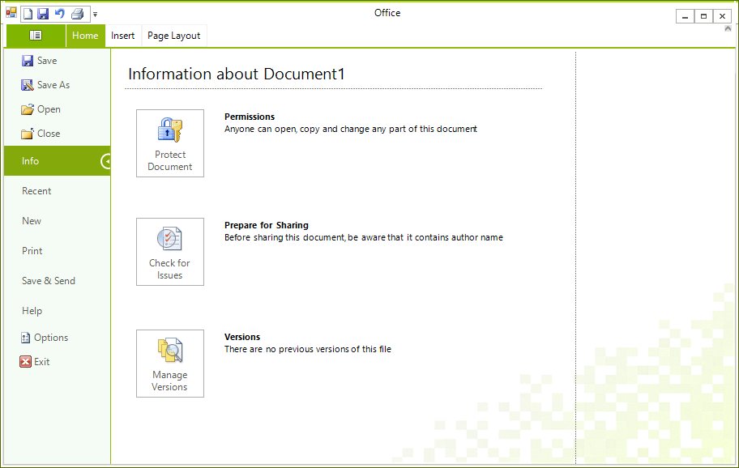

# BackStage View

## 

Backstage View is the Office 2010 replacement of the Application Menu. It is a menu that covers the whole window area and contains buttons and tabs. Each tab have a content area, which can be populated with any type of Controls. To enable the Backstage View in RadRibbonBar change the __ApplicationMenuStyle__ property to *BackstageView*.

#### Enabling Backstage view

{{source=..\SamplesCS\RibbonBar\BackstageView\RibbonBackstageView.cs region=ApplicationMenuStyle}} 
{{source=..\SamplesVB\RibbonBar\BackstageView\RibbonBackstageView.vb region=ApplicationMenuStyle}} 

````C#
radRibbonBar1.ApplicationMenuStyle = Telerik.WinControls.UI.ApplicationMenuStyle.BackstageView;

````
````VB.NET
RadRibbonBar1.ApplicationMenuStyle = Telerik.WinControls.UI.ApplicationMenuStyle.BackstageView

````

{{endregion}} 

