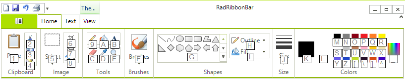

# Using Key Tips

Key tips allow the user to easily discover the keyboard shortcuts for any item of __RadRibbonBar__ control. To display the valid key tips at any time, press and release the __Alt__ key.

For example, when the user presses the __Alt__ key, the top-level key tips are displayed: 

Furthermore, pressing the __4__ key selects the __Write__ tab and displays the key tips for the controls on that tab: 

Pressing the __1__ key selects the Clip Art function.

