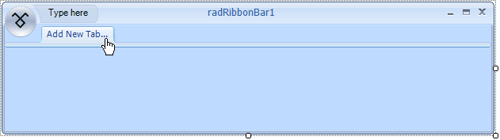
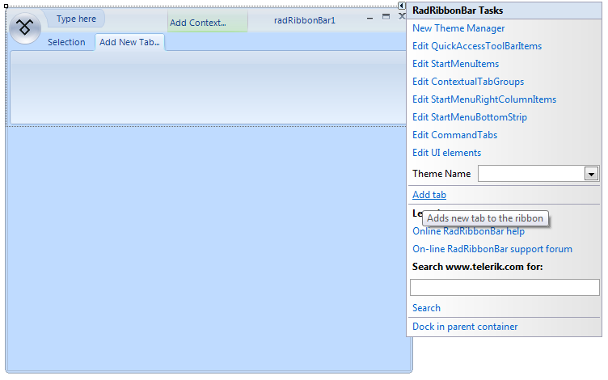
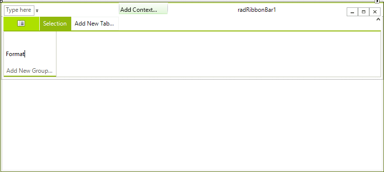
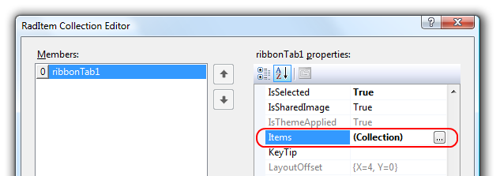
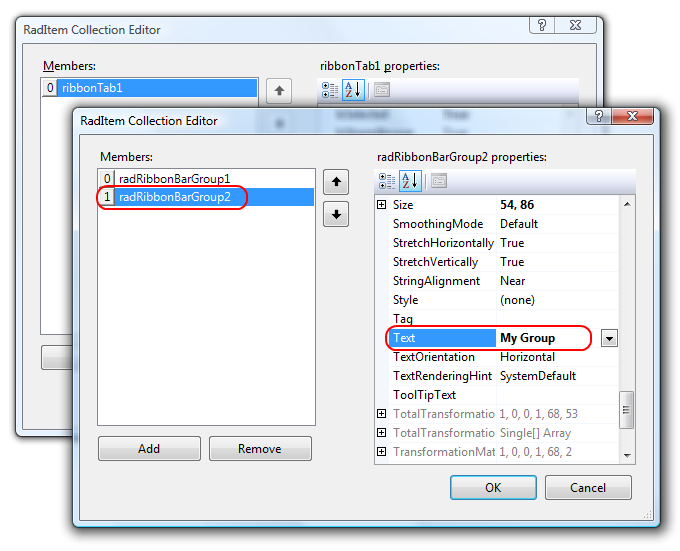

# Adding and Removing Tabs and RibbonBar Groups

## Adding and Removing Tabs and RibbonBar groups

When you are designing a new Telerik RadRibbonBar, one of your first tasks will be adding tabs and RibbonBar groups to the control. Tabs and RibbonBar groups will logically organize the functionality of your application.

## To Add Tabs to a Telerik RadRibbonBar

1. To add a new tab to a Telerik RadRibbonBar, drag a __RadRibbonBar__ control to a form in Visual Studio, and then click __Add New Tab__:  

1. This action will open a text box editor where you can type the name for your new tab:

1. After typing the text, press 'Enter' to confirm the creation of the tab:

You can also add tabs to the __RadRibbonBar__ by selecting __Add Tab__ from the __RadRibbonBar__ control's Smart Tag menu:

1. Display the Smart Tag menu by clicking the Smart Tag menu button located in the upper right corner of the __RadRibbonBar.__

1. On the Smart Tag menu, click __Add Tab__.  

1. Once you have added the tab, select the tab and set its __Text__ property to the desired name for the tab.

## To Remove a Tab from a Telerik RadRibbonBar

To remove a tab from a __RadRibbonBar__: Right-click on the tab, and then click __Delete__.

## To Add a RibbonBar group to a Tab

To add a new RibbonBar group to a tab, follow these steps:

1. Select a tab on the __RadRibbonBar__ control.

2. Click anywhere in the box labeled '__Add New Group...__' and type the name of the group:  

3. This action will create a new RibbonBar group with the desired name, add it to the group collection of the tab and outline it: 

You can also add RibbonBar groups to a tab using the collection editor:

1. On your form, select the __RadRibbonBar__.

2. In the Properties window, select the ribbon bar's __CommandTabs__ property and click the ellipsis button to open __RadRibbonBarCommandTab Collection Editor__.

3. In the Members box of the RadRibbonBarCommandTab Collection Editor, select the __RadRibbonBarCommandTab__ item that is associated with the tab to which you want to add the RibbonBar group. The image below shows the __RadRibbonBarCommandTab__ item for tabItem2 is selected.  

4. Select the __Items__ property of the __RadRibbonBarCommandTab____,__ and then click the ellipsis button to open the __RadItem Collection Editor__:  

5. In the RadItem Collection Editor, click __Add__ to add a RibbonBar group to the tab. After clicking the __Add__ button, a new __RadRibbonBarGroup__ appears in the Members box, as shown below:  

6. Set the __Text__ property to the desired name for the RibbonBar group. The image above shows the Text property set to RibbonBar group 1.

7. Click __OK__ to exit from the __RadItem Collection Editor__, and then click __OK__ to exit the  __RadRibbonBarCommandTab Collection Editor__ The image below shows the new RibbonBar group (with the caption, RibbonBar group 1) added to the __Second Tab__ tab.