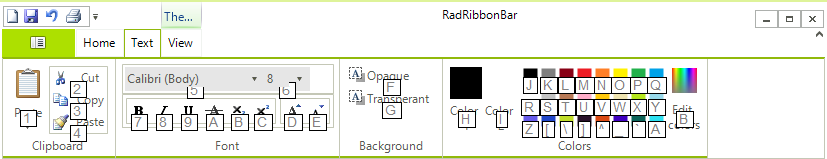

# Adding Key Tips

Key tips provide a way to add discoverable keyboard shortcuts to the items on the Telerik RadRibbonBar. Every element on the Telerik RadRibbonBar (including tabs, RadRibbonbar groups, buttons, and other elements), has a __KeyTip__ property. You can fill in these properties with letters or numbers to assign shortcut keys to the elements. When the user presses the __Alt__ key, the currently-available shortcuts are displayed in a hierarchical fashion until the user presses a key that triggers an action.

For example, when the user presses the __Alt__ key with the control on this Telerik RadRibbonBar, the top-level key tips are displayed:

Furthermore, pressing the __4__ key selects the __Write__tab and displays the key tips for the elements on that tab:

## 
