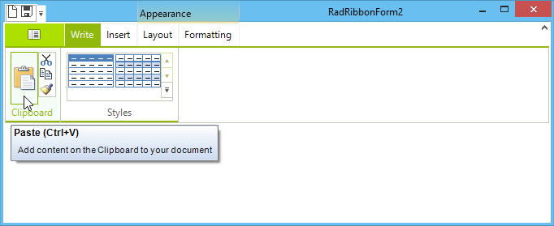

# Adding Screen Tips

Screen tips give you a mechanism to provide extended tooltips for any element within a Telerik RadRibbonBar.<br>

## Creating a Screen Tip

To create a screen tip, follow these steps:

1. Select an element on a RadRibbonBar control such as a RadButtonElement.

1. Click the drop-down arrow in the element's __ScreenTip__ property.

1. Select the __Telerik.WinControls.UI.RadOffice2007ScreenTipElement__ template.

1. Use the embedded property sheet to customize the screen tip.<br>

## Modifying a Screen Tip

To modify an existing screen tip, follow these steps:

1. Select the element whose screen tip you wish to customize.

1. Expand the __ScreenTip__ property.

1. Click the ellipsis button in the __TipItems__ collection.

1. Use the RadItems Collection Editor to change the properties of any part of the screen tip.<br>

## Adding Screen Tips Programmatically

There are several options for Office 2007-like screen tips we introduced in 2008 Q3 for your convenience.

To completely customize the screen tips appearance, its size, text wrapping, etc you may handle the ScreenTipNeeded event of any RadControl (RadRibbonBar, RadGridView, etc) and customize the screen tip provided by the event arguments, or even assign a new ScreenTip object to the corresponding item. 

## Using ScreenTipNeeded event(example 1):

#### Adding screen tips programatically

{{source=..\SamplesCS\RibbonBar\GettingStarted\AddingScreenTips.cs region=addingScreenTips}} 
{{source=..\SamplesVB\RibbonBar\GettingStarted\AddingScreenTips.vb region=addingScreenTips}} 

````C#
RadOffice2007ScreenTipElement screenTip = new RadOffice2007ScreenTipElement();
private void radGridView1_ScreenTipNeeded(object sender, Telerik.WinControls.ScreenTipNeededEventArgs e)
{
    GridDataCellElement cell = e.Item as GridDataCellElement;
    if (cell != null)
    {
        screenTip.MainTextLabel.Image = Image.FromFile("..\\..\\DataSources\\star.png");
        screenTip.MainTextLabel.Padding = new Padding(2);
        screenTip.CaptionLabel.Padding = new Padding(2);
        screenTip.CaptionLabel.Text = cell.ColumnInfo.HeaderText;
        screenTip.MainTextLabel.Text = cell.Text;
        //The following line indicates that Office 2007 UI complient screen tip sizing should not be used.
        screenTip.EnableCustomSize = true;
        cell.ScreenTip = this.screenTip;
    }
}

````
````VB.NET
Dim screenTip As New RadOffice2007ScreenTipElement
Private Sub RadGridView1_ScreenTipNeeded(ByVal sender As Object, ByVal e As Telerik.WinControls.ScreenTipNeededEventArgs) Handles RadGridView1.ScreenTipNeeded
    Dim cell As GridDataCellElement = TryCast(e.Item, GridDataCellElement)
    If Not cell Is Nothing Then
        screenTip.MainTextLabel.Image = Image.FromFile("..\\..\\DataSources\\star.png")
        screenTip.MainTextLabel.Padding = New Padding(2)
        screenTip.CaptionLabel.Padding = New Padding(2)
        screenTip.CaptionLabel.Text = cell.ColumnInfo.HeaderText
        screenTip.MainTextLabel.Text = cell.Text
        'The following line indicates that Office 2007 UI complient screen tip sizing should not be used.
        screenTip.EnableCustomSize = True
        cell.ScreenTip = Me.screenTip
    End If
End Sub

````

{{endregion}}

## Using ScreenTipNeeded event(example 2):

#### Modifing screen tips

{{source=..\SamplesCS\RibbonBar\GettingStarted\AddingScreenTips.cs region=usingScreenTipEventExample2}} 
{{source=..\SamplesVB\RibbonBar\GettingStarted\AddingScreenTips.vb region=usingScreenTipEventExample2}} 

````C#
private void radGridView1_ScreenTipNeeded2(object sender, Telerik.WinControls.ScreenTipNeededEventArgs e)
{
    RadOffice2007ScreenTipElement screenTip = e.Item.ScreenTip as RadOffice2007ScreenTipElement;
    if (screenTip != null)
    {
        //Enable Custom sizing - if AutoSize is true (by default) the screen tip will size according to MainTextLabel size
        screenTip.EnableCustomSize = true;
        //Optionally set auto-size to false to specify exact size parameters
        screenTip.AutoSize = false;
        screenTip.Size = new Size(200, 150);
        //optionally set the following properties to allow screen tip text to wrap
        screenTip.MainTextLabel.AutoSize = false;
        screenTip.MainTextLabel.AutoSizeMode = RadAutoSizeMode.FitToAvailableSize;
        screenTip.MainTextLabel.Size = new Size(200, 150);
        screenTip.MainTextLabel.TextWrap = true;
    }
}

````
````VB.NET
Sub radRibbonBar1_ScreenTipNeeded2(ByVal sender As Object, ByVal e As ScreenTipNeededEventArgs) Handles RadGridView1.ScreenTipNeeded
    Dim screenTip As RadOffice2007ScreenTipElement = TryCast(e.Item.ScreenTip, RadOffice2007ScreenTipElement)
    If screenTip IsNot Nothing Then
        'Enable Custom sizing - if AutoSize is true (by default) the screen tip will size according to MainTextLabel size
        screenTip.EnableCustomSize = True
        'Optionally set auto-size to false to specify exact size parameters
        screenTip.AutoSize = False
        screenTip.Size = New Size(200, 150)
        'optionally set the following properties to allow screen tip text to wrap
        screenTip.MainTextLabel.AutoSize = False
        screenTip.MainTextLabel.AutoSizeMode = RadAutoSizeMode.FitToAvailableSize
        screenTip.MainTextLabel.Size = New Size(200, 150)
        screenTip.MainTextLabel.TextWrap = True
    End If
End Sub

````

{{endregion}}

The code sample below adds screen tips to two button elements in the __RadRibbonBar__:

#### Adding screen tips to button elements

{{source=..\SamplesCS\RibbonBar\GettingStarted\AddingScreenTips.cs region=addScreenTipsToButtonElements}} 
{{source=..\SamplesVB\RibbonBar\GettingStarted\AddingScreenTips.vb region=addScreenTipsToButtonElements}} 

````C#
RadOffice2007ScreenTipElement tip1 = new RadOffice2007ScreenTipElement();
tip1.CaptionLabel.Text = "Button1";
tip1.MainTextLabel.Text = "My Text";
RadOffice2007ScreenTipElement tip2 = new RadOffice2007ScreenTipElement();
tip2.CaptionLabel.Text = "Button2";
tip2.MainTextLabel.Text = "My Text";
this.radButtonElement2.ScreenTip = tip1;
this.radButtonElement3.ScreenTip = tip2;

````
````VB.NET
Dim tip1 As New RadOffice2007ScreenTipElement()
tip1.CaptionLabel.Text = "Button1"
tip1.MainTextLabel.Text = "My Text"
Dim tip2 As New RadOffice2007ScreenTipElement()
tip2.CaptionLabel.Text = "Button2"
tip2.MainTextLabel.Text = "My Text"
Me.RadButtonElement2.ScreenTip = tip1
Me.RadButtonElement3.ScreenTip = tip2

````

{{endregion}}