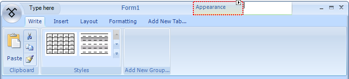
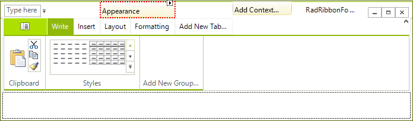

# Creating and Using Contextual Tab Groups

The __Contextual Tab Groups__ can be used to group tabs in a context and thus improve the usability of your UI.
      __Contextual Tab Groups__ can be easily added to the __RadRibbonBar__ either programmatically or in the Visual Studio designer. Tabs can be quickly associated with a __Contextual Tab Group__ with drag-and-drop in the Visual Studio designer.

This topic demonstrates how __Contextual Tab Groups__ are created and how tabs are associated with them.
      

## Creating a Contextual Tab Group and Associating Tabs with it

1. Add a __RadRibbonForm__ to your project by either changing the base class of an existing form to __RadRibbonForm__,
         or using the 'Add New Item...' dialog for your project.

2. Open the __RadRibbonForm__ designer and select the __RadRibbonBar__ control.

3. Create 4 tabs in the __RadRibbonBar__ with the following names: Write, Insert, Layout, Formatting

4. Create 2 __Contextual Tab Groups__ by clicking on 'Add Context...'. Call the __Contextual Tab Group__
        'Appearance' and press enter:

5. Drag and drop the __Formatting__  tab onto the __Appearance__group and do the same with the
        __Layout__tab:

The __Contextual Tab Group__ is positioned over both the __Formatting__and __Layout__tabs and sizes
    to fit the sum of the lengths of both tabs.

>note Tabs that are associated with a Contextual Tab Group are always positioned at the end of the TabStrip.
>

>note Contextual Tab Groups always extend to the sum of the lengths of the tabs associated with them.
>

