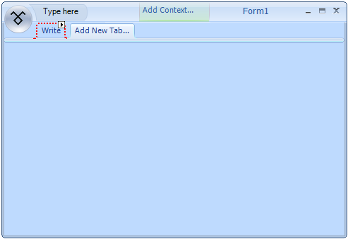
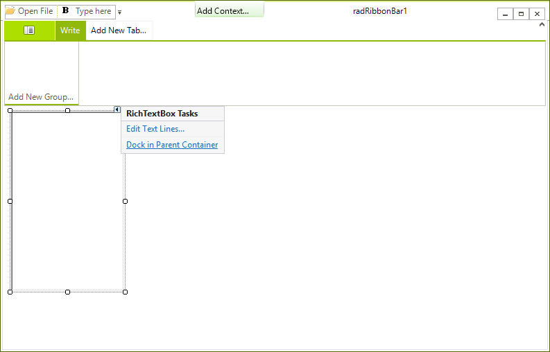
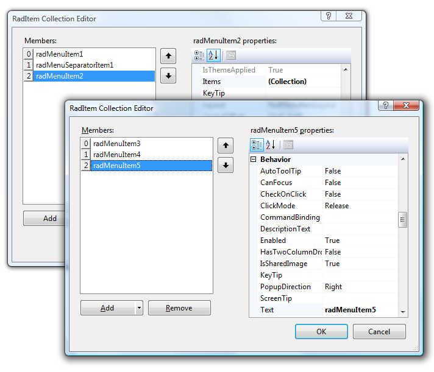
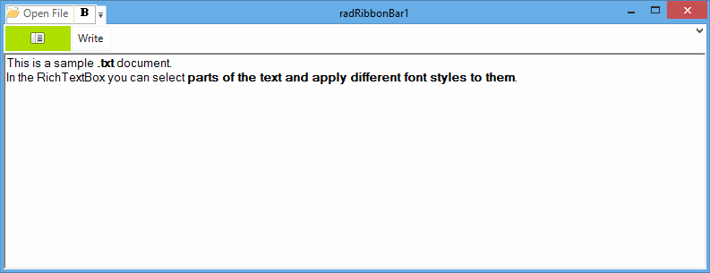

# Creating the Start Menu, Quick Access Toolbar, and Shortcuts

This tutorial is in three parts. First, you will create a Quick Access Toolbar with some functionality on a Telerik RadRibbonBar.
      Then, you will add a Start Menu to add more functionality. Last, you will create keyboard shortcuts to some of these functions.

## Add Quick Access Toolbar Items to a Telerik RadRibbonBar

## Prepare an ImageList to be Used in the Telerik RadRibbonBar

1. Drag a WinForms __ImageList__ component from the toolbox to the form.
            In the area below the design surface, you will see __imageList1__.

1. Using the Images Collection Editor, add the desired images to the __ImageList__.
            You can use the existing images, or any similar sized images or icons that you have available. For more help with this task, see[How to: Add or Remove ImageList Images with the Designer in the Visual Studio 2005](http://msdn2.microsoft.com/en-us/library/ms233674.aspx) documentation.

## Adding a Telerik RadRibbonBar

1. Create a __RadRibbonForm__by changing the base class of a standard form to __RadRibbonForm__ or by
            using the *Add New Item* dialog for your project:

1. Select the __RadRibbonBar__ control on the form and open the *Properties*
            window in Visual Studio. In the __Properties__ window find the __ImageList__
            property and from the drop-down menu select the __imageList1__ option.

## Adding Tabs to the Telerik RadRibbonBar

1. Click __Add New Tab...__ to create a new tab.

1. Type the word __Write__ and press __Enter__: 

## Add Items to the Quick Access Toolbar

1. Select the __RadRibbonBar__ control in the Visual Studio Designer.

1. Open the *Properties* window and locate the __QuickAccessToolbarItems__ property.

1. Open the Collection Editor for this collection.

1. On the __Add__ button, click the drop-down arrow and select __RadButtonElement__ from the list.

1. Repeat this step to add a __CommandBarSeparator__ and then another __RadButtonElement__.

## Set Properties of the RadButtonElements

1. In the __Members__ list, click __radButtonElement1__.

1. Locate its __DisplayStyle__ property, open its drop-down list, and select __Image__.

1. Locate the __ImageIndex__ property, open its drop-down list, 
            and select an image from those stored in the __imageList1__ component. Set the text of the element to 'Open File'.

1. In the Members list, click __radButtonElement2__.

1. Change its __DisplayStyle__ property to __Image__ and the __ImageIndex__ 
            property to an icon that represents Bold. Select the appropriate image from the Image List.

1. Click __OK__ to close the RadElement Collection Editor.

## Add a RichTextBox

1. Drag a standard WinForms __RichTextBox__ control onto the form.

1. Open the __Smart Tag__ of the control and execute the 'Dock in parent container' action.

## Add Code

1. Copy the following code to the code window of the form. The first method will run when clicking 
            the FileOpen Quick Access Menu item. The second method will run when the user clicks the Bold item.

#### __[C#] Open a text file and make its text bold__

{{source=..\SamplesCS\RibbonBar\GettingStarted\CreatingStartMenuQATAndShortcuts.cs region=OpenFileAndMakeTextBold}}
	        private void radButtonElement1_Click(object sender, EventArgs e)
	        {
	             OpenFileDialog dlg = new OpenFileDialog();
	               dlg.Filter = "*.txt,*.rtf|*.txt;*.rtf";
	               dlg.ShowDialog();
	               if (dlg.FileName != string.Empty)
	               {
	                   OpenFile(dlg.FileName);
	               }
	        }
	
	        private void OpenFile(string fname)
	        {
	            if (fname.EndsWith("txt"))
	            {
	                richTextBox1.LoadFile(fname, RichTextBoxStreamType.PlainText);
	            }
	            else
	            {
	                if (fname.EndsWith("rtf"))
	                {
	                    richTextBox1.LoadFile(fname, RichTextBoxStreamType.RichText);
	                }
	            }
	        }   
	
	        private void radButtonElement2_Click(object sender, EventArgs e)
	        {
	            if (richTextBox1.SelectionFont.Bold)
	            {
	                richTextBox1.SelectionFont = new Font(richTextBox1.SelectionFont, FontStyle.Regular);
	            }
	            else
	            {
	                richTextBox1.SelectionFont = new Font(richTextBox1.SelectionFont, FontStyle.Bold);
	            }
	        }
	{{endregion}}

#### __[VB.NET] Open a text file and make its text bold__

{{source=..\SamplesVB\RibbonBar\GettingStarted\CreatingStartMenuQATAndShortcuts.vb region=OpenFileAndMakeTextBold}}
	    Private Sub RadButtonElement1_Click(ByVal sender As System.Object, ByVal e As System.EventArgs) Handles RadButtonElement1.Click
	        Dim dlg As New OpenFileDialog
	        dlg.Filter = "*.txt,*.rtf|*.txt;*.rtf"
	        dlg.ShowDialog()
	        If dlg.FileName > "" Then
	            OpenFile(dlg.FileName)
	        End If
	    End Sub
	
	    Private Sub OpenFile(ByVal fname As String)
	        If fname.EndsWith("txt") Then
	            RichTextBox1.LoadFile(fname, RichTextBoxStreamType.PlainText)
	        ElseIf fname.EndsWith("rtf") Then
	            RichTextBox1.LoadFile(fname, RichTextBoxStreamType.RichText)
	        End If
	    End Sub
	
	    Private Sub RadButtonElement2_Click(ByVal sender As System.Object, ByVal e As System.EventArgs) Handles RadButtonElement2.Click
	        If RichTextBox1.SelectionFont.Bold Then
	            RichTextBox1.SelectionFont = New Font(RichTextBox1.SelectionFont, RichTextBox1.SelectionFont.Style And Not FontStyle.Bold)
	        Else
	            RichTextBox1.SelectionFont = New Font(RichTextBox1.SelectionFont, RichTextBox1.SelectionFont.Style Or FontStyle.Bold)
	        End If
	    End Sub
	{{endregion}}

In C#, it is necessary to connect the controls to the methods you have copied into the code:

1. Click __radButtonElement1__ (File Open button) on the form.

1. In the __Properties__ window, click the __Events__ icon.

1. Locate the __Click__ action.

1. Click the drop-down arrow and choose __radButtonElement1_Click__ from the list.

1. Change the Click action of __radButtonElement2__ (Bold button) to __radButtonElement2_Click__.

## Run the Form.

1. Press __F5__ to run the form.

1. Type some text into the __RichTextBox__ control, highlight it, 
            and click the __Bold__ Quick Access Menu item to toggle the font's bold property on and off.

1. Use the File Open icon on the Quick Access Menu to open a .txt file or an .rtf file into the __RichTextBox__.

## Add Start Menu Items to the Telerik RadRibbonBar

## Add a Start Button

1. Select the __RadRibbonBar__ control on your form.

1. Open the __Properties__ window in Visual Studio, locate the
            __StartButtonImage__ property, and open its editor.

1. In the __Select Resource__ dialog box select the __Local Resource__ option.

1. Click the __Import__ button.

1. Select a suitable image and click __Open__.

1. Click __OK__.

## Add Items to the Start Menu

1. Select the __RadRibbonBar__ control on your form and in the __Properties__window locate the __StartMenuItems__ property.

1. Open the Collection Editor for this property. 

1. On the Collection Editor form click the drop-down arrow next to the __Add__ button and
            select __RadMenuItem__ from the list.

1. Repeat this action to add a __RadMenuSeparatorItem__ and then another __RadMenuItem__.

1. Change the __DisplayStyle__ of __radMenuItem1__ to
            __Image__ and its __Text__ property to __Open File__.

1. Change the __ImageIndex__ of __radMenuItem1__ to match
            the image of the File Open item on the Quick Access Menu.

1. Change the __DisplayStyle__ of __radMenuItem2__ to
            __Text__ and its __Text__ property to __Recent Files__.

## Add a Sub-menu to radMenuItem2 (Recent Files Item)

1. Locate the __Items__ property of __radMenuItem2__.

1. Open the Collection Editor for this property.

1. Add three __RadMenuItem__'s and change their __DisplayStyle__
            property to __Text__. 

The sub-menu will display the three most recently used files.

1. Click __OK__ to close the Collection Editor for the sub-menu.

1. Click __OK__ to close the parent Collection Editor.

## Create Application Settings to Store the Most Recently Used Files

1. Right-click on the project in the Solution Explorer and choose __Properties__ from the bottom of the menu.

1. Click the __Settings__ tab to open the __Application Settings__ property page.

1. In the __Name__ field of the first row type __File1__, then tab to the next cell.
            A new row will be created.

1. Type __File2__ in the Name field of the second
            row and __File3__ in the Name field of the third row.

These settings will be used to keep track of the three most recent files a user has opened.

If you would like to learn more about Application Settings, follow the __Learn more about application settings...__ link on the page:
         
       
      

## Modify Existing Code

1. Replace the __OpenFile__ method with the following code:

#### __[C#] Modify the OpenFile method__

{{source=..\SamplesCS\RibbonBar\GettingStarted\CreatingStartMenuQATAndShortcuts.cs region=modifiedOpenFile}}
	        private void ModifiedOpenFile(string fname)
	        {
	            if (fname.EndsWith("txt"))
	            {
	                richTextBox1.LoadFile(fname, RichTextBoxStreamType.PlainText);
	                AddNewMostRecentFile(fname);
	            }
	            else
	            {
	                if (fname.EndsWith("rtf"))
	                {
	                    richTextBox1.LoadFile(fname, RichTextBoxStreamType.RichText);
	                    AddNewMostRecentFile(fname);
	                }
	            }
	        }
	{{endregion}}

#### __[VB.NET] Modify the OpenFile method__

{{source=..\SamplesVB\RibbonBar\GettingStarted\CreatingStartMenuQATAndShortcuts.vb region=modifiedOpenFile}}
	    Private Sub ModifiedOpenFile(ByVal fname As String)
	        If fname.EndsWith("txt") Then
	            RichTextBox1.LoadFile(fname, RichTextBoxStreamType.PlainText)
	            AddNewMostRecentFile(fname)
	        Else
	            If fname.EndsWith("rtf") Then
	                RichTextBox1.LoadFile(fname, RichTextBoxStreamType.RichText)
	                AddNewMostRecentFile(fname)
	            End If
	        End If
	    End Sub
	{{endregion}}

1. Add the __Click__ event of the File Open button (__radMenuItem1__) on the
            Start Menu to the event handler that is being used for the File Open button (__radButtonElement1__) on the Quick Access Menu.

In C#, do this in the property window.

1. Choose __radMenuItem1__ from the control list in the __Properties__ window.

1. Click the __Events__ icon .

1. Locate the __Click__ event and select __radButtonElement1_Click__ from its drop-down list.  
          

## Add Code for the Start Menu Items

Note that __OpenfromMRU__ method will respond to the user clicking any of the three items on the __Recent____Files__ sub-menu.
        

#### __[C#] Add most recent files functionality__

{{source=..\SamplesCS\RibbonBar\GettingStarted\CreatingStartMenuQATAndShortcuts.cs region=addMostRecentOpenedFiles}}
	        private void AddNewMostRecentFile(string newFile)
	        {
	            //last three files are stored in appliation settings: "File1","File2","File3" with File1 being the newest
	            //replace 3 with 2 and 2 with 1 and then add new to 1
	            Properties.Settings.Default.File3 = Properties.Settings.Default.File2;
	            Properties.Settings.Default.File2 = Properties.Settings.Default.File1;
	            Properties.Settings.Default.File1 = newFile;
	        }
	
	        private void radMenuItem1_Click(object sender, EventArgs e)
	        {
	            OpenFileDialog dlg = new OpenFileDialog();
	            dlg.Filter = "*.txt,*.rtf|*.txt;*.rtf";
	            dlg.ShowDialog();
	            if (dlg.FileName != string.Empty)
	            {
	                ModifiedOpenFile(dlg.FileName);
	            }
	        }
	
	        private void radMenuItem2_DropDownOpening(object sender, CancelEventArgs e)
	        {
	            //dynamically populate MRU File list
	            //this example is not concerned about duplicates
	            radMenuItem3.Text = Properties.Settings.Default.File1;
	            radMenuItem4.Text = Properties.Settings.Default.File2;
	            radMenuItem5.Text = Properties.Settings.Default.File3;
	        }
	
	        private void OpenfromMRU(object sender, EventArgs e)
	        {
	            Telerik.WinControls.UI.RadMenuItem filetoOpen = (Telerik.WinControls.UI.RadMenuItem)sender;
	            if (filetoOpen.Text != String.Empty)
	            {
	                ModifiedOpenFile(filetoOpen.Text);
	            }
	        }
	{{endregion}}

#### __[VB.NET] Add most recent files functionality__

{{source=..\SamplesVB\RibbonBar\GettingStarted\CreatingStartMenuQATAndShortcuts.vb region=addMostRecentOpenedFiles}}
	    Private Sub AddNewMostRecentFile(ByVal newFile As String)
	        'last three files are stored in appliation settings: "File1","File2","File3" with File1 being the newest
	        'replace 3 with 2 and 2 with 1 and then add new to 1
	        My.Settings.File3 = My.Settings.File2
	        My.Settings.File2 = My.Settings.File1
	        My.Settings.File1 = newFile
	    End Sub
	
	    Private Sub radMenuItem1_Click(ByVal sender As Object, ByVal e As EventArgs) Handles RadMenuItem1.Click
	        Dim dlg As New OpenFileDialog()
	        dlg.Filter = "*.txt,*.rtf|*.txt;*.rtf"
	        dlg.ShowDialog()
	        If dlg.FileName <> String.Empty Then
	            ModifiedOpenFile(dlg.FileName)
	        End If
	    End Sub
	
	    Private Sub radMenuItem2_DropDownOpening(ByVal sender As Object, ByVal e As CancelEventArgs) Handles RadMenuItem2.DropDownOpening
	        'dynamically populate MRU File list
	        'this example is not concerned about duplicates
	        RadMenuItem3.Text = My.Settings.File1
	        RadMenuItem4.Text = My.Settings.File2
	        RadMenuItem5.Text = My.Settings.File3
	    End Sub
	
	    Private Sub OpenfromMRU(ByVal sender As Object, ByVal e As EventArgs) Handles RadMenuItem5.Click, RadMenuItem4.Click, RadMenuItem3.Click
	        Dim filetoOpen As Telerik.WinControls.UI.RadMenuItem = DirectCast(sender, Telerik.WinControls.UI.RadMenuItem)
	        If filetoOpen.Text <> [String].Empty Then
	            ModifiedOpenFile(filetoOpen.Text)
	        End If
	    End Sub
	{{endregion}}

In C#, it is necessary to connect these methods to the control events:

1. Choose __radMenuItem1__ from the control list in the __Properties__ window.

1. Click the __Events__ icon .

1. Locate the __Click__ event and select __radMenuItem2_DropDownOpening__ from its drop-down list.

1. Choose __radMenuItem3__.

1. Change its __Click__ event to __OpenfromMRU__.

1. Change the __Click__ events for __radMenuItem4__ and __radMenuItem5__
            to __OpenfromMRU__.

##  Run the Form

## Add Shortcuts to Telerik RadRibbonBar Items

## Create a Shortcut for the File Open and Bold functions

The shorcut assignments is pretty simple. Just switch to the Code View of the fold
        and add shortcuts to the appropriate RadMenuItem by calling the Add method of their Shortcuts property.
        You should pass a new instance of the RadShortcut type giving the keys that will trigger the shortcut:

#### __[C#] Add most recent files functionality__

{{source=..\SamplesCS\RibbonBar\GettingStarted\CreatingStartMenuQATAndShortcuts.cs region=shortcuts}}
	            radMenuItem1.Shortcuts.Add(new Telerik.WinControls.RadShortcut(Keys.Control, Keys.O));
	            radMenuItem2.Shortcuts.Add(new Telerik.WinControls.RadShortcut(Keys.Control, Keys.B));
	{{endregion}}

#### __[VB.NET] Add most recent files functionality__

{{source=..\SamplesVB\RibbonBar\GettingStarted\CreatingStartMenuQATAndShortcuts.vb region=shortcuts}}
	        RadMenuItem1.Shortcuts.Add(New Telerik.WinControls.RadShortcut(Keys.Control, Keys.O))
	        RadMenuItem2.Shortcuts.Add(New Telerik.WinControls.RadShortcut(Keys.Control, Keys.B))
	{{endregion}}

## Run the Form

1. Press __F5__ to run the form.

1. Try out the new __Ctrl+O__ and __Ctrl+B__ keyboard shortcuts.

