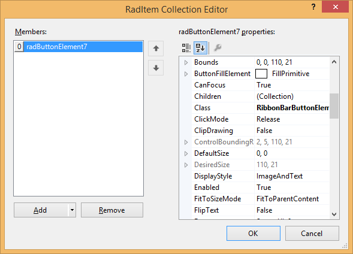

# Customizing the Quick Access Toolbar

The Quick Access Toolbar is an area at the top of the Telerik RadRibbonBar, above the tabs:

The Quick Access Toolbar can contain the same elements as the [RadMenu]():

* Menu items, displayed as either images, text, or both

* Combo boxes

* Custom items

* Separators

## Adding Items to the Quick Access Toolbar

To add an item to the Quick Access Toolbar, follow these steps:

1. Select the __RadRibbonBar__ control.

1. Open the Smart Tag menu.

1. Click the __Edit QuickAccessToolbarItems__ task. Alternatively, you can click in the  __QuickAccessToolbarItems__ property, and then click the ellipsis button.

1. In the RadElement Collection Editor dialog box, click the drop-down arrow next to the Add button to select the type of element you wish to add to the Quick Access Toolbar. 

1. Use the Properties window in the RadElement Collection Editor dialog box to set the properties of the new Quick Access Toolbar item. 

1. Repeat steps 3 and 4 to add additional Quick Access Toolbar items.

1. Click __OK__.

## Removing Items from the Quick Access Toolbar

To remove an item from the Quick Access Toolbar, follow these steps:

1. Select the __RadRibbonBar__ control.

1. Click in the __QuickAccessToolbarItems__ property, and then click the ellipsis button.

1. In the RadElement Collection Editor dialog box, select the Quick Access Menu item that you wish to remove.

1. Click __Remove__.

1. Click __OK__.

## To Handle Quick Access Toolbar Item Events

To handle events from a Quick Access Toolbar item, follow these steps:

1. Select the Quick Access Toolbar item in the selected control combo box at the top of the Visual Studio Properties window.

1. Click the events toolbar button.

1. Double-click the appropriate event to generate an event handler. Normally this event will be the __Click__ event.