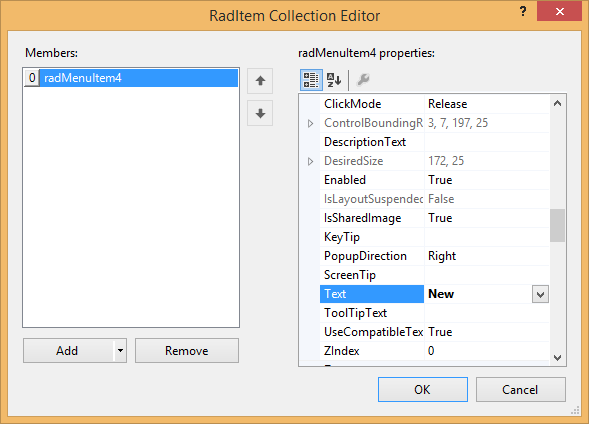

# Customizing the Start Menu

The Start Menu is a menu that is displayed when you click on the Office Button in the upper left corner of the Telerik RadRibbonBar:

The Start Menu can contain the same elements as the [RadMenu]():
      

* Menu items, displayed as either images, text, or both 

* Combo boxes 

* Custom items

* Separators

In addition, items on the Start menu can be arranged in two columns. 

## Adding Items to the Start Menu

To add an item to the Start Menu, follow these steps:

1. Select the __RadRibbonBar__ control.

1. Select the Smart Tags menu, click the __Edit StartMenuItems__ task to edit the items in the left column of the Start Menu,
            or click the __Edit StartMenuRightColumnItems__ task to edit the items in the right column of the Start Menu.

1. In the RadElement Collection Editor dialog box, click the drop-down arrow next to the Add button to select
            the type of element you wish to add to the Start Menu.

1. In the RadElement Collection Editor dialog box use the Properties window to set the properties of the new Start Menu item.

1. Repeat steps 3 and 4 to add additional Start Menu items.

1. Click __OK__. 

## 

## 

## Removing Items from the Start Menu

To remove an item from the Start Menu, follow these steps:

1. Select the __RadRibbonBar__ control.

1. Click in the __StartMenuItems__ property or the __StartMenuRightColumnItems__
            property, and then click the ellipsis button. 

1. In the RadElement Collection Editor dialog box, select the Start Menu item that you wish to remove.

1. Click __Remove__. 

1. Click __OK__.

## To Handle Start Menu Item Events

To handle events from a Start Menu item, follow these steps:

1. Select the Start Menu item in the selected control combo box at the top of the Visual Studio Properties window.

1. Click the events toolbar button.

1. Double-click the appropriate event to generate an event handler. Normally this event will be the __Click__ event. 

## 

## Setting an Image to the RadRibbonBar Start Menu

You can easily set an Image to the __RadRibbonBar__ Start Menu by accessing the __StartButtonImage__property of the __RadRibbonBar__control:

#### __[C#] Set RibbonBar start button image__

{{source=..\SamplesCS\RibbonBar\GettingStarted\CustomizingTheStartMenu.cs region=StartButtonImage}}
	            this.radRibbonBar1.StartButtonImage = startMenuButtonImage;
	{{endregion}}

#### __[VB.NET] Set RibbonBar start button image__

{{source=..\SamplesVB\RibbonBar\GettingStarted\CustomizingTheStartMenu.vb region=StartButtonImage}}
	        Me.RadRibbonBar1.StartButtonImage = startMenuButtonImage
	{{endregion}}

>The size of the RadRibbonBar Start Button will be automatically adjusted to fit the size of the image set. Unappropriate image sizes might lead to undesired visual appearance of the button.
