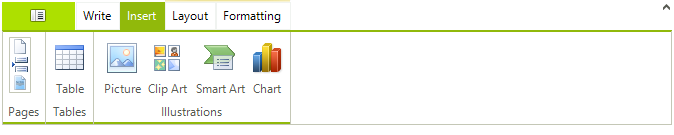

# Using Large and Small Images

Elements on a Telerik RadRibbonBar (such as buttons, check boxes, and repeat buttons) can each be assigned two images. In addition to the regular set of image properties (__Image__, __ImageIndex__, and __ImageKey__), there is a second set of image properties (__SmallImage__, __SmallImageIndex__, and __SmallImageKey__) that are used to designate an alternative, small, image for the element. This small image is only displayed when the user resizes the form on which the Telerik RadRibbonBar is displayed and using small images enables the control to display more elements.

For example, here is a Telerik RadRibbonBar control with adequate space to display all of its default images:

As the user resizes the form containing the control, the labels in the __Text__ group are first eliminated to save space:

Continued resizing switches the elements in the __Illustrations__ group from their large images to their small images (in addition to eliminating their labels):

## 
