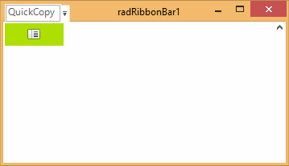

# Set RadRibbonBar in titlebar mode

## 

In order to remove the tabstrip part of RadRibbonBar and leave only the titlebar part visible (together with the Start button, and QuickAccess menu), you need to set the following properties:

#### __[C#] Set the RibbonBar in TitleBar mode__

{{region setRadRibbonBarInTitleBarMode}}
	            this.radRibbonBar1.RibbonBarElement.TabStripElement.Visibility = Telerik.WinControls.ElementVisibility.Collapsed;
	            this.radRibbonBar1.StartButtonImage = new Bitmap(this.radRibbonBar1.StartButtonImage, new Size(15, 15));
	{{endregion}}

#### __[VB.NET] Set the RibbonBar in TitleBar mode__

{{region setRadRibbonBarInTitleBarMode}}
	        Me.RadRibbonBar1.RibbonBarElement.TabStripElement.Visibility = Telerik.WinControls.ElementVisibility.Collapsed
	        Me.RadRibbonBar1.StartButtonImage = New Bitmap(Me.RadRibbonBar1.StartButtonImage, New Size(15, 15))
	{{endregion}}

The result is shown on the screenshot below:
