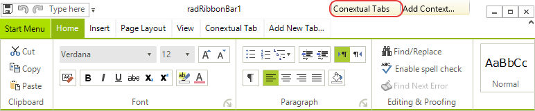
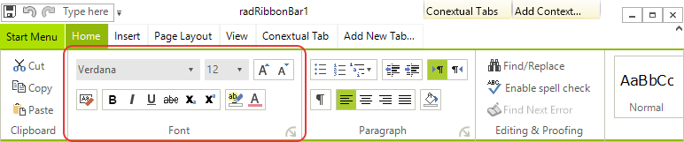
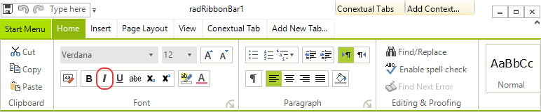

# Structure of RadRibbonBar

This article describes the inner structure and organization of the elements which build the __RadRibbonBar__ control.

## Element Hierarchy

__RadRibbonBar__ is a complex control. In order to customize the styles that determine the display of this control, you need to know its structure. Here is a brief explanation of some of the elements in the tree.

This image shows the __RadRibbonBar__ control element structure as displayed by the [Element Hierarchy Editor]():

>caption Figure 1: RadRibbonBar`s Element Hierarchy

* __RadRibbonBarElement__: Represents the entire RadRibbonBar. Any setting at this level are inherited by the elements down in the tree.

* The __RadQuickAccessToolbar__: Represents the Quick Access Toolbar and any settings made to this element and its child nodes reflect on the visual appearance of the element. 

* __RadRibbonBarCaption__: Contains the minimize, maximize and close buttons.

* __RadItem__: Contains the RadTabStripElement used in RadRibbonBar.

* __RadApplicationMenuButtonElement__: The button element of the application drop-down menu.

* The __RadMDIControlsItem__: Represents the system buttons displayed when a MDI child is maximized in a Form which contains a __RadRibbonBar__ control.

* The __RibbonBarCaptionFillPrimitive__: Represents the background fill of the RibbonBar's caption (title bar).

* The __RadImageButtonElement__: Node represents the Help button which may be shown next to the MDI System Buttons

You can add a variety of constituent controls to customize the Telerik __RadRibbonBar__.

## Quick Access Toolbar

The Quick Access Toolbar is an area at the top of the Telerik RadRibbonBar, above the tabs:

The Quick Access Toolbar can contain the same elements as the [RadMenu]():

* Menu items, displayed as either images, text, or both 

* Combo boxes

* Custom items

* Separators

## Start Menu

The Start Menu is a menu that is displayed when you click on the Office Button in the upper left corner of the Telerik RadRibbonBar:

The Start Menu includes two columns of items, each of which can contain the same elements as the [RadMenu]():

* Menu items, displayed as either images, text, or both

* Combo boxes

* Custom items

* Separators

## Tabs

The tabs are the first level of organization of the main part of the Telerik __RadRibbonBar__. Tabs are typically used to split the functionality of an application into major areas.

The drop-down arrow to the right of the tabs opens a menu listing all of the tabs on the Telerik RadRibbonBar. Selecting a tab from the menu makes it the active tab.

## Contextual Tabs Groups

Contextual Tab Groups provide a way to organize related tabs. They are often used to group tabs that apply to a specific object in your application.

In the screenshot above, __Appearance__ and __Data__ are contextual tab groups. Their width indicates the tabs that they contain, so that the __Appearance__ contextual tab group includes the __Formatting__ and __Layout__ tabs, and the __Data__ contextual tab group includes the __Spelling__ and __Insert__ tabs. Color is also used to unify a contextual tab group with its contained __Ribbon Bar Groups__. The tabs that belong to contextual tab groups are always placed to the right of other tabs on the Telerik __RadRibbonBar__.

## Ribbon Bar Groups

Each tab hosts one or more groups. A group is a container for the other containers and individual functional elements. __Ribbon Bar Groups__ can individually collapse if there is not enough room to display all of them.

In the screenshot above, Clipboard, Font, and Paragraph are __Ribbon Bar Groups__ placed on the Write tab.

## Button Groups

__Ribbon Bar Groups__ may (but are not required to) contain one or more button groups. A button group is a container that can contain other nested button groups or individual functional elements. Button groups can be oriented horizontally (containing a horizontal row of elements) or vertically (containing a vertical column of elements).

## Elements

Elements are the individual functional pieces of the Telerik RadRibbonBar. Elements can be contained directly within __Ribbon Bar Groups__ or within button groups. __Ribbon Bar Groups__ and button groups can contain a variety of elements:

* Button elements, displayed as either images, text, or both

* Drop-down button elements 

* Split button elements

* Repeat button elements

* Toggle button elements

* Check box elements

## Galleries

A gallery is a special type of element that is designed to allow the user to select visually from among a number of choices. A gallery may be displayed in either collapsed or expanded view.

In its default collapsed view, a gallery shows a single row of choices, as well as up and down arrows for scrolling to other rows of choices and a drop-down arrow for switching to expanded view.

In its expanded view, a gallery shows all of its choices at one time, a filter selection bar at the top, and tools at the bottom.

## See Also

* [Design Time]()
* [Structure]()
* [Getting Started]()