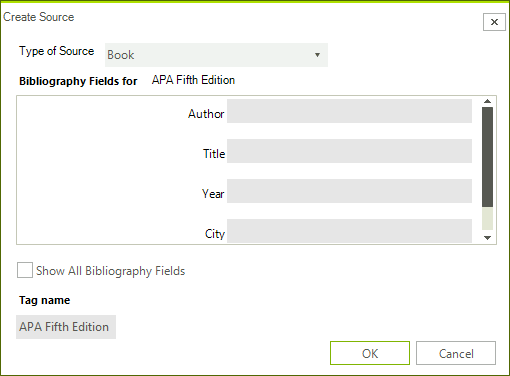
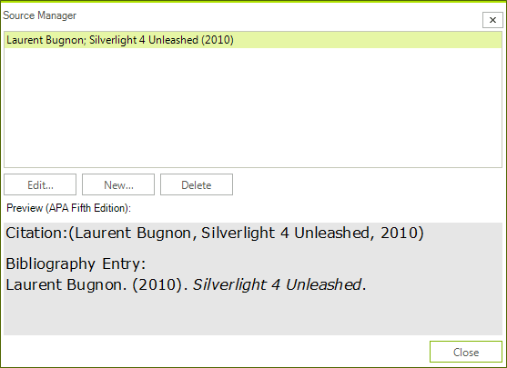
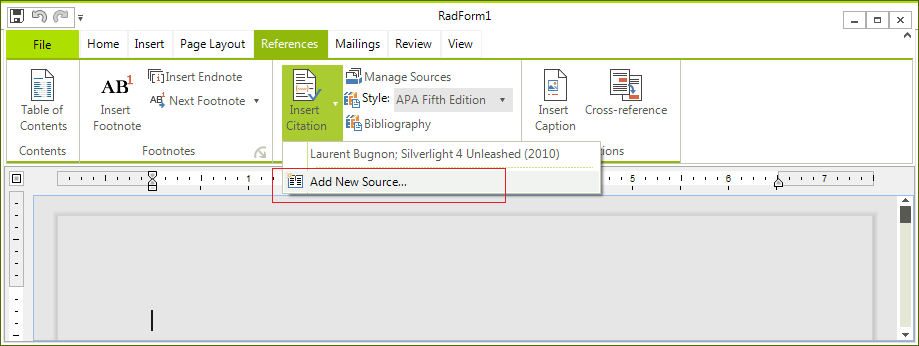

# Bibliographic References


Bibliographic references represent links (in the form of text) to documents, books, films and everything that can be cited in a Word document. You can manage those in __RadRichTextEditor__ by going to References -> Citations & Bibliography. It looks like this:


This article covers:

* [Add Bibliographic Reference](#add-bibliographic-reference)

* [User Interface](#user-interface)

* [Using Bibliographic References API](#using-bibliographic-references-api)

## Add Bibliographic Reference

The two main parts of Bibliographic References are:

### Source

This is what describes the source you want to refer. We named the class representing a source __BibliographicSource__. It has a number of properties:
            

* __Type of Source__ – there is a predefined list of available types (Book, Book Section, Journal Article, Conference Proceeding, etc.). You have to choose the type of your source (for example if you quote a line from a movie you can choose type "Film", etc).
                

* __TagName__ – this is the unique identifier of the Source. Every source has to have a unique TagName. You will be prompted if you try to enter a duplicate.
                

* __All other fields__ – there are a number of Fields that an object of type __BibliographicSource__ possesses like Author,Title, Year, City, etc. Those properties are a lot and we won’t enumerate them all now, but you have to know that every type of source includes some subset of those properties. When you open the __AddNewBibliographicSourceDialog__, upon changing the type only the necessary properties will be shown. The dialog looks like this:



### Style

This is how the source is represented when inserted in the document. There are a number of predefined styles in Word. We support 3 for now – APA Fifth Edition, Harvard – Anglia 2008 and ISO 690 – First Element and Date. The name of the class we use to describe a style is called __BibliographicReferenceStyleBase__. Every style should derive from this abstract class and implement the methods needed to function properly. Those methods are:
            

* Properties __Key__ and __Name__ – the key is used to uniquely identify the style in the document and the Name is what is displayed in the drop down.
              

* __Get{Type}Citation()__  method -  there is such method for every __SourceType__. It returns string and describes how the citation looks like according to this Style.
              

* __Get{Type}BibliographyRecord()__ – there is such method for every __SourceType__. It returns object of type __Telerik.Windows.Documents.Model.Paragraph__ and describes how the entry should look like in the Bibliography.
              

## User Interface

You already saw how the __AddNewBibliographicSourceDialog__ looks like. It is used to insert a new Source. After you have inserted all the sources you need, you can manage them through the __ManageBibliographicSourcesDialog__. It looks like so:



As you can see you can edit an existing source, delete an existing source or create a new one.

You can insert a bibliography on the caret position using the following button:


When you click on the "Insert Citation" drop down button you will get a list with all the available sources. Clicking on one will insert a Citation in the document. At the bottom there is another button that allows you to create new __BibliographicSource__ object (it shows the __AddNewBibliographicSource__ dialog):
 

## Using Bibliographic References API

Everything that we can do using UI, we can do in code behind too. All sources reside in __RadDocument.BibliographicSources__ collection. It is of type __ObservableCollection<BibliographicSource>__. What you have to do in order to insert a source is to create an object of the proper type and add it to the collection. The UI will be updated accordingly. This is true for updating and removing sources as well.
        
This is how you can add a new source:

{{source=..\SamplesCS\RichTextEditor\Features\BibliographicReferences.cs region=init}} 
{{source=..\SamplesVB\RichTextEditor\Features\BibliographicReferences.vb region=init}} 

````C#
            BibliographicSource bibliographicSource = new BibliographicSource("test");
            bibliographicSource.Author = "authorTest";
            bibliographicSource.Title = "titleTest";
            bibliographicSource.Editor = "editorTest";
            bibliographicSource.SourceType = BibliographicSourceType.Book;
            this.radRichTextEditor1.Document.BibliographicSources.Add(bibliographicSource);
````
````VB.NET
        Dim bibliographicSource As New BibliographicSource("test")
        bibliographicSource.Author = "authorTest"
        bibliographicSource.Title = "titleTest"
        bibliographicSource.Editor = "editorTest"
        bibliographicSource.SourceType = BibliographicSourceType.Book
        Me.radRichTextEditor1.Document.BibliographicSources.Add(bibliographicSource)
        '
````

{{endregion}} 


To create a custom __BibliographicStyle__ you have to derive from __BibliographicReferenceStyleBase__ and  add the style to the document so it can be usable. All styles are kept in a dictionary that matches a string to a  __BibliographicReferenceStyleBase__ object. Usually the string is the key of the particular style. Adding style is as easy as:


{{source=..\SamplesCS\RichTextEditor\Features\BibliographicReferences.cs region=add}} 
{{source=..\SamplesVB\RichTextEditor\Features\BibliographicReferences.vb region=add}} 

````C#
            APAFifthEditionStyle APAFifthEdition = new APAFifthEditionStyle();
            this.radRichTextEditor1.Document.BibliographicStyles.Add(APAFifthEdition.Key, APAFifthEdition);

            HarvardAnglia2008Style HarvardAnglia2008 = new HarvardAnglia2008Style();
            this.radRichTextEditor1.Document.BibliographicStyles.Add(HarvardAnglia2008.Key, HarvardAnglia2008);

            ISO690_FirstElementAndDateStyle ISO690_FirstElementAndDate =
            new ISO690_FirstElementAndDateStyle();
            this.radRichTextEditor1.Document.BibliographicStyles.Add(ISO690_FirstElementAndDate.Key,
            ISO690_FirstElementAndDate);
````
````VB.NET
        Dim APAFifthEdition As New APAFifthEditionStyle()
        Me.radRichTextEditor1.Document.BibliographicStyles.Add(APAFifthEdition.Key, APAFifthEdition)

        Dim HarvardAnglia2008 As New HarvardAnglia2008Style()
        Me.radRichTextEditor1.Document.BibliographicStyles.Add(HarvardAnglia2008.Key, HarvardAnglia2008)

        Dim ISO690_FirstElementAndDate As New ISO690_FirstElementAndDateStyle()
        Me.radRichTextEditor1.Document.BibliographicStyles.Add(ISO690_FirstElementAndDate.Key, ISO690_FirstElementAndDate)
        '
````

{{endregion}} 


Insert Citation Field using code behind

The Citation field is a field not different from every other field. You can use the __InsertFIeld()__ method of  __RadDocument__ to insert a citation:

{{source=..\SamplesCS\RichTextEditor\Features\BibliographicReferences.cs region=citation}} 
{{source=..\SamplesVB\RichTextEditor\Features\BibliographicReferences.vb region=citation}} 

````C#
            CitationField citationField = new CitationField();
            citationField.SourceName = "test";
            this.radRichTextEditor1.Document.InsertField(citationField, FieldDisplayMode.Result);
````
````VB.NET
        Dim citationField As New CitationField()
        citationField.SourceName = "test"
        Me.radRichTextEditor1.Document.InsertField(citationField, FieldDisplayMode.Result)
        '
````

{{endregion}} 


Insert Bibliography Field using code behind

The Bibliography field is a field not different from every other field. You can use the __InsertFIeld()__ method of
 __RadDocument__ to insert a citation:


{{source=..\SamplesCS\RichTextEditor\Features\BibliographicReferences.cs region=bibliography}} 
{{source=..\SamplesVB\RichTextEditor\Features\BibliographicReferences.vb region=bibliography}} 

````C#
            BibliographyField bibliographyField = new BibliographyField();
            this.radRichTextEditor1.Document.InsertField(bibliographyField, FieldDisplayMode.Result);
````
````VB.NET
        Dim bibliographyField As New BibliographyField()
        Me.radRichTextEditor1.Document.InsertField(bibliographyField, FieldDisplayMode.Result)
        '
````

{{endregion}} 


Changing Bibliographic Style using code behind

There is a method called __ChangeBibliographicStyle()__ on __RadRichTextEditor__. It accepts one argument of type __BibliographicReferenceStyleBase__. Changing the current style is as simple as:


{{source=..\SamplesCS\RichTextEditor\Features\BibliographicReferences.cs region=style}} 
{{source=..\SamplesVB\RichTextEditor\Features\BibliographicReferences.vb region=style}} 

````C#
            this.radRichTextEditor1.ChangeBibliographicStyle(new HarvardAnglia2008Style());
````
````VB.NET
        Me.radRichTextEditor1.ChangeBibliographicStyle(New HarvardAnglia2008Style())
        '
````

{{endregion}} 


