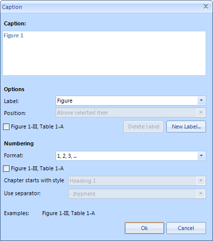
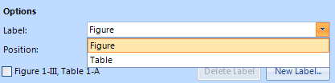
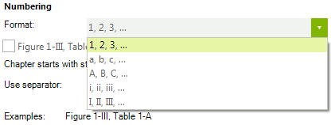
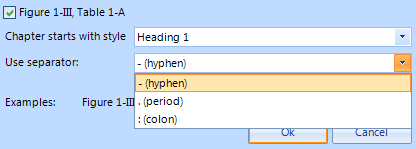

# Captions for tables and Figures


In __Telerik's RadRichTextEditor__ you can easily insert images, tables, etc. Now it is possible to label these by inserting __captions__. This will help you define an image or a table and then refer to it later.
      

## Insert Caption

You can open the __Caption__ window by clicking on the __Caption__ button.

 

If the caret is inside a table, the dialog would look like this:



### Caption Preview

On the top there is a preview of the caption text that would be inserted. In this case we haven’t inserted any other captions with label  "Table" so the number that follows is 1. That number represents the number of captions inserted before that one with the same label.

### Options

You can select different options. The first one is __Label__. From here you can select the label text. By default you have  two options – __Figure__ and __Table__.



You can also specify the __Position__ of the caption - __Above selected item__ or __Below  selected item__

We will have this option only if the caret is in a table or on an image. Otherwise it will be disabled.

### Creating and deleting labels

You can add new labels by using the __New Label…__ dialog and of course delete old ones with the __Delete Label__ button.


>note You cannot delete the two default labels - __Figure__ and __Table__ 
>

When __Exclude label from caption__ checkbox is checked the label text will be removed and only the number will be left.

### Format

You can control how the numbering is displayed by using the __Format__ ComboBox. You can see the available formats in the  picture below. By default the (“1, 2, 3, …”) format is selected.

 

### Include chapter number

When the __Include chapter number__ checkbox is checked, every time you insert a __Caption__ in a new section, the numbering is restarted. That’s why the preview now looks like this:


The first number shows the bullet of the section you are currently in, and the second number shows the number of __Captions__ being inserted in this section.
            

A section is defined by the __Heading__ styles, but only when they are in a list. You can choose which __Heading__ style the chapter starts from and what separator to use. There are several available separators   – __hyphen__, __period__, __colon__.



### Insert

Clicking on the __OK__ button will insert the __Caption__. It would look like this:


Here the __Below selected item__ position is chosen, __:__ for separator and __A, B, C…__ for formatting.

## Inserting a Caption using RadRichTextEditor's API

Using Telerik's rich text editor's API is pretty straight forward. There is a method called __InsertCaption()__ on __RadRichTextEditor__ which you can use to insert a new __Caption__ into the document with a custom label.
        

The __CaptionDefinition__ class contains viable information for the creation of the caption like  __Label__, __NumberingFormat__ and __SeparatorType__. The "caption"  parameter is of type string and represents the text in the caption that will be inserted after the number (also known as caption text). The "includeLabel" parameter is of type Boolean and if true will include the label text to the caption. The "insertBelow" parameter is of type Boolean as well and if true will insert the caption below the table or figure. So, in order to insert a caption using this method you would do something like:

{{source=..\SamplesCS\RichTextEditor\Features\Caption.cs region=insert1}} 
{{source=..\SamplesVB\RichTextEditor\Features\Caption.vb region=insert1}} 

````C#
CaptionDefinition captionDefinition = new CaptionDefinition();
captionDefinition.Label = "testLabel";
captionDefinition.NumberingFormat = NumberingFormat.Arabic;
captionDefinition.SeparatorType = CaptionSeparatorType.Colon;
this.radRichTextEditor1.InsertCaption(captionDefinition, "captionText", true, true);

````
````VB.NET
Dim captionDefinition As New CaptionDefinition()
captionDefinition.Label = "testLabel"
captionDefinition.NumberingFormat = NumberingFormat.Arabic
captionDefinition.SeparatorType = CaptionSeparatorType.Colon
Me.radRichTextEditor1.InsertCaption(captionDefinition, "captionText", True, True)

````

{{endregion}}

The __RadDocument__ contains the two default __CaptionDefinitions__ by default. They reside in a collection called "CaptionDefinitions" which is of type Dictionary<string, CaptionDefinition>. If you want to insert a caption of a default type, you can do as follow:


{{source=..\SamplesCS\RichTextEditor\Features\Caption.cs region=insert2}} 
{{source=..\SamplesVB\RichTextEditor\Features\Caption.vb region=insert2}} 

````C#
this.radRichTextEditor1.InsertCaption(this.radRichTextEditor1.Document.CaptionDefinitions["Table"], "captionText", true, true);

````
````VB.NET
Me.radRichTextEditor1.InsertCaption(Me.radRichTextEditor1.Document.CaptionDefinitions("Table"), "captionText", True, True)

````

{{endregion}} 

This code will insert a default caption with label __Table__.
        
