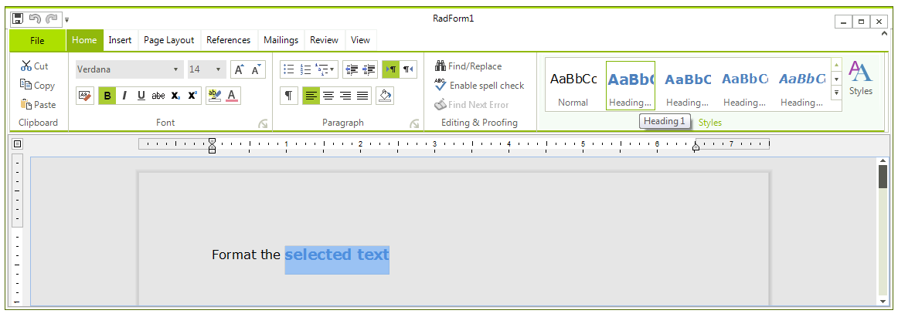
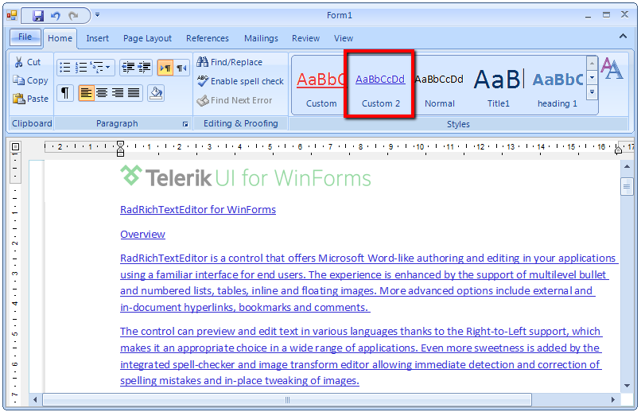
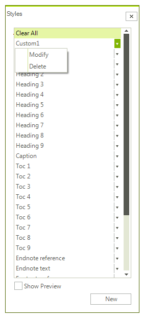
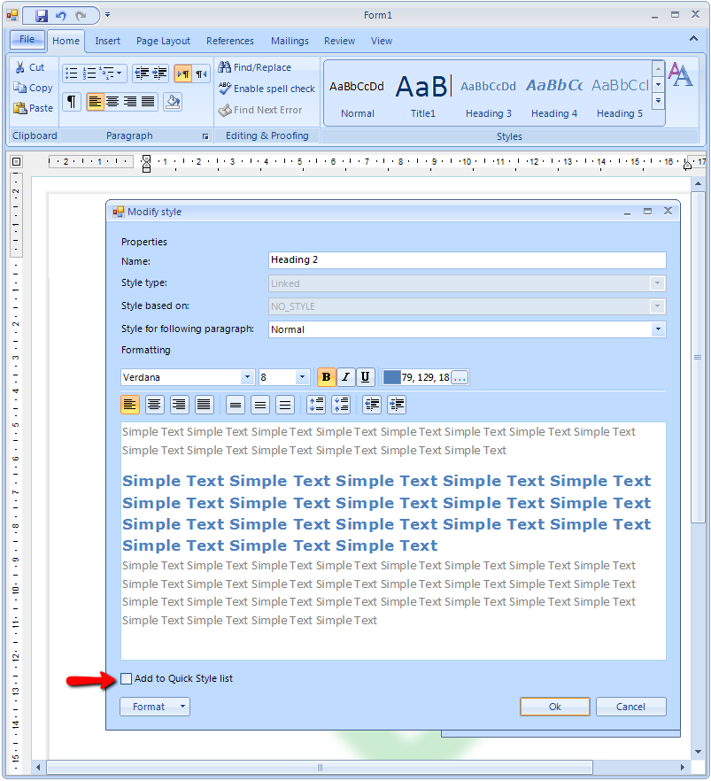

# Applying Styles

The topic explains how to apply, add, modify and delete styles using the predefined UI of RadRichTextEditor.

* [Apply Style](#apply-style)

* [Add Style](#add-style)

* [Modify Style](#modify-style)

* [Delete Style](#delete-style)

## Apply Style

Applying a Style from the Quick Styles gallery is easy and intuitive. The only thing you should consider is where the caret is located.
   
In the image above the firs paragraph has style applied only to part of the text - the selection. The rest of the text has the default *Normal* style.
   
As opposed to that, positioning the caret somewhere in the paragraph will style it. 
  
It is also possible to apply a style using the Styles dialog as shown in the picture below.

## Add Style

Other than using the API to declare a style, you can also use the UI.

>tip More info on how to create a style from code can be found in the [Styles article]()
>

Clicking the *New* button on the Styles dialog invokes the __Create new style from formatting__ dialog where you can specify the properties of the new style:
        

* __Name__ - corresponding to the Name property of the StyleDefinition;
            

* __Style type__ - the Type of the style;
            

* __Style based on__ - specifies that the current style inherits the StyleDefinition set to this property. Corresponds to the BasedOn property;
            

* __Style for following paragraph__ - specifies the style that will be applied to a newly created paragraph following a paragraph with this style. The respective property is NextStyleName;

You can also specify the wanted formatting as the dialog slightly changes depending on the type of style you are defining.

The checkbox on the bottom - *Add to Quick Style list*, allows you to add custom styles to the Quick Styles for easier access.

## Modify Style

All styles can be modified using the Modify option in the Styles dialog.

This will change the formatting of the style as well as the formatting of document elements that already have this style applied.

As all pictures in the Styles dialog and in Quick Styles are dynamically populated, a snapshot of the new look will be included immediately.
        
## Delete Style

The predefined set of Styles in RadDocument cannot be deleted using the UI. Only the custom styles you've created can be removed using the __Delete__ option in the styles dialog.

>tip It is possible to remove the default styles from the Quick Styles by using the Modify option and unchecking the Add to Quick Styles checkbox.
>

# See Also

 * [Styles]()
