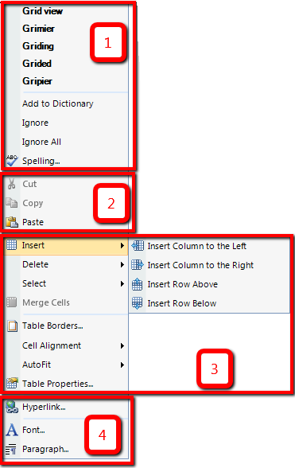
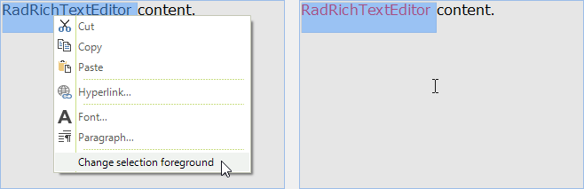

# Context Menu

The __RadRichTextEditor__ UI has a built-in context menu feature which can be used to easily customize different elements in a document. The menu is displayed when you __mouse right click__ on the __RadRichTextEditor__ control. It contains some context specific commands arranged in groups. There are groups for spellchecking, clipboard, table editing and text editing.

>caption Figure 1: Menu in the context of a table



The context menu is enabled by default. You can control this with the __IsContextMenuEnabled__ property. If you set the property to False, the [Selection Mini Tool Bar]() will be displayed when you click the mouse right button.

#### Disabling the context menu

{{source=..\SamplesCS\RichTextEditor\UI\ContextMenuCode.cs region=DisableContextMenu}} 
{{source=..\SamplesVB\RichTextEditor\UI\ContextMenuCode.vb region=DisableContextMenu}}
````C#
private void DisableContextMenu()
{
    this.radRichTextEditor1.IsContextMenuEnabled = false;
}

````
````VB.NET
Private Sub DisableContextMenu()
    Me.RadRichTextEditor1.IsContextMenuEnabled = False
End Sub

````


{{endregion}} 

The menu is accessible through the __ContextMenu__ property of __RadRichTextEditor__ control.

>note The context menu instance is cached and shared between all the instances of RadRichTextEditor in an application.
	
The RadRichTextEditor default context menu can be fully replaced by an object that implements the __IContextMenu__ interface which is marked with __CustomContextMenuAttribute__. Additionally, the menu can be customized by adding, removing and modifying menu groups and items. You can do that by using the __Showing__ event of the menu or by creating a custom content builder and override its construction methods.

You can customize the context menu bu using one of the following approaches
      
* [Using the Showing event](#using-the-showing-event)

* [Creating ContextMenuBuilder Class](#creating-contextmenubuilder-class)

## Using the Showing event

The first one involves subscribing to the __Showing__ event of the default __ContextMenu__.  The __Showing__ event is not part of the __IContextMenu__ interface, so in order to subscribe to it you need a cast to the __ContextMenu__ class (the default implementation of __IContextMenu__ in __Telerik.Windows.Documents.RadRichTextEditor.dll__). Here is an example of this approach.

#### Subscribe to Event

{{source=..\SamplesCS\RichTextEditor\UI\ContextMenuCode.cs region=SubscribeShowingEvent}} 
{{source=..\SamplesVB\RichTextEditor\UI\ContextMenuCode.vb region=SubscribeShowingEvent}}
````C#
Telerik.WinControls.RichTextEditor.UI.ContextMenu contextMenu = (Telerik.WinControls.RichTextEditor.UI.ContextMenu)this.radRichTextEditor1.RichTextBoxElement.ContextMenu;
contextMenu.Showing += this.ContextMenu_Showing;

````
````VB.NET
Dim contextMenu As Telerik.WinControls.RichTextEditor.UI.ContextMenu = DirectCast(Me.RadRichTextEditor1.RichTextBoxElement.ContextMenu, Telerik.WinControls.RichTextEditor.UI.ContextMenu)
AddHandler contextMenu.Showing, AddressOf Me.ContextMenu_Showing

```` 


{{endregion}} 

#### Handle Event

{{source=..\SamplesCS\RichTextEditor\UI\ContextMenuCode.cs region=HandleShowingEvent}} 
{{source=..\SamplesVB\RichTextEditor\UI\ContextMenuCode.vb region=HandleShowingEvent}}
````C#
private void ContextMenu_Showing(object sender, Telerik.WinForms.RichTextEditor.RichTextBoxUI.Menus.ContextMenuEventArgs e)
{
    if (!this.radRichTextEditor1.Document.Selection.IsEmpty)
    {
        RadMenuItem menuItem = new RadMenuItem()
        {
            Text = "Change selection foreground"
        };
        menuItem.Click += this.OnChangeSelectionForeground;
        ContextMenuGroup contextMenuGroup = new ContextMenuGroup();
        contextMenuGroup.Add(menuItem);
        e.ContextMenuGroupCollection.Add(contextMenuGroup);
    }
}
private void OnChangeSelectionForeground(object sender, EventArgs e)
{
    this.radRichTextEditor1.ChangeTextForeColor(Colors.Red);
}

````
````VB.NET
Private Sub ContextMenu_Showing(sender As Object, e As Telerik.WinForms.RichTextEditor.RichTextBoxUI.Menus.ContextMenuEventArgs)
    If Not Me.RadRichTextEditor1.Document.Selection.IsEmpty Then
        Dim menuItem As New RadMenuItem() With {
            .Text = "Change selection foreground"
        }
        AddHandler menuItem.Click, AddressOf Me.OnChangeSelectionForeground
        Dim contextMenuGroup As New ContextMenuGroup()
        contextMenuGroup.Add(menuItem)
        e.ContextMenuGroupCollection.Add(contextMenuGroup)
    End If
End Sub
Private Sub OnChangeSelectionForeground(sender As Object, e As EventArgs)
    Me.RadRichTextEditor1.ChangeTextForeColor(Colors.Red)
End Sub

```` 


{{endregion}} 

>caption Figure 2: Changing Text Color



## Creating ContextMenuBuilder Class

The second approach is more suitable when you need to reuse the customization across several __RadRichTextEditor__   instances/applications. Here you can either implement the __IContextMenuContentBuilder__ interface or derive from the __ContextMenuContentBuilder__ class and override some of its protected methods which are responsible for the creation of each context menu group:

#### Custom Builder Class

{{source=..\SamplesCS\RichTextEditor\UI\ContextMenuCode.cs region=CustomContextMenuBuilderClass}} 
{{source=..\SamplesVB\RichTextEditor\UI\ContextMenuCode.vb region=CustomContextMenuBuilderClass}}
````C#
public class CustomContextMenuContentBuilder : ContextMenuContentBuilder
{
    public override ContextMenuGroupCollection Construct()
    {
        var groupsCollection = base.Construct();
        if (!this.RadRichTextBox.Document.Selection.IsEmpty)
        {
            RadMenuItem menuItem = new RadMenuItem()
            {
                Text = "Change selection foreground"
            };
            menuItem.Click += this.OnChangeSelectionForeground;
            ContextMenuGroup contextMenuGroup = new ContextMenuGroup();
            contextMenuGroup.Add(menuItem);
            groupsCollection.Add(contextMenuGroup);
        }
        return groupsCollection;
    }
    private void OnChangeSelectionForeground(object sender, EventArgs e)
    {
        this.RadRichTextBox.ChangeTextForeColor(Colors.Red);
    }
}

````
````VB.NET
Public Class CustomContextMenuContentBuilder
    Inherits ContextMenuContentBuilder
    Public Overrides Function Construct() As ContextMenuGroupCollection
        Dim groupsCollection = MyBase.Construct()
        If Not Me.RadRichTextBox.Document.Selection.IsEmpty Then
            Dim menuItem As New RadMenuItem() With {
                .Text = "Change selection foreground"
            }
            AddHandler menuItem.Click, AddressOf Me.OnChangeSelectionForeground
            Dim contextMenuGroup As New ContextMenuGroup()
            contextMenuGroup.Add(menuItem)
            groupsCollection.Add(contextMenuGroup)
        End If
        Return groupsCollection
    End Function
    Private Sub OnChangeSelectionForeground(sender As Object, e As EventArgs)
        Me.RadRichTextBox.ChangeTextForeColor(Colors.Red)
    End Sub
End Class

```` 


{{endregion}}

Now you can simply assign the instance of your class to the __ContentBuilder__ property of the context menu:

#### Assinging Builder

{{source=..\SamplesCS\RichTextEditor\UI\ContextMenuCode.cs region=AssignCustomContextMenuBuilder}} 
{{source=..\SamplesVB\RichTextEditor\UI\ContextMenuCode.vb region=AssignCustomContextMenuBuilder}}
````C#
Telerik.WinControls.RichTextEditor.UI.ContextMenu contextMenu = (Telerik.WinControls.RichTextEditor.UI.ContextMenu)this.radRichTextEditor1.RichTextBoxElement.ContextMenu;
contextMenu.ContentBuilder = new CustomContextMenuContentBuilder();

````
````VB.NET
Dim contextMenu As Telerik.WinControls.RichTextEditor.UI.ContextMenu = DirectCast(Me.RadRichTextEditor1.RichTextBoxElement.ContextMenu, Telerik.WinControls.RichTextEditor.UI.ContextMenu)
contextMenu.ContentBuilder = New CustomContextMenuContentBuilder()

```` 


{{endregion}} 

And of course, for those of you who don’t need additional UI pop-ups, these can be disabled by setting the __IsContextMenuEnabled__ property of the __RadRichTextEditor__ to __False__.

# See Also

 * [Getting Started]()
 * [Ribbon Ui]()
 * [Selection Mini Toolbar]()
