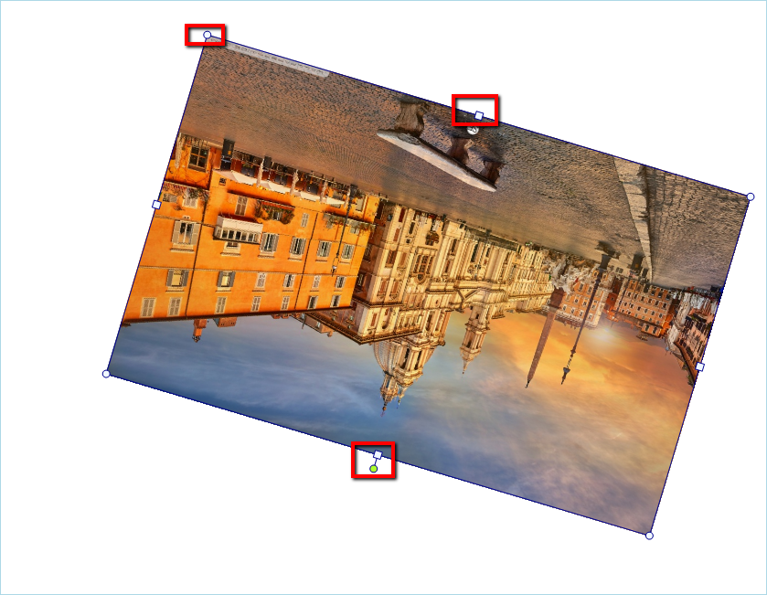

# Editing Images

This topic contains the following sections:

* [Using the UI](#using-the-ui)

* [Disable Image Editing Capabilities](#disable-image-editing-capabilities)

__RadRichTextEditor__ allow editing images that have been inserted in the editor. Currently you can resize, rotate and drag and drop images. The supported image formats are as follows:
      
* JPEG

* PNG

* BMP

## Using the UI

You can resize the image using the adorner that is shown around the image. In addition, the thumb that is shown on top allows you to rotate the image.



## Disable Image Editing Capabilities

As most features of the editor, the image editing capabilities can be easily disabled.

To remove the image adorner from your application you can create a new __UILayersBuilder__ as shown [here]() and remove the __AdornerLayer__.

{{source=..\SamplesCS\RichTextEditor\UI\EditingImages.cs region=layer}} 
{{source=..\SamplesVB\RichTextEditor\UI\EditingImages.vb region=layer}} 

````C#
public class CustomLayersBuilder : UILayersBuilder
{
    protected override void BuildUILayersOverride(IUILayerContainer uiLayerContainer)
    {
        uiLayerContainer.UILayers.Remove("AdornerLayer");
    }
}

````
````VB.NET
Public Class CustomLayersBuilder
    Inherits UILayersBuilder
    Protected Overrides Sub BuildUILayersOverride(ByVal uiLayerContainer As IUILayerContainer)
        uiLayerContainer.UILayers.Remove("AdornerLayer")
    End Sub
End Class

````

{{endregion}} 

Alternatively, you can disable the capabilities of the image adorner by accessing it though RadRichTextEditor's __ImageSelectionAdornerSettings__ property. This allows you to set the bolean properties __CanDrag__,  __CanResize__ and __CanRotate__ which disable/enable respectively dragging of the image, resizing it or rotating it.

{{source=..\SamplesCS\RichTextEditor\UI\EditingImages.cs region=disable}} 
{{source=..\SamplesVB\RichTextEditor\UI\EditingImages.vb region=disable}} 

````C#
this.radRichTextEditor1.ImageSelectionAdornerSettings.CanDrag = false;
this.radRichTextEditor1.ImageSelectionAdornerSettings.CanResize = false;
this.radRichTextEditor1.ImageSelectionAdornerSettings.CanRotate = false;

````
````VB.NET
Me.radRichTextEditor1.ImageSelectionAdornerSettings.CanDrag = False
Me.radRichTextEditor1.ImageSelectionAdornerSettings.CanResize = False
Me.radRichTextEditor1.ImageSelectionAdornerSettings.CanRotate = False

````

{{endregion}} 

# See Also

 * [Inline images]()
