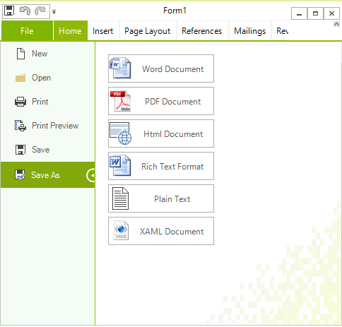

# Create Custom RichTextEditorRibbonBar

This topic explains how one can create custom class that inherits __RichTextEditorRibbonBar__. This is useful because all events in this class can be overridden. All elements that you see in the ribbon are accessible by their names in the inherited class as well. This allows you to easily modify them from the inherited class. 

A common scenario is to hide the "Save As" button and override the functionality of the save button. The following spinet demonstrates this:

#### Create custom RichTextEditorRibbonBar class

{{source=..\SamplesCS\RichTextEditor\UI\CustomRibbonCode.cs region=DisableContextMenu}} 
{{source=..\SamplesVB\RichTextEditor\UI\CustomRibbonCode.vb region=DisableContextMenu}}

{{endregion}} 

|Default|Custom|
|---|---|
|||

# See Also

 * [Ribbon UI]()
 * [Localization]()
