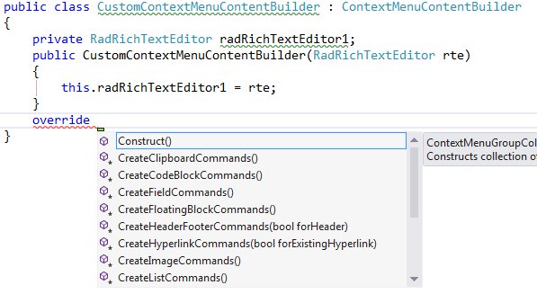

# Context Menu

The __ContextMenu__ is showed on right click over the __RadRichTextEditor__,
        and contains some context specific commands arranged in groups – there are groups for spellchecking (1), clipboard (2), table editing (3) and 
        text editing commands (4) as shown here:
      

You can customize the context menu bu using one of the following approaches
      

* [Handling the Showing event](#handling-the-showing-event)

* [Use ContextMenuBuilder class](#use-contextmenubuilder-class)

## Handling the Showing event

The first one involves subscribing to the __Showing__ event of the default __ContextMenu__.
          The __Showing__ event is not part of the __IContextMenu__ interface, so in order to subscribe to it you
          need a cast to the __ContextMenu__ class (the default implementation of __IContextMenu__ in
          __Telerik.Windows.Documents.RadRichTextEditorUI.dll__). Here is an example of this approach.
        

#### __[C#] __

{{source=..\SamplesCS\RichTextEditor\UI\ContextMenuCode.cs region=example}}
	        public ContextMenuCode()
	        {
	            InitializeComponent();
	            Telerik.WinControls.RichTextEditor.UI.ContextMenu contextMenu = (Telerik.WinControls.RichTextEditor.UI.ContextMenu)this.radRichTextEditor1.RichTextBoxElement.ContextMenu;
	            contextMenu.Showing += this.ContextMenu_Showing;
	        }
	
	        //In the event handler you can check the context relevant items and add some RadMenuItems if needed.
	        private void ContextMenu_Showing(object sender, ContextMenuEventArgs e)
	        {
	            // First check the context - if caret is in table, add our item
	            if (this.radRichTextEditor1.Document.CaretPosition.IsPositionInsideTable)
	            {
	                RadMenuItem makeCellYellowMenuItem = new RadMenuItem()
	                {
	                    Text = "Make Cell Yellow"
	                };
	                makeCellYellowMenuItem.Click += makeCellYellowMenuItem_Click;
	                ContextMenuGroup customContextMenuGroup = new ContextMenuGroup();
	                customContextMenuGroup.Add(makeCellYellowMenuItem);
	                e.ContextMenuGroupCollection.Add(customContextMenuGroup);
	            }
	        }
	
	        void makeCellYellowMenuItem_Click(object sender, EventArgs e)
	        {
	            TableCell currentCell = this.radRichTextEditor1.Document.CaretPosition.GetCurrentTableCellBox().AssociatedTableCell;
	            currentCell.Background = Colors.Yellow;
	            this.radRichTextEditor1.UpdateEditorLayout();
	        }
	{{endregion}}

#### __[VB.NET] __

{{source=..\SamplesVB\RichTextEditor\UI\ContextMenuCode.vb region=example}}
	    Public Sub New()
	        InitializeComponent()
	
	        Dim contextMenu1 As Telerik.WinControls.RichTextEditor.UI.ContextMenu = CType(Me.radRichTextEditor1.RichTextBoxElement.ContextMenu, Telerik.WinControls.RichTextEditor.UI.ContextMenu)
	        AddHandler contextMenu1.Showing, AddressOf Me.ContextMenu_Showing
	    End Sub
	
	    'In the event handler you can check the context relevant items and add some RadMenuItems if needed.
	    Private Sub ContextMenu_Showing(ByVal sender As Object, ByVal e As ContextMenuEventArgs)
	        ' First check the context - if caret is in table, add our item
	        If Me.radRichTextEditor1.Document.CaretPosition.IsPositionInsideTable Then
	            Dim makeCellYellowMenuItem As New RadMenuItem() With {.Text = "Make Cell Yellow"}
	            AddHandler makeCellYellowMenuItem.Click, AddressOf makeCellYellowMenuItem_Click
	            Dim customContextMenuGroup As New ContextMenuGroup()
	            customContextMenuGroup.Add(makeCellYellowMenuItem)
	            e.ContextMenuGroupCollection.Add(customContextMenuGroup)
	        End If
	    End Sub
	
	    Private Sub makeCellYellowMenuItem_Click(ByVal sender As Object, ByVal e As EventArgs)
	        Dim currentCell As TableCell = Me.radRichTextEditor1.Document.CaretPosition.GetCurrentTableCellBox().AssociatedTableCell
	        currentCell.Background = Colors.Yellow
	        Me.radRichTextEditor1.UpdateEditorLayout()
	    End Sub
	{{endregion}}

## Use ContextMenuBuilder class

The second approach is more suitable when you need to reuse the customization across several __RadRichTextEditor__ 
          instances/applications. Here you can either implement the __IContextMenuContentBuilder__ interface or derive from the
          __ContextMenuContentBuilder__ class and override some of its protected methods which are responsible for the creation
          of each context menu group:
        

Now you can simply assign the instance of your class to the __ContentBuilder__ property of the context menu:
        

#### __[C#] __

{{source=..\SamplesCS\RichTextEditor\UI\ContextMenuCode.cs region=create}}
	            Telerik.WinControls.RichTextEditor.UI.ContextMenu contextMenu = (Telerik.WinControls.RichTextEditor.UI.ContextMenu)this.radRichTextEditor1.RichTextBoxElement.ContextMenu;
	            contextMenu.ContentBuilder = new CustomContextMenuContentBuilder(this.radRichTextEditor1);
	{{endregion}}

#### __[VB.NET] __

{{source=..\SamplesVB\RichTextEditor\UI\ContextMenuCode.vb region=create}}
	
	        Dim contextMenu1 As Telerik.WinControls.RichTextEditor.UI.ContextMenu = CType(Me.radRichTextEditor1.RichTextBoxElement.ContextMenu, Telerik.WinControls.RichTextEditor.UI.ContextMenu)
	        contextMenu1.ContentBuilder = New CustomContextMenuContentBuilder(Me.radRichTextEditor1)
	{{endregion}}

And of course, for those of you who don’t need additional UI pop-ups, these can be disabled by setting the 
          __IsContextMenuEnabled__ property of the __RadRichTextEditor__ to __False__.
        
