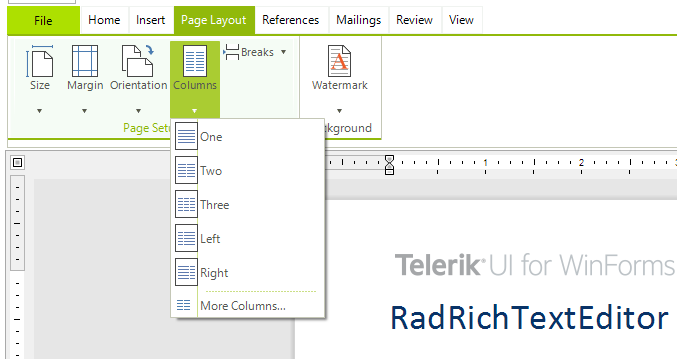

# Section Columns

With the Section Columns feature, **RadRichTextEditor** allows you arrange the text in a [Section]() into columns. This article will show you how to use the predefined UI to arrange the text into columns with equal or different width.

* [Create Section Columns](#create-section-columns)

* [Changing the Width of a Section Column](#changing-the-width-of-a-section-column)

#### __Figure 1: Text laid out in columns__

## Create Section Columns

The Page Layout tab of [RadRichTextEditorRibbonUI]() allows you set different types of section columns.

#### __Figure 2: Section columns menu__

* **One**: Represents a single text column.

* **Two**: Represents two text columns with equal width.

* **Three**: Represents three text columns with equal width.

* **Left**: Represents two text columns where the left one has a smaller width than the right one.

* **Right**: Represents two text columns where the right one has a smaller width than the left one.

#### __Figure 3: Left option applied on a section__

## Changing the Width of a Section Column

When the Section contains columns with equal width, you can customize the width of a column through the Document Ruler. When the caret is positioned on a column, a thumb appears that allows you change the width by dragging it.

#### __Figure 3: Customizing the width of a column__

# See Also

* [Section]()
* [RadDocument]()
* [RadDocumentEditor]()