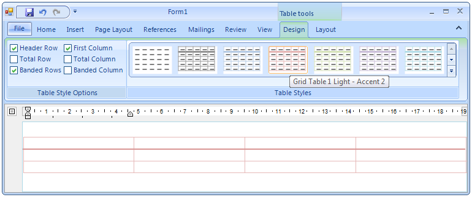

# Table Styles Gallery

RadRichTextEditor's concept of styles allows you to use a predefined set of formatting options for different document elements.  More about this you can learn in the Styles article [here]().
      

One of the supported type of styles is Table styles. The __TableStylesGallery__ was introduced as a way to easily create, delete, modifyand apply table styles in a document. The gallery initially loads all the table styles which are present in the document and a set of built-in styles. Currently built-in styles for Office2010 and Office2013 are supported and you can easily configure which version to be used.
      

## Apply Table Style

Applying a Table Style from the TableStylesGallery is easy and intuitive. You can apply a style from the preview or open the gallery and chose  one of the styles using the popup.

