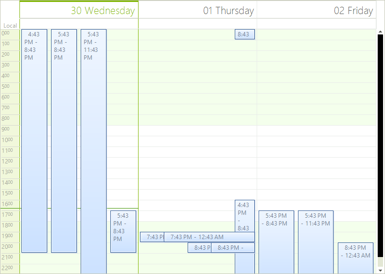
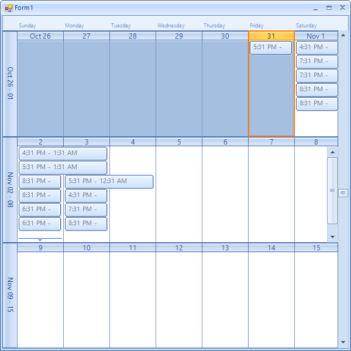
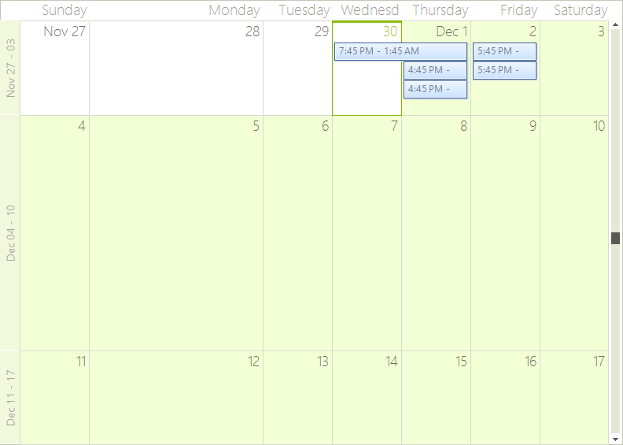
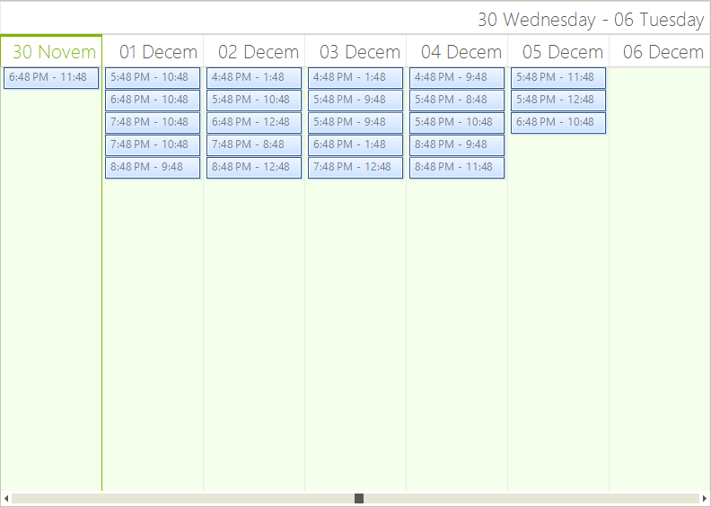
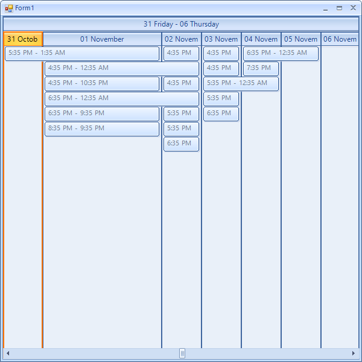
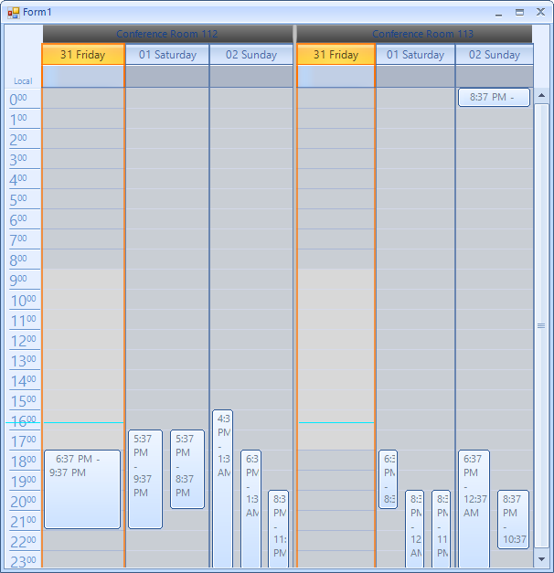
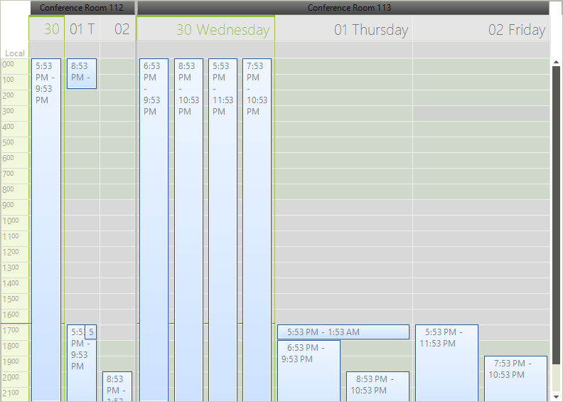

# Modify Size of Rows, Columns and Resources

__RadScheduler__  allows you to customize the size of the rows and the columns of the views where this is applicable. Below you can see how to customize each of the available views:

## DayView, WeekView and WorkWeekView

>caption Figure 1: Equal Column Width


On the day view you can resize the columns which represent a given day (16 Friday, 17 Saturday, 18 Sunday on the figure above).

Here is how you can make the middle columns three times bigger:

#### Resize Column

{{source=..\SamplesCS\Scheduler\Appearance\ModifySizeOfRowsColumnsAndResources.cs region=DayView}} 
{{source=..\SamplesVB\Scheduler\Appearance\ModifySizeOfRowsColumnsAndResources.vb region=DayView}} 

````C#
scheduler.ActiveViewType = SchedulerViewType.Day; // this can be changed to either Week or WorkWeek, the ViewElement is always SchedulerDayViewElement
(scheduler.ViewElement as SchedulerDayViewElement).SetColumnWidth(1, 3);

````
````VB.NET
scheduler.ActiveViewType = SchedulerViewType.Day
' this can be changed to either Week or WorkWeek, the ViewElement is always SchedulerDayViewElement
TryCast(scheduler.ViewElement, SchedulerDayViewElement).SetColumnWidth(1, 3)

````

{{endregion}} 

>important The actual width of a column will be calculated proportionally according to the values other columns have. The default value of each column is 1. This means that setting a value of 2 for a given column will make it twice as large compared to other columns.

>caption Figure 2:Increased Column Width


## MonthView

>caption Figure 3: Equal Width


In month view both rows and columns are resizable. The rows on the screenshots are May 11-17, May 18-24, May 25-31 and  the columns are May 11, 12, 13 ,14 ,15 ,16 ,17 for the first row and 18, 19 and so on for the second row.
The approach for this view is similar:

#### Resize Column

{{source=..\SamplesCS\Scheduler\Appearance\ModifySizeOfRowsColumnsAndResources.cs region=MonthView}} 
{{source=..\SamplesVB\Scheduler\Appearance\ModifySizeOfRowsColumnsAndResources.vb region=MonthView}} 

````C#
scheduler.ActiveViewType = SchedulerViewType.Month;
(scheduler.ViewElement as SchedulerMonthViewElement).SetColumnWidth(1, 2.5f);
(scheduler.ViewElement as SchedulerMonthViewElement).SetRowHeight(1, 2.5f);

````
````VB.NET
scheduler.ActiveViewType = SchedulerViewType.Month
TryCast(scheduler.ViewElement, SchedulerMonthViewElement).SetColumnWidth(1, 2.5F)
TryCast(scheduler.ViewElement, SchedulerMonthViewElement).SetRowHeight(1, 2.5F)

````

{{endregion}} 

>caption Figure 4: Increased Column Width


## TimelineView

>caption Figure 5: Equal Width


Here we see the columns named as 19-25 may. The same approach can be applied here as well:

#### Resize Column

{{source=..\SamplesCS\Scheduler\Appearance\ModifySizeOfRowsColumnsAndResources.cs region=TimelineView}} 
{{source=..\SamplesVB\Scheduler\Appearance\ModifySizeOfRowsColumnsAndResources.vb region=TimelineView}} 

````C#
scheduler.ActiveViewType = SchedulerViewType.Timeline;
(scheduler.ViewElement as SchedulerTimelineViewElement).SetColumnWidth(1, 3f);

````
````VB.NET
scheduler.ActiveViewType = SchedulerViewType.Timeline
TryCast(scheduler.ViewElement, SchedulerTimelineViewElement).SetColumnWidth(1, 3.0F)

````

{{endregion}} 

>caption Figure 6: Increased Column Width


## ResourceView

>caption Figure 7: Equal Width


Here we see the resources - *"Conference Room 112/113"*. Resizing them can happen as follows:

#### Resize Resource

{{source=..\SamplesCS\Scheduler\Appearance\ModifySizeOfRowsColumnsAndResources.cs region=ResourceView}} 
{{source=..\SamplesVB\Scheduler\Appearance\ModifySizeOfRowsColumnsAndResources.vb region=ResourceView}} 

````C#
scheduler.GroupType = GroupType.Resource;
scheduler.ActiveViewType = SchedulerViewType.Day;
(scheduler.ViewElement as SchedulerDayViewGroupedByResourceElement).SetResourceSize(0, 0.25f);

````
````VB.NET
scheduler.GroupType = GroupType.Resource
scheduler.ActiveViewType = SchedulerViewType.Day
TryCast(scheduler.ViewElement, SchedulerDayViewGroupedByResourceElement).SetResourceSize(0, 0.25F)

````

{{endregion}} 

>caption Figure 8: Increased Resource Size 


# See Also

* [Visual Style Builder]()
* [Using Default Themes]()
* [Views]()
* [Working with Appointments]()