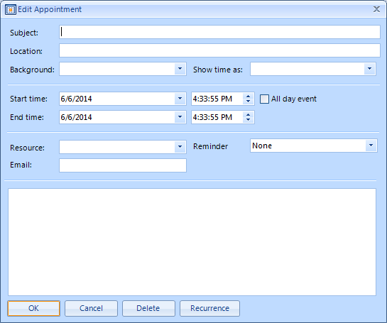

# Adding a custom field to the EditAppointment dialog

## 

| RELATED VIDEOS |  |
| ------ | ------ |
|[Adding Custom Fields to RadScheduler Appointmentss](http://www.telerik.com/videos/winforms/adding-custom-fields-to-radscheduler-for-winforms-appointments) <br/> In this video, you will learn how to add custom fields to the RadScheduler for WinForms. You'll learn how to create the required classes, mappings, and dialogs that make it easy to integrate any custom data in a Scheduler appointment. (Runtime: 19:48)||
|[Introduction to RadScheduler for WinForms](http://www.telerik.com/videos/winforms/introduction-to-radscheduler-for-winforms-webinar)<br/>In this webinar, Telerik Developer Support Specialist Robert Shoemate will introduce RadScheduler and demonstrate how to utilize its powerful feature set in your own applications. By attending this webinar, you will learn about features such as codeless data binding, adding custom fields, and UI customization. (Runtime: 55:58)||


| RELATED BLOGS |  |
| ------ | ------ |
|Adding Custom Fields to RadScheduler AppointmentsWhen using RadScheduler for WinForms, it will almost always need to be customized in some way. This could come in the form of custom dialogs, context menus, or even custom appointments.In this blog entry, I am going to explain the steps required to add a custom field to RadScheduler [Read full post ...](  http://blogs.telerik.com/winformsteam/posts/10-04-02/adding_custom_fields_to_radscheduler_for_winforms_appointments.aspx )||


The following tutorial will demonstrate how you can customize the default EditAppointmentDialog (shown above) by adding a custom field to it. In our case, we are going to add an E-mail field. This field will not only exist in the dialog as a control, but will also be stored as a value in the custom appointment provided below.
        
Here is a step by step guide how to achieve that:

1\. First we have to create a new form (let's call it CustomAppointmentEditForm) which derives from EditAppointmentDialog in order to extend the default scheduler’s dialog.

2\. Open the dialog in Design Time and add a label and a text box to under the Resource label and text box. Name the text box __txtEmail__


3\. Here is the form's implementation:
 
{{source=..\SamplesCS\Scheduler\AppointmentsAndDialogues\CustomAppointmentEditForm.cs region=customAppEditForm}}           
````C#
<Global.Microsoft.VisualBasic.CompilerServices.DesignerGenerated()> _
Partial Class CustomAppointmentEditForm
    Inherits Telerik.WinControls.UI.Scheduler.Dialogs.EditAppointmentDialog

````
````VB.NET
public partial class CustomAppointmentEditForm : EditAppointmentDialog
{
    public CustomAppointmentEditForm()
    {
        InitializeComponent();
    }
    protected override void LoadSettingsFromEvent(IEvent ev)
    {
        base.LoadSettingsFromEvent(ev);
        AppointmentWithEmail appointmentWithEmail = ev as AppointmentWithEmail;
        if (appointmentWithEmail != null)
        {
            this.txtEmail.Text = appointmentWithEmail.Email;
        }
    }
    protected override void ApplySettingsToEvent(IEvent ev)
    {
        AppointmentWithEmail appointmentWithEmail = ev as AppointmentWithEmail;
        if (appointmentWithEmail != null)
        {
            appointmentWithEmail.Email = this.txtEmail.Text;
        }
        base.ApplySettingsToEvent(ev);
    }
    protected override IEvent CreateNewEvent()
    {
        return new AppointmentWithEmail();
    }
}

````

{{endregion}} 


4\. Create a new appointment class (let's call it AppointmentWithEmail) which derives from the Appointment class and add an Email property as shown:


{{source=..\SamplesCS\Scheduler\AppointmentsAndDialogues\AddingCustomFieldHelper.cs region=appWithMail}} 
````C#
public partial class CustomAppointmentEditForm : EditAppointmentDialog
{
    public CustomAppointmentEditForm()
    {
        InitializeComponent();
    }
    protected override void LoadSettingsFromEvent(IEvent ev)
    {
        base.LoadSettingsFromEvent(ev);
        AppointmentWithEmail appointmentWithEmail = ev as AppointmentWithEmail;
        if (appointmentWithEmail != null)
        {
            this.txtEmail.Text = appointmentWithEmail.Email;
        }
    }
    protected override void ApplySettingsToEvent(IEvent ev)
    {
        AppointmentWithEmail appointmentWithEmail = ev as AppointmentWithEmail;
        if (appointmentWithEmail != null)
        {
            appointmentWithEmail.Email = this.txtEmail.Text;
        }
        base.ApplySettingsToEvent(ev);
    }
    protected override IEvent CreateNewEvent()
    {
        return new AppointmentWithEmail();
    }
}

````
````VB.NET
    
public class AppointmentWithEmail : Appointment
{
    public AppointmentWithEmail() : base()
    {
    }
    
    protected override Event CreateOccurrenceInstance()
    {
        return new AppointmentWithEmail();
    }
    
    private string email = string.Empty;
    
    public string Email
    {
        get
        {
            return this.email;
        }
        set
        {
            if (this.email != value)
            {
                this.email = value;
                this.OnPropertyChanged("Email");
            }
        }
    }
}

````

{{endregion}} 

5\. Create an appointment factory which returns our AppointmentWithEmail when creating appointments:

{{source=..\SamplesCS\Scheduler\AppointmentsAndDialogues\AddingCustomFieldHelper.cs region=customAppFactory}} 
{{source=..\SamplesVB\Scheduler\AppointmentsAndDialogues\AddingCustomFieldHelper.vb region=customAppFactory}} 

````C#
    
public class CustomAppointmentFactory : IAppointmentFactory
{
    public IEvent CreateNewAppointment()
    {
        return new AppointmentWithEmail();
    }
}

````
````VB.NET
Public Class CustomAppointmentFactory
Implements IAppointmentFactory
    Public Function CreateNewAppointment() As IEvent Implements IAppointmentFactory.CreateNewAppointment
        Return New AppointmentWithEmail()
    End Function
End Class

````

{{endregion}} 

6\. Subscribe to the AppointmentEditDialogShowing event and in the event handler use the AppointmentEditDialog property of the event arguments to change the default dialog with the custom one you just created. For optimization, you can create a global variable, which can be reused, instead of creating a new instance of the form every time.
     
{{source=..\SamplesCS\Scheduler\AppointmentsAndDialogues\AddingCustomField.cs region=showing}}        
{{source=..\SamplesVB\Scheduler\AppointmentsAndDialogues\AddingCustomField.vb region=showing}} 

````C#
CustomAppointmentEditForm appointmentDialog = null;
void radScheduler1_AppointmentEditDialogShowing(object sender, AppointmentEditDialogShowingEventArgs e)
{
    if (this.appointmentDialog == null)
    {
        this.appointmentDialog = new CustomAppointmentEditForm();
    }
   e.AppointmentEditDialog = this.appointmentDialog;
}

````
````VB.NET
Private appointmentDialog As CustomAppointmentEditForm = Nothing
Private Sub radScheduler1_AppointmentEditDialogShowing(ByVal sender As Object, ByVal e As AppointmentEditDialogShowingEventArgs)
    If Me.appointmentDialog Is Nothing Then
        Me.appointmentDialog = New CustomAppointmentEditForm()
    End If
    e.AppointmentEditDialog = Me.appointmentDialog
End Sub

````

{{endregion}} 

7\. Last, but not least we should assign the custom AppointmentFactory to our RadScheduler. This will come in handy when you create your appointments in-line:
            

{{source=..\SamplesVB\Scheduler\AppointmentsAndDialogues\AddingCustomField.vb region=settingFactory}} 
{{source=..\SamplesCS\Scheduler\AppointmentsAndDialogues\AddingCustomField.cs region=settingFactory}} 
````C#
Me.RadScheduler1.AppointmentFactory = New CustomAppointmentFactory()

````
````VB.NET
this.radScheduler1.AppointmentFactory = new CustomAppointmentFactory();

````

{{endregion}} 


