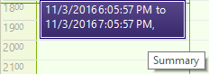

# Working with Appointments


| RELATED VIDEOS |  |
| ------ | ------ |
|[Adding Custom Fields to RadScheduler Appointments](http://tv.telerik.com/winforms/radscheduler/adding-custom-fields-radscheduler-winforms-appointments)In this video, you will learn how to add custom fields to the RadScheduler for WinForms. You'll learn how to create the required classes, mappings, and dialogs that make it easy to integrate any custom data in a Scheduler appointment. (Runtime: 19:48)||
|[Introduction to RadScheduler for WinForms](http://tv.telerik.com/winforms/radscheduler/introduction-radscheduler-winforms)In this webinar, Telerik Developer Support Specialist Robert Shoemate will introduce RadScheduler and demonstrate how to utilize its powerful feature set in your own applications. By attending this webinar, you will learn about features such as codeless data binding, adding custom fields, and UI customization. (Runtime: 55:58)||


| RELATED BLOGS |  |
| ------ | ------ |
|Adding Custom Fields to RadScheduler AppointmentsWhen using RadScheduler for WinForms, it will almost always need to be customized in some way.
              This could come in the form of custom dialogs, context menus, or even custom appointments.
              In this blog entry, I am going to explain the steps required to add a custom field to RadScheduler.[Read full post ...](
                  http://blogs.telerik.com/winformsteam/posts/10-04-02/adding_custom_fields_to_radscheduler_for_winforms_appointments.aspx
                )||

## Creating a new Appointment instance

Use one of many overloads to build a new Appointment instance. The example below creates an appointment that starts "Now", extends for one half hour and has summary and descriptions. You can use the __StatusId__ and __BackgroundId__ appointment properties to provide visual feedback in the left edge and background of each appointment.
        #_[C#] Adding a new appointment_

	


{{source=..\SamplesCS\Scheduler\AppointmentsAndDialogues\WorkingWithAppointments.cs region=creatingAppointment}} 
{{source=..\SamplesVB\Scheduler\AppointmentsAndDialogues\WorkingWithAppointments.vb region=creatingAppointment}} 

````C#
            Appointment appointment = new Appointment(DateTime.Now, TimeSpan.FromMinutes(30), "Summary", "Description");
            appointment.StatusId = 2;
            appointment.BackgroundId = 6;
            this.radScheduler1.Appointments.Add(appointment);
````
````VB.NET
        Dim appointment As New Appointment(Date.Now, TimeSpan.FromMinutes(30), "Summary", "Description")
        appointment.StatusId = 2
        appointment.BackgroundId = 6
        Me.RadScheduler1.Appointments.Add(appointment)
        '
````

{{endregion}} 




## Customizing Appointments

* To add new a Status to an appointment, the __Statuses__ collection should be used. By default this collection is filled with the following statuses:
            

* 

* 1 = Free

* 2 = Busy

* 3 = Unavailable

* 4 = Tentative

* To extend/replace the __Statuses__ collection, use the __AppointmentStatusInfo__ class:
            

>note Make sure that the IDs of the statues are unique. It is good to add a new status with an ID bigger than the last filled status.
>
#_[C#] Using the AppointmentStatusInfo class_

	


{{source=..\SamplesCS\Scheduler\AppointmentsAndDialogues\WorkingWithAppointments.cs region=addStatus}} 
{{source=..\SamplesVB\Scheduler\AppointmentsAndDialogues\WorkingWithAppointments.vb region=addStatus}} 

````C#
            this.radScheduler1.Statuses.Add(new AppointmentStatusInfo(5, "test", Color.Purple, Color.Purple, AppointmentStatusFillType.Solid));
````
````VB.NET
        Me.RadScheduler1.Statuses.Add(New AppointmentStatusInfo(5, "test", Color.Purple, Color.Purple, AppointmentStatusFillType.Solid))
        '
````

{{endregion}} 


* To add new a Background to an appointment, the __Backgrounds__ collection should be used. By default this collection is filled with the following statuses:
            

* 1 = None

* 2 = Important

* 3 = Business

* 4 = Personal

* 5 = Vacation

* 6 = MustAttend

* 7 = TravelRequired

* 8 = NeedsPreparation

* 9 = Birthday

* 10 = Anniversary

* 11 = PhoneCall

* To extend/replace the __Backgrounds__ collection, use the __AppointmentBackgroundInfo__ class:
            

>note Make sure that the IDs of the Backgrounds are unique. It is good to add a new status with an ID bigger than the last filled status.
>
#_[C#] Using the AppointmentBackgroundInfo class_

	


{{source=..\SamplesCS\Scheduler\AppointmentsAndDialogues\WorkingWithAppointments.cs region=addBackground}} 
{{source=..\SamplesVB\Scheduler\AppointmentsAndDialogues\WorkingWithAppointments.vb region=addBackground}} 

````C#
            this.radScheduler1.Backgrounds.Add(new AppointmentBackgroundInfo(12, "test", Color.Purple));
````
````VB.NET
        Me.RadScheduler1.Backgrounds.Add(New AppointmentBackgroundInfo(12, "test", Color.Purple))
        '
````

{{endregion}} 


* In order to change the background of an appointment, use the Appointment's __BackgroundId__ property and choose a value from a value list. 
            

* In order to change the status of an appointment, use the Appointment's __StatusId__ property and choose a value of the predefined values list. 
            

* In order to hide/show an appointment, use the Appointment's __Visible__ property. The value of this property is true by default.
            

* In order to change Appointment's Summary, Description or Locations strings, use the __Summary__, __Description__ and __Location__ properties of Appointment class.
            

* In order to change Appointment's text formatting which will reflect on the Start, End, Summary, Location and Description strings, use the __AppointmentTitleFormat__ property:
            #_[C#] Using the AppointmentTitleFormat property_

	


{{source=..\SamplesCS\Scheduler\AppointmentsAndDialogues\WorkingWithAppointments.cs region=appointmentFormat}} 
{{source=..\SamplesVB\Scheduler\AppointmentsAndDialogues\WorkingWithAppointments.vb region=appointmentFormat}} 

````C#
            this.radScheduler1.AppointmentTitleFormat = "{0} to {1}, {2} ({3})";
````
````VB.NET
        Me.RadScheduler1.AppointmentTitleFormat = "{0} to {1}, {2} ({3})"
        '
````

{{endregion}} 


Here is a list with the different elements and their content:
            

* {0} – Start time

* {1} – End time

* {2} – Subject

* {3} – Location

* {4} – "<span S>" where S is a style attribute with font-family, font-size and color

* {5} – "</span>"

* {6} – "<b>"

* {7} – "</b>"

* {8} – New line or empty string

* In order to change Appointment's Start, End, Duration, use the __Start__, __End__, __Duration__ properties of Appointment class.
            

* In order to change Appointment's tool-tip text, use the Appointment's __ToolTipText__ property:
            #_[C#] Using the ToolTipText property_

	


{{source=..\SamplesCS\Scheduler\AppointmentsAndDialogues\WorkingWithAppointments.cs region=toolTipText}} 
{{source=..\SamplesVB\Scheduler\AppointmentsAndDialogues\WorkingWithAppointments.vb region=toolTipText}} 

````C#
            appointment.ToolTipText = "Some text";
````
````VB.NET
        appointment.ToolTipText = "Some text"
        '
````

{{endregion}} 


* In order to enable/disable Appointment's editing and deleting operations, use the Appointment's __AllowEdit__ and __AllowDelete__ properties.
            
