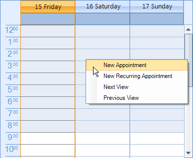
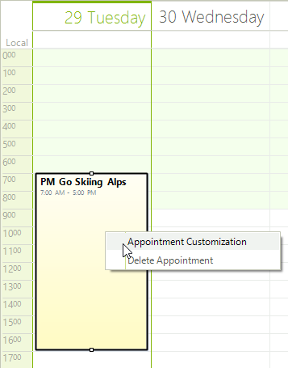

# Customize the ContextMenu

__RadScheduler__ gives you the ability to easily customize its default context menu. This can be achieve by using the 
        __ContextMenuOppennig__ event.
      

## Replace the default and the appointments context menu.

1. Create a __RadContextMenu__ and add the necessary items to it. Create another __RadContextMenu__ 
            and fill it with items.

1. Subscribe to the __ContextMenuOpening__ event.

1. In the __ContextMenuOpenning__ event handler replace the default context menus with the newly created ones.

#### __[C#]__

{{source=..\SamplesCS\Scheduler\CustomizeContextMenu.cs region=contextMenuOpening}}
	        void radScheduler1_ContextMenuOpening(object sender, SchedulerContextMenuOpeningEventArgs e)
	        {
	            if (e.Element is AppointmentElement)
	            {
	                e.Menu = this.radContextMenu1;
	            }
	            else
	            {
	                e.Menu = this.radContextMenu2;
	            }
	        }
	{{endregion}}

#### __[VB.NET]__

{{source=..\SamplesVB\Scheduler\CustomizeContextMenu.vb region=contextMenuOpening}}
	    Private Sub radScheduler1_ContextMenuOpening(sender As Object, e As SchedulerContextMenuOpeningEventArgs) Handles RadScheduler1.ContextMenuOpening
	        If TypeOf e.Element Is AppointmentElement Then
	            e.Menu = Me.RadContextMenu1
	        Else
	            e.Menu = Me.RadContextMenu2
	        End If
	    End Sub
	{{endregion}}

As you can see in the screenshots below, we can set different context menus depending on the element that invokes the context menu creation.

## Change the default items or and disable the context menu.

The __Menu__ property of the __SchedulerContextMenuOpeningEventArgs__ objects gives you the opportunity to change the existing
        items of the context menu. Also you can entirely disable the context menu by setting the *Cancel*  property to true. 
        For example you can change the context menu for the appointments and disable the default context menu as follows:
      

#### __[C#]__

{{source=..\SamplesCS\Scheduler\CustomizeContextMenu.cs region=contextMenuOpening1}}
	        void radScheduler1_ContextMenuOpening1(object sender, SchedulerContextMenuOpeningEventArgs e)
	        {
	            if (e.Element is AppointmentElement)
	            {
	                e.Menu.Items.RemoveAt(0);
	            }
	            else
	            {
	                e.Cancel = true;
	            }
	        }
	{{endregion}}

#### __[VB.NET]__

{{source=..\SamplesVB\Scheduler\CustomizeContextMenu.vb region=contextMenuOpening1}}
	    Private Sub radScheduler1_ContextMenuOpening1(sender As Object, e As SchedulerContextMenuOpeningEventArgs)
	        If TypeOf e.Element Is AppointmentElement Then
	            e.Menu.Items.RemoveAt(0)
	        Else
	            e.Cancel = True
	        End If
	    End Sub
	{{endregion}}

