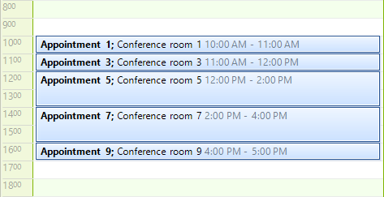
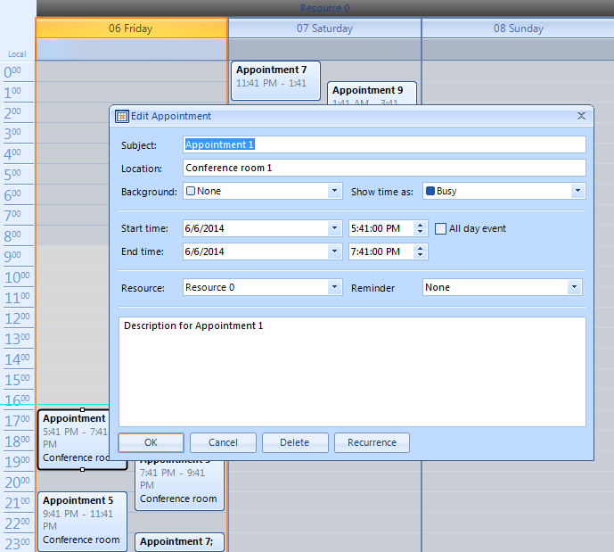
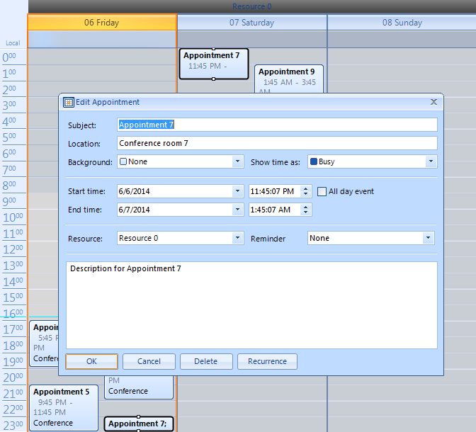

# Binding to Business Objects

What if your scheduling data originates from somewhere other than an easily accessible database? An API that accesses a legacy system or an email based system are two examples that might fit this description. RadScheduler allows binding to objects of any arbitrary structure.

Binding to objects follows the same basic pattern as binding to database tables. You must assign a collection of objects to an instance of SchedulerBindingDataSource. You also need to define mappings so that the appointment data expected in the scheduler (Start, End, Subject, etc.) is satisfied by specific properties in the bound objects.

The code below is an example appointment. Keep in mind that the particular construction of the CustomAppointment class and the names of its properties are arbitrary. The mappings will decide where properties are used. Notice that the object implements the __INotifyPropertyChanged__ interface. Without this interface implementation the populated appointment object data will not show up in the scheduler.

{{source=..\SamplesCS\Scheduler\DataBinding\CustomAppointment.cs region=customAppointment}} 
{{source=..\SamplesVB\Scheduler\DataBinding\CustomAppointment.vb region=customAppointment}} 

````C#
public class CustomAppointment : INotifyPropertyChanged
{
    private DateTime start = DateTime.Now;
    private DateTime end = DateTime.Now;
    private string subject = string.Empty;
    private string description = string.Empty;
    private string location = string.Empty;
    private Guid id = Guid.NewGuid();
    private List<CustomAppointment> exceptions;
    public CustomAppointment()
    {
    }
    public CustomAppointment(DateTime start, DateTime end, string subject, string description, string location)
    {
        this.start = start;
        this.end = end;
        this.subject = subject;
        this.description = description;
        this.location = location;
        List<CustomAppointment> exceptions = new List<CustomAppointment>();
    }
    public List<CustomAppointment> Exceptions
    {
        get
        {
            return this.exceptions;
        }
        set
        {
            if (this.exceptions != value)
            {
                this.exceptions = value;
                this.OnPropertyChanged("Exceptions");
            }
        }
    }
    public Guid Id
    {
        get
        {
            return this.id;
        }
        set
        {
            if (this.id != value)
            {
                this.id = value;
                this.OnPropertyChanged("Id");
            }
        }
    }
    public DateTime Start
    {
        get
        {
            return this.start;
        }
        set
        {
            if (this.start != value)
            {
                this.start = value;
                this.OnPropertyChanged("Start");
            }
        }
    }
    public DateTime End
    {
        get
        {
            return this.end;
        }
        set
        {
            if (this.end != value)
            {
                this.end = value;
                this.OnPropertyChanged("End");
            }
        }
    }
    public string Subject
    {
        get
        {
            return this.subject;
        }
        set
        {
            if (this.subject != value)
            {
                this.subject = value;
                this.OnPropertyChanged("Subject");
            }
        }
    }
    public string Description
    {
        get
        {
            return this.description;
        }
        set
        {
            if (this.description != value)
            {
                this.description = value;
                this.OnPropertyChanged("Description");
            }
        }
    }
    public string Location
    {
        get
        {
            return this.location;
        }
        set
        {
            if (this.location != value)
            {
                this.location = value;
                this.OnPropertyChanged("Location");
            }
        }
    }
    public event PropertyChangedEventHandler PropertyChanged;
    protected virtual void OnPropertyChanged(string propertyName)
    {
        if (this.PropertyChanged != null)
        {
            this.PropertyChanged(this, new PropertyChangedEventArgs(propertyName));
        }
    }

````
````VB.NET
Public Class CustomAppointment
    Implements INotifyPropertyChanged
    Private _start As Date = Date.Now
    Private _end As Date = Date.Now
    Private _subject As String = String.Empty
    Private _description As String = String.Empty
    Private _location As String = String.Empty
    Private _id As Guid = Guid.NewGuid()
    Private _exceptions As List(Of CustomAppointment)
    Public Sub New()
    End Sub
    Public Sub New(ByVal start As Date, ByVal [end] As Date, ByVal subject As String, ByVal description As String, ByVal location As String)
        Me._start = start
        Me._end = [end]
        Me._subject = subject
        Me._description = description
        Me._location = location
        Dim _exceptions As New List(Of CustomAppointment)()
    End Sub
    Public Property Exceptions() As List(Of CustomAppointment)
        Get
            Return Me._exceptions
        End Get
        Set(ByVal value As List(Of CustomAppointment))
            If Me._exceptions IsNot value Then
                Me._exceptions = value
                Me.OnPropertyChanged("Exceptions")
            End If
        End Set
    End Property
    Public Property Id() As Guid
        Get
            Return Me._id
        End Get
        Set(ByVal value As Guid)
            If Me._id <> value Then
                Me._id = value
                Me.OnPropertyChanged("Id")
            End If
        End Set
    End Property
    Public Property Start() As Date
        Get
            Return Me._start
        End Get
        Set(ByVal value As Date)
            If Me._start <> value Then
                Me._start = value
                Me.OnPropertyChanged("Start")
            End If
        End Set
    End Property
    Public Property [End]() As Date
        Get
            Return Me._end
        End Get
        Set(ByVal value As Date)
            If Me._end <> value Then
                Me._end = value
                Me.OnPropertyChanged("End")
            End If
        End Set
    End Property
    Public Property Subject() As String
        Get
            Return Me._subject
        End Get
        Set(ByVal value As String)
            If Me._subject <> value Then
                Me._subject = value
                Me.OnPropertyChanged("Subject")
            End If
        End Set
    End Property
    Public Property Description() As String
        Get
            Return Me._description
        End Get
        Set(ByVal value As String)
            If Me._description <> value Then
                Me._description = value
                Me.OnPropertyChanged("Description")
            End If
        End Set
    End Property
    Public Property Location() As String
        Get
            Return Me._location
        End Get
        Set(ByVal value As String)
            If Me._location <> value Then
                Me._location = value
                Me.OnPropertyChanged("Location")
            End If
        End Set
    End Property
    Public Event PropertyChanged As PropertyChangedEventHandler Implements INotifyPropertyChanged.PropertyChanged
    Protected Overridable Sub OnPropertyChanged(ByVal propertyName As String)
        If Me.PropertyChangedEvent IsNot Nothing Then
            RaiseEvent PropertyChanged(Me, New PropertyChangedEventArgs(propertyName))
        End If
    End Sub

````

{{endregion}} 

To use your custom object, create CustomAppointment instances and place them in a generic list before mapping and binding to the SchedulerBindingDataSource component.

{{source=..\SamplesCS\Scheduler\DataBinding\BindingToBusinessObjects.cs region=bindingToList}} 
{{source=..\SamplesVB\Scheduler\DataBinding\BindingToBusinessObjects.vb region=bindingToList}} 

````C#
// create a list of CustomAppointment objects
BindingList<CustomAppointment> appointments = new BindingList<CustomAppointment>();
for (int i = 0; i < 10; i++)
{
    // add every other appointment, populate with sample data
    if ((i % 2) == 0)
    {
        int appointmentNumber = i + 1;
        CustomAppointment myAppointment =
        new CustomAppointment(
        DateTime.Now.AddHours(appointmentNumber),
        DateTime.Now.AddHours(appointmentNumber + 2),
        "Appointment " + appointmentNumber.ToString(),
        "Description for Appointment " + appointmentNumber.ToString(),
        "Conference room " + appointmentNumber.ToString());
        appointments.Add(myAppointment);
    }
}
// create and configure a scheduler binding source
SchedulerBindingDataSource dataSource = new SchedulerBindingDataSource();
// map the MyAppointment properties to the scheduler
AppointmentMappingInfo appointmentMappingInfo = new AppointmentMappingInfo();
appointmentMappingInfo.Start = "Start";
appointmentMappingInfo.End = "End";
appointmentMappingInfo.Summary = "Subject";
appointmentMappingInfo.Description = "Description";
appointmentMappingInfo.Location = "Location";
appointmentMappingInfo.UniqueId = "Id";
appointmentMappingInfo.Exceptions = "Exceptions";
dataSource.EventProvider.Mapping = appointmentMappingInfo;
// assign the generic List of CustomAppointment as the EventProvider data source
dataSource.EventProvider.DataSource = appointments;
this.radScheduler1.DataSource = dataSource;

````
````VB.NET
'create a list of CustomAppointment objects
Dim appointments As New BindingList(Of CustomAppointment)()
For i As Integer = 0 To 9
    'add every other appointment, populate with sample data
    If (i Mod 2) = 0 Then
        Dim appointmentNumber As Integer = i + 1
        Dim myAppointment As New CustomAppointment(DateTime.Now.AddHours(appointmentNumber), DateTime.Now.AddHours(appointmentNumber + 2), "Appointment " + appointmentNumber.ToString(), "Description for Appointment " + appointmentNumber.ToString(), "Conference room " + appointmentNumber.ToString())
        appointments.Add(myAppointment)
    End If
Next
'create_and_configure_a_scheduler_binding_source
Dim dataSource As New SchedulerBindingDataSource()
'map the MyAppointment properties to the scheduler
Dim appointmentMappingInfo As New AppointmentMappingInfo()
appointmentMappingInfo.Start = "Start"
appointmentMappingInfo.[End] = "End"
appointmentMappingInfo.Summary = "Subject"
appointmentMappingInfo.Description = "Description"
appointmentMappingInfo.Location = "Location"
appointmentMappingInfo.UniqueId = "Id"
appointmentMappingInfo.Exceptions = "Exceptions"
dataSource.EventProvider.Mapping = appointmentMappingInfo
'assign the generic List of CustomAppointment as the EventProvider data source
dataSource.EventProvider.DataSource = appointments
Me.radScheduler1.DataSource = dataSource

````

{{endregion}} 

When the application is run, a series of CustomAppointment objects show up in the scheduler.



## Grouping by resources

To use grouping by resource in this scenario, first you will need to create the business object that represents the resources:

{{source=..\SamplesCS\Scheduler\DataBinding\BindingToBusinessObjects.cs region=createTheResourceObject}} 
{{source=..\SamplesVB\Scheduler\DataBinding\BindingToBusinessObjects.vb region=createTheResourceObject}} 

````C#
public class CustomResource : INotifyPropertyChanged
{
    private int id;
    private string name;
    public int Id
    {
        get
        {
            return this.id;
        }
        set
        {
            if (this.id != value)
            {
                this.id = value;
                this.OnPropertyChanged("Id");
            }
        }
    }
    public string Name
    {
        get
        {
            return this.name;
        }
        set
        {
            if (this.name != value)
            {
                this.name = value;
                this.OnPropertyChanged("Name");
            }
        }
    }
    public event PropertyChangedEventHandler PropertyChanged;
    protected virtual void OnPropertyChanged(string propertyName)
    {
        if (this.PropertyChanged != null)
        {
            this.PropertyChanged(this, new PropertyChangedEventArgs(propertyName));
        }
    }
}

````
````VB.NET
Public Class CustomResource
    Implements INotifyPropertyChanged
    Private m_id As Integer
    Private m_name As String
    Public Property Id() As Integer
        Get
            Return Me.m_id
        End Get
        Set(value As Integer)
            If Me.m_id <> value Then
                Me.m_id = value
                Me.OnPropertyChanged("Id")
            End If
        End Set
    End Property
    Public Property Name() As String
        Get
            Return Me.m_name
        End Get
        Set(value As String)
            If Me.m_name <> value Then
                Me.m_name = value
                Me.OnPropertyChanged("Name")
            End If
        End Set
    End Property
    Public Event PropertyChanged As PropertyChangedEventHandler Implements INotifyPropertyChanged.PropertyChanged
    Protected Overridable Sub OnPropertyChanged(propertyName As String)
        RaiseEvent PropertyChanged(Me, New PropertyChangedEventArgs(propertyName))
    End Sub
End Class

````

{{endregion}} 

Now we need to bind the __ResourceProvider__ of __SchedulerBindingDataSource__ to a collection of __CustomResource__ objects:

{{source=..\SamplesCS\Scheduler\DataBinding\BindingToBusinessObjects.cs region=bind_the_resource_provider}} 
{{source=..\SamplesVB\Scheduler\DataBinding\BindingToBusinessObjects.vb region=bind_the_resource_provider}} 

````C#
BindingList<CustomResource> resources = new BindingList<CustomResource>();
for (int i = 0; i < 5; i++)
{
    CustomResource resource = new CustomResource();
    resource.Id = i;
    resource.Name = "Resource " + i;
    resources.Add(resource);
}
ResourceMappingInfo resourceMappingInfo = new ResourceMappingInfo();
resourceMappingInfo.Name = "Name";
resourceMappingInfo.Id = "Id";
dataSource.ResourceProvider.Mapping = resourceMappingInfo;
dataSource.ResourceProvider.DataSource = resources;

````
````VB.NET
Dim resources As New BindingList(Of CustomResource)()
For i As Integer = 0 To 4
    Dim resource As New CustomResource()
    resource.Id = i
    resource.Name = "Resource " & i
    resources.Add(resource)
Next
Dim resourceMappingInfo As New ResourceMappingInfo()
resourceMappingInfo.Name = "Name"
resourceMappingInfo.Id = "Id"
dataSource.ResourceProvider.Mapping = resourceMappingInfo
dataSource.ResourceProvider.DataSource = resources

````

{{endregion}} 

Next we need to create the relation between appointments and resources. We can create either one-to-many relation or many-to-many relation. The following two sections cover each of these scenarios.

## One-to-many relation

To create a one-to-many relation between appointments and resources we need to add a property of type __EventId__ to the business object that represents an appointment:

{{source=..\SamplesCS\Scheduler\DataBinding\CustomAppointment.cs region=CustomAppointmentWithOneToManyRelation}} 
{{source=..\SamplesVB\Scheduler\DataBinding\CustomAppointment.vb region=CustomAppointmentWithOneToManyRelation}} 

````C#
//other fields…
private EventId resourceId;
//other properties…
public EventId ResourceId
{
    get
    {
        return this.resourceId;
    }
    set
    {
        if (this.resourceId != value)
        {
            this.resourceId = value;
            this.OnPropertyChanged("ResourceId");
        }
    }
}

````
````VB.NET
'other fields…
Private _resourceId As EventId
'other properties…
Public Property ResourceId() As EventId
    Get
        Return Me._resourceId
    End Get
    Set(value As EventId)
        If Not Object.Equals(Me._resourceId, value) Then
            Me._resourceId = value
            Me.OnPropertyChanged("ResourceId")
        End If
    End Set
End Property

````

{{endregion}} 

To map the new property, add the following setting to your __AppointmentMappingInfo__ instance:

{{source=..\SamplesCS\Scheduler\DataBinding\BindingToBusinessObjects.cs region=OneToMany1}} 
{{source=..\SamplesVB\Scheduler\DataBinding\BindingToBusinessObjects.vb region=OneToMany1}} 

````C#
appointmentMappingInfo.ResourceId = "ResourceId";

````
````VB.NET
appointmentMappingInfo.ResourceId = "ResourceId"

````

{{endregion}} 


>note In this scenario you should -not- set the __Resources__ property of the __AppointmentMappingInfo__ 
>

{{source=..\SamplesCS\Scheduler\DataBinding\BindingToBusinessObjects.cs region=OneToMany2}} 
{{source=..\SamplesVB\Scheduler\DataBinding\BindingToBusinessObjects.vb region=OneToMany2}} 

````C#
CustomAppointment myAppointment =
new CustomAppointment(
DateTime.Now.AddHours(appointmentNumber),
DateTime.Now.AddHours(appointmentNumber + 2),
"Appointment " + appointmentNumber.ToString(),
"Description for Appointment " + appointmentNumber.ToString(),
"Conference room " + appointmentNumber.ToString());
appointments.Add(myAppointment);
//set the resource id
myAppointment.ResourceId = new EventId(i % 2);

````
````VB.NET
Dim myAppointment As New CustomAppointment(DateTime.Now.AddHours(appointmentNumber), DateTime.Now.AddHours(appointmentNumber + 2), "Appointment " + appointmentNumber.ToString(), "Description for Appointment " + appointmentNumber.ToString(), "Conference room " + appointmentNumber.ToString())
appointments.Add(myAppointment)
'set the resource id

````

{{endregion}} 

To test this scenario, assign each appointment with a __ResourceId__ and enable grouping by setting RadScheduler’s __GroupType__ property:

{{source=..\SamplesCS\Scheduler\DataBinding\BindingToBusinessObjects.cs region=OneToMany3}} 
{{source=..\SamplesVB\Scheduler\DataBinding\BindingToBusinessObjects.vb region=OneToMany3}} 

````C#
this.radScheduler1.GroupType = GroupType.Resource;

````
````VB.NET
Me.radScheduler1.GroupType = GroupType.Resource

````

{{endregion}} 




## Many-to-many relation

This scenario can be implemented similarly to the previous one. Instead of the __ResourceId__ property, we should add a __Resources__ property which represents a collection of __EventId__ objects:

{{source=..\SamplesCS\Scheduler\DataBinding\CustomAppointment.cs region=CustomAppointmentWithManyToManyRelation}} 
{{source=..\SamplesVB\Scheduler\DataBinding\CustomAppointment.vb region=CustomAppointmentWithManyToManyRelation}} 

````C#
//other fields…
private List<EventId> resources = new List<EventId>();
//other properties…
public List<EventId> Resources
{
    get
    {
        return this.resources;
    }
    set
    {
        if (this.resources != value)
        {
            this.resources = value;
            this.OnPropertyChanged("Resources");
        }
    }
}

````
````VB.NET
'other fields…
Private _resources As New List(Of EventId)
'other properties…
Public Property Resources() As List(Of EventId)
    Get
        Return Me._resources
    End Get
    Set(value As List(Of EventId))
        If Not Me._resources.Equals(value) Then
            Me._resources = value
            Me.OnPropertyChanged("Resources")
        End If
    End Set
End Property

````

{{endregion}} 

In the __AppointmentMappingInfo__ settings the __ResourceId__ property should be left unset and the __Resources__ property should be set with the name of the collection:

{{source=..\SamplesCS\Scheduler\DataBinding\BindingToBusinessObjects.cs region=ManyToMany1}} 
{{source=..\SamplesCS\Scheduler\DataBinding\BindingToBusinessObjects.vb region=ManyToMany1}} 

````C#
appointmentMappingInfo.Resources = "Resources";

````
````VB.NET
````

{{endregion}} 

Now we can add a resource to an appointment by adding its id in the __Resources__ collection of our business objects:

{{source=..\SamplesCS\Scheduler\DataBinding\BindingToBusinessObjects.cs region=ManyToMany2}} 
{{source=..\SamplesVB\Scheduler\DataBinding\BindingToBusinessObjects.vb region=ManyToMany2}} 

````C#
myAppointment.Resources.Add(new EventId(resources[i%3].Id));

````
````VB.NET
myAppointment.Resources.Add(New EventId(resources(i Mod 3).Id))

````

{{endregion}} 


