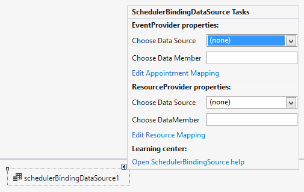
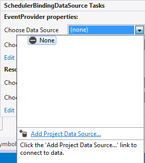
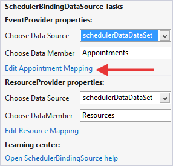

# Codeless data binding

## 

| RELATED VIDEOS |  |
| ------ | ------ |
|[Codeless Data Binding with RadScheduler for WinForms](http://tv.telerik.com/watch/winforms/radscheduler/codeless-data-binding-with-radscheduler-winforms)<br>In this video, you will learn how to use the SchedulerBindingDataSource with the RadScheduler for WinForms to quickly and codelessly data bind a RadScheduler. You will also be introduced to the RadSchedulerNavigator, a simple control that makes it easy for users navigate a RadScheduler. (Runtime: 07:04)||
|[Introduction to RadScheduler for WinForms](http://tv.telerik.com/watch/winforms/radscheduler/introduction-radscheduler-winforms)<br>In this webinar, Telerik Developer Support Specialist Robert Shoemate will introduce RadScheduler and demonstrate how to utilize its powerful feature set in your own applications. By attending this webinar, you will learn about features such as codeless data binding, adding custom fields, and UI customization. (Runtime: 55:58)||

This tutorial will show you how to bind RadScheduler from the Visual Studio design time surface, by only using the RadScheduler design-time support, and without writing any code. The tutorial uses the data base which comes with the installation of Telerik UI for WinForms.

1\. Open Visual Studio and start a new Windows Forms project. Open the form, created by the project.

2\. Drag a __RadScheduler__ from the toolbox to your form.

3\. Drag a __SchedulerBindingDataSource__ from the toolbox to your form.

4\. Select RadScheduler and open its ActionList (smart tag). In it, there is a __DataSource__ property, which is used to specify the __SchedulerBindingDataSource__ component which will be used as a data source in RadScheduler. Select the instance of the __SchedulerBindingDataSource__ that we just added and close the smart tag:

 

5\. Open the __SchedulerBindingDataSource__ smart tag. It shows two types of provider properties, which can be used for setting the data sources for the __Appointments__ (EventProvider) and the __Resources__ (ResourceProvider):



6\. Set the __Appointments__ and the __Resources__ data sources. To do that, in the Properties window, open the __EventProvider__ property. Drop down the __DataSource__ sub-property list and select __Add Project DataSource...__ This step will display the Data Source Configuration Wizard dialog. 

 

7\. In the "Choose a Data Source Type" page of the wizard, select the __Database__ type and click the __Next__ button to continue.

8\. In the "Choose a Data Connection" page of the wizard, add a connection to the SchedulerData.mdf file supplied with Telerik UI for WinForms distribution.

  - Click the __New Connection...__ button to display the Add Connection dialog.

  - Click the __Change__ button and select the Access Database File option.

  - Set the Database File Name to the Schedulerdata.mdb file located in the Telerik UI for WinForms installation directory under \Examples\DataSources.

  - Click __OK__ to close the Add Connection dialog.

9\. Back in the "Choose a Data Connection" page of the wizard, click the __Next__ button to continue.

10\. A dialog will pop-up to ask where the file should be located. Choose __No__ to leave the file located in the \Examples\DataSources directory.

11\. In the "Save the Connection String in the Application Configuration File" click the __Next__ button to continue.

12\. In the "Choose Your Database Objects" page of the wizard, select the "Tables" checkbox to automatically select the Appointments, Resources and AppointmentsResources tables.

13\. Click __Finish__ to complete the wizard and close the dialog. This step will create a DataSet component and add it to the component tray below the form designer.

14\. Then you need to edit the mappings between the objects used in RadScheduler and your data source objects. Open the __SchedulerBindingDataSource__ ActionList and specify the __DataSource__ for both the *EventProvider* and *ResourceProvider* to the binding source.
            

15\. While still in the __SchedulerBindingDataSource__ ActionList, set the __DataMember__ properties for both the *EventProvider* and *ResourceProvider* to the respective tables.
            

1. The *EventProvider* takes care of the data, related to the Appointments (Events) and has the following properties:
                

	1. Data Source, which should be a DataSet object;
                    

	1. Data Member, which usually is bound to Appointments (Appointments is the name of the data table in the Data set)
                    

	1. Edit Appointment Mapping (see #16 below) 

1. The *ResourceProvider* takes care of the data, related to Resources and has the following properties:
                

	1. Data Source, which should be a DataSet object;
                    

	1. Data Member which usually is bound to Resources (Resources is the name of the data table in the Data set)
                    

	1. Edit Resource Mapping (see #17 below) 

In our case we should set the __DataMember__ properties for both the *EventProvider* and *ResourceProvider* to __Appointments__ and __Resources__ respectively: 

 

16\. While still in the __SchedulerBindingDataSource__ ActionList, click on the *Edit Appointment Mapping* link.

 

This will invoke the *Appointment Mapping Dialog* which provides you with an easy and intuitive UI for mapping __Appointment__ properties with __DataSource__ properties. Map all of the properties with their respective counterpart, whereas:

  1. __UniqueID__ is the ID of your appointments

  1. __[Resources]()__ is a relation in the dataset, in this case __AppointmentsAppointmentsResources__

  1. __[Exceptions]()__ is a self-relation in the dataset, in this case __AppointmentsAppointments__. 

At the end the *Appointment Mapping Dialog* should look like the following screenshot. Save and Close the dialog when done:

  

17\. By using the __SchedulerBindingDataSource__ ActionList, click on the *Edit Resource Mapping* link to edit the ResourceMappingInfo:


18\. Select the ID and ResourceName for the respective properties and close the dialog:


19\. Fill the data tables in the data set:

{{source=..\SamplesCS\Scheduler\DataBinding\DataBindingWalkthrough.cs region=codelessDatabinding}} 
{{source=..\SamplesVB\Scheduler\DataBinding\DataBindingWalkthrough.vb region=codelessDatabinding}} 

````C#
AppointmentsTableAdapter appointmentsAdapter = new AppointmentsTableAdapter();
appointmentsAdapter.Fill(this.schedulerDataDataSet.Appointments);
ResourcesTableAdapter resourcesAdapter = new ResourcesTableAdapter();
resourcesAdapter.Fill(this.schedulerDataDataSet.Resources);
AppointmentsResourcesTableAdapter appointmentsResourcesAdapter = new AppointmentsResourcesTableAdapter();
appointmentsResourcesAdapter.Fill(this.schedulerDataDataSet.AppointmentsResources);

````
````VB.NET
Dim appointmentsAdapter As New AppointmentsTableAdapter()
appointmentsAdapter.Fill(Me.SchedulerDataDataSet.Appointments)
Dim resourcesAdapter As New ResourcesTableAdapter()
resourcesAdapter.Fill(Me.SchedulerDataDataSet.Resources)
Dim appointmentsResourcesAdapter As New AppointmentsResourcesTableAdapter()
appointmentsResourcesAdapter.Fill(Me.SchedulerDataDataSet.AppointmentsResources)

````

{{endregion}} 

20\. Use the __Rebind__ method of the SchedulerBindingDataSource object if the dataset is filled after applying the event provider data source:

{{source=..\SamplesCS\Scheduler\DataBinding\DataBindingWalkthrough.cs region=Rebind}} 
{{source=..\SamplesVB\Scheduler\DataBinding\DataBindingWalkthrough.vb region=Rebind}} 

````C#
schedulerBindingDataSource1.Rebind();

````
````VB.NET
SchedulerBindingDataSource1.Rebind()

````

{{endregion}} 

21\. Run the project.
