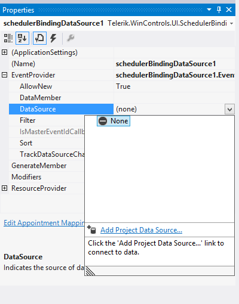
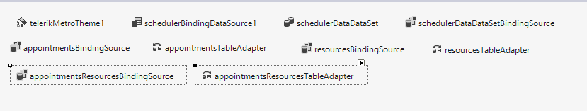
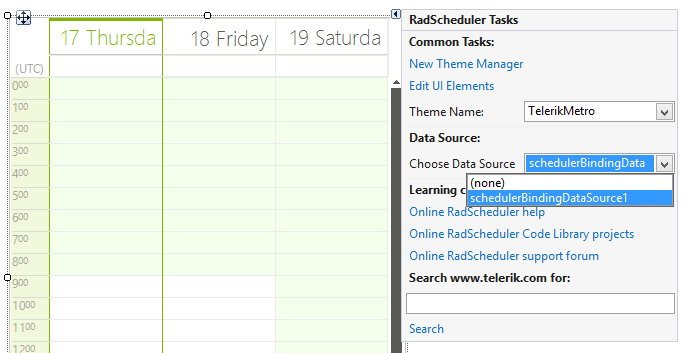
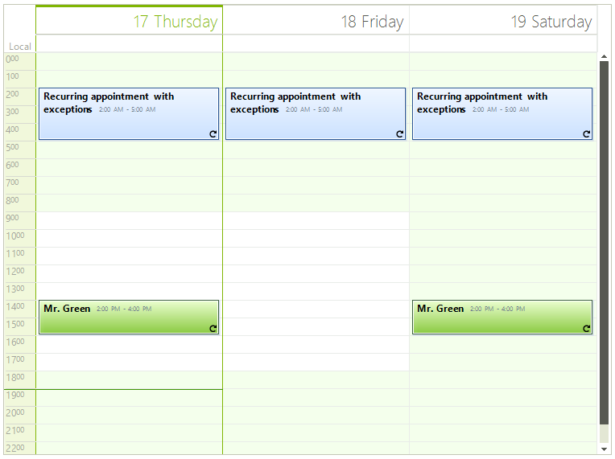

# Data Binding Walkthrough

This walkthrough will cover creating and binding RadScheduler to a data source in a step-by-step manner

>Another example of binding RadScheduler is available in our
          [Telerik UI for WinForms Step-by-step Tutorial](http://www.telerik.com/support/documentation-and-tutorials/step-by-step-tutorial-for-winforms.aspx)

## The database

RadScheduler has a very flexible binding system which can cover various binding scenarios.
          Most of them are covered in the next articles. Here we will cover the scenario with binding
          to a database in which appointments and resources are in a many-to-many relation.
          A sample database ships with our products and can be found under
          [Your installation directory]\Examples\QuickStart\DataSources\SchedulerData.mdb.
          By default the installation directory is *C:\Program Files\Telerik\UI for WinForms\Version\*

The following screen shot demonstrates the schema of the database.

## Binding the Scheduler

Let’s assume you have added a RadScheduler to your form and you want to bind it to a data source.
          To do so you must first create and set up a SchedulerBindingDataSource instance. SchedulerBindingDataSource
          is a component and is available in your toolbox. To setup a SchedulerBindingDataSource, follow these steps:
        

1. Add a __SchedulerBindingDataSource__ from the Toolbox to the form.
            

1. In the Properties window, open the __EventProvider__ property. Drop down the
              __DataSource__ sub-property list and select __Add Project DataSource...__
              This step will display the Data Source Configuration Wizard dialog.
            

1. Complete this wizard by choosing __Access Database File__ connection
              and selecting the sample database located under the \Examples\DataSources directory. This will
              create a DataSet component and add it to the component tray below the form designer.
            

1. Click the "SchedulerDataDataSet" Smart Tag and select __Edit in Dataset Designer__.
              Add a relation between the Appointments and AppointmentsResources tables and name it "Appointments_AppointmentsResources".
              Make the "Key Columns" entry be "ID" from the Appointments table and set "Foreign Key Columns" from the AppointmentsResources
              table to "AppointmentID".
            

1. When you create a dataset from the MS Access database, several properties of the auto number fields are wrongly set.
              Please, set these as in the right (correct) version below:
            

1. Build the project. This step will create several useful adapter components that we will use later to fill the dataset.
            

## Mapping the properties

In order to map the fields of your data source to the correct properties of scheduler’s objects,
          you need to setup two mapping info instances: one of type AppointmentMappingInfo and one of type ResourceMappingInfo.
          You can do this either through code or in the Visual Studio designer.
        

To setup appointment mapping at design time, click the Edit Appointment Mapping button in the smart tag menu
          of your SchedulerBindingDataSource instance. To edit the resource mapping, click the Edit Resource Mapping button.
        

When you do so, a dialog will appear letting you choose the field of the data source which should be mapped
          to the corresponding appointment/resource property.
        

>The data source fields should be set prior editing the mapping in order to get automatically populated
            with data source fields drop downs.
          

>The Resources property of the AppointmentMappingInfo should be set with the name of the relation
            that connects the Appointments and the AppointmentsResources tables. The ResourceId property should
            be set with the name of the column in the AppointmentsResources table that holds the id of the resource.
          

## Programatically mapping

In order to programatically map the fields of your data source to the correct properties of scheduler’s objects,
          you need to setup two mapping info instances: one of type AppointmentMappingInfo and one of type ResourceMappingInfo
          and assign them to the SchedulerBindingDataSource instance as it is demonstrated below.
        

#### __[C#]__

{{region creatingMappings}}
	            AppointmentMappingInfo appointmentMappingInfo = new AppointmentMappingInfo();
	            appointmentMappingInfo.BackgroundId = "BackgroundID";
	            appointmentMappingInfo.Description = "Description";
	            appointmentMappingInfo.End = "End";
	            appointmentMappingInfo.Location = "Location";
	            appointmentMappingInfo.MasterEventId = "ParentID";
	            appointmentMappingInfo.RecurrenceRule = "RecurrenceRule";
	            appointmentMappingInfo.ResourceId = "ResourceID";
	            appointmentMappingInfo.Resources = "AppointmentsAppointmentsResources";
	            appointmentMappingInfo.Start = "Start";
	            appointmentMappingInfo.StatusId = "StatusID";
	            appointmentMappingInfo.Summary = "Summary";
	            schedulerBindingDataSource1.EventProvider.Mapping = appointmentMappingInfo;
	
	            ResourceMappingInfo resourceMappingInfo = new ResourceMappingInfo();
	            resourceMappingInfo.Id = "ID";
	            resourceMappingInfo.Name = "ResourceName";
	            this.schedulerBindingDataSource1.ResourceProvider.Mapping = resourceMappingInfo;
	{{endregion}}

#### __[VB.NET]__

{{region creatingMappings}}
	        Dim appointmentMappingInfo As New AppointmentMappingInfo()
	        appointmentMappingInfo.BackgroundId = "BackgroundID"
	        appointmentMappingInfo.Description = "Description"
	        appointmentMappingInfo.[End] = "End"
	        appointmentMappingInfo.Location = "Location"
	        appointmentMappingInfo.MasterEventId = "ParentID"
	        appointmentMappingInfo.RecurrenceRule = "RecurrenceRule"
	        appointmentMappingInfo.ResourceId = "ResourceID"
	        appointmentMappingInfo.Resources = "AppointmentsAppointmentsResources"
	        appointmentMappingInfo.Start = "Start"
	        appointmentMappingInfo.StatusId = "StatusID"
	        appointmentMappingInfo.Summary = "Summary"
	        SchedulerBindingDataSource1.EventProvider.Mapping = appointmentMappingInfo
	
	        Dim resourceMappingInfo As New ResourceMappingInfo()
	        resourceMappingInfo.Id = "ID"
	        resourceMappingInfo.Name = "ResourceName"
	        Me.SchedulerBindingDataSource1.ResourceProvider.Mapping = resourceMappingInfo
	{{endregion}}

## Retrieving the data

To retrieve the data, first we need to fill the data set:

#### __[C#]__

{{region fillingAdapters}}
	            this.resourcesTableAdapter.Fill(this.schedulerDataDataSet.Resources);
	            this.appointmentsResourcesTableAdapter.Fill(this.schedulerDataDataSet.AppointmentsResources);
	            this.appointmentsTableAdapter.Fill(this.schedulerDataDataSet.Appointments);
	{{endregion}}

#### __[VB.NET]__

{{region fillingAdapters}}
	        Me.ResourcesTableAdapter.Fill(Me.SchedulerDataDataSet.Resources)
	        Me.AppointmentsResourcesTableAdapter.Fill(Me.SchedulerDataDataSet.AppointmentsResources)
	        Me.AppointmentsTableAdapter.Fill(Me.SchedulerDataDataSet.Appointments)
	{{endregion}}

>You should fill the tables in the exact same order if you have already set the DataSource property of RadScheduler.
            Alternatively, you can just call the DataBind method of RadScheduler after you fill the tables.
          

Now we need to assign the Appointments and Resources tables from the data set to our SchedulerBindingDataSource
          (the following can also be set at design time through the Smart Tag of your SchedulerBindingDataSource instance
          as you can see on the previous image):
        

#### __[C#]__

{{region AssignAppointmentsAndResources}}
	            schedulerBindingDataSource1.ResourceProvider.DataSource = schedulerDataDataSet.Resources;
	            schedulerBindingDataSource1.EventProvider.DataSource = schedulerDataDataSet.Appointments;
	{{endregion}}

#### __[VB.NET]__

{{region AssignAppointmentsAndResources}}
	        SchedulerBindingDataSource1.ResourceProvider.DataSource = SchedulerDataDataSet.Resources
	        SchedulerBindingDataSource1.EventProvider.DataSource = SchedulerDataDataSet.Appointments
	{{endregion}}

Finally, we assign our SchedulerBindingDataSource instance to RadScheduler as its DataSource.
          This can be achieved either through the Smart Tag of RadScheduler or via code:
        

#### __[C#]__

{{region dataSource}}
	            radScheduler1.DataSource = schedulerBindingDataSource1;
	{{endregion}}

#### __[VB.NET]__

{{region dataSource}}
	        RadScheduler1.DataSource = SchedulerBindingDataSource1
	{{endregion}}

>If the above steps are not performed in the same order, RadScheduler might not display the appointments.
            In this case you can try calling the DataBind method of RadScheduler or the Rebind method of SchedulerBindingDataSource.
          

## Updating the database

Add the following code to the Click event handler for an "Update" button, which will update the data source.
          (for more information on saving data, see MSDN:
          [How to: Update Data by Using a TableAdapter](http://msdn.microsoft.com/en-us/library/ms171933.aspx)
          ).Note that we need to update the added, modified and deleted records in a certain order because of the relations between our tables.
          We also need to use the two dictionaries to keep track of the automatically generated IDs before and after calling Update.
          This is due to a synchronization problem between the database and the dataset, where the data adapter could not update correctly
          the ID of the added row. This happens because the IDs generated locally might differ from the IDs generated from the database
          (for example when multiple users work simultaneously) and we use this IDs to store the relation between appointments and resources.
          (Here is an MSDN article which describes this limitation:
          [Retrieving Identity or Autonumber Values](http://msdn.microsoft.com/en-us/library/ks9f57t0%28VS.71%29.aspx)
          )
        

#### __[C#]__

{{region update}}
	        private void btnUpdate_Click(object sender, EventArgs e)
	        {
	            appointmentsResourcesTableAdapter.Adapter.AcceptChangesDuringUpdate = false;
	
	            SchedulerDataDataSet.AppointmentsResourcesDataTable deletedRelationRecords =
	                            this.schedulerDataDataSet.AppointmentsResources.GetChanges(DataRowState.Deleted)
	                            as SchedulerDataDataSet.AppointmentsResourcesDataTable;
	
	            SchedulerDataDataSet.AppointmentsResourcesDataTable newRelationRecords =
	                            this.schedulerDataDataSet.AppointmentsResources.GetChanges(DataRowState.Added)
	                            as SchedulerDataDataSet.AppointmentsResourcesDataTable;
	
	            SchedulerDataDataSet.AppointmentsResourcesDataTable modifiedRelationRecords =
	                            this.schedulerDataDataSet.AppointmentsResources.GetChanges(DataRowState.Modified)
	                            as SchedulerDataDataSet.AppointmentsResourcesDataTable;
	
	            SchedulerDataDataSet.AppointmentsDataTable newAppointmentRecords =
	                this.schedulerDataDataSet.Appointments.GetChanges(DataRowState.Added) as SchedulerDataDataSet.AppointmentsDataTable;
	
	            SchedulerDataDataSet.AppointmentsDataTable deletedAppointmentRecords =
	                this.schedulerDataDataSet.Appointments.GetChanges(DataRowState.Deleted) as SchedulerDataDataSet.AppointmentsDataTable;
	
	            SchedulerDataDataSet.AppointmentsDataTable modifiedAppointmentRecords =
	                this.schedulerDataDataSet.Appointments.GetChanges(DataRowState.Modified) as SchedulerDataDataSet.AppointmentsDataTable;
	
	            try
	            {
	                if (newAppointmentRecords != null)
	                {
	                    Dictionary<int, int> newAppointmentIds = new Dictionary<int, int>();
	                    Dictionary<object, int> oldAppointmentIds = new Dictionary<object, int>();
	
	                    for (int i = 0; i < newAppointmentRecords.Count; i++)
	                    {
	                        oldAppointmentIds.Add(newAppointmentRecords[i], newAppointmentRecords[i].ID);
	                    }
	
	                    appointmentsTableAdapter.Update(newAppointmentRecords);
	
	                    for (int i = 0; i < newAppointmentRecords.Count; i++)
	                    {
	                        newAppointmentIds.Add(oldAppointmentIds[newAppointmentRecords[i]], newAppointmentRecords[i].ID);
	                    }
	
	                    if (newRelationRecords!=null)
	                    {
	                        for (int i = 0; i < newRelationRecords.Count; i++)
	                        {
	                        newRelationRecords[i].AppointmentID = newAppointmentIds[newRelationRecords[i].AppointmentID];
	                        }
	                    }
	                }
	
	                if (deletedRelationRecords != null)
	                {
	                    appointmentsResourcesTableAdapter.Update(deletedRelationRecords);
	                }
	
	                if (deletedAppointmentRecords != null)
	                {
	                    appointmentsTableAdapter.Update(deletedAppointmentRecords);
	                }
	                if (modifiedAppointmentRecords != null)
	                {
	                    appointmentsTableAdapter.Update(modifiedAppointmentRecords);
	                }
	
	                if (newRelationRecords != null)
	                {
	                    appointmentsResourcesTableAdapter.Update(newRelationRecords);
	                }
	                if (modifiedRelationRecords != null)
	                {
	                    appointmentsResourcesTableAdapter.Update(modifiedRelationRecords);
	                }
	
	                this.schedulerDataDataSet.AcceptChanges();
	            }
	            catch (Exception ex)
	            {
	                MessageBox.Show(string.Format("An error occurred during the update process:\n{0}", ex.Message));
	            }
	            finally
	            {
	                if (deletedRelationRecords != null)
	                {
	                    deletedRelationRecords.Dispose();
	                }
	                if (newRelationRecords != null)
	                {
	                    newRelationRecords.Dispose();
	                }
	                if (modifiedRelationRecords != null)
	                {
	                    modifiedRelationRecords.Dispose();
	                }
	            }
	
	            lblStatus.Text = "Updated scheduler at " + DateTime.Now.ToString();
	        }
	{{endregion}}

#### __[VB.NET]__

{{region update}}
	    Private Sub btnUpdate_Click(ByVal sender As Object, ByVal e As EventArgs)
	        AppointmentsResourcesTableAdapter.Adapter.AcceptChangesDuringUpdate = False
	
	        Dim deletedRelationRecords As SchedulerDataDataSet.AppointmentsResourcesDataTable = TryCast(Me.SchedulerDataDataSet.AppointmentsResources.GetChanges(DataRowState.Deleted), SchedulerDataDataSet.AppointmentsResourcesDataTable)
	        Dim newRelationRecords As SchedulerDataDataSet.AppointmentsResourcesDataTable = TryCast(Me.SchedulerDataDataSet.AppointmentsResources.GetChanges(DataRowState.Added), SchedulerDataDataSet.AppointmentsResourcesDataTable)
	        Dim modifiedRelationRecords As SchedulerDataDataSet.AppointmentsResourcesDataTable = TryCast(Me.SchedulerDataDataSet.AppointmentsResources.GetChanges(DataRowState.Modified), SchedulerDataDataSet.AppointmentsResourcesDataTable)
	
	        Dim newAppointmentRecords As SchedulerDataDataSet.AppointmentsDataTable = TryCast(Me.SchedulerDataDataSet.Appointments.GetChanges(DataRowState.Added), SchedulerDataDataSet.AppointmentsDataTable)
	        Dim deletedAppointmentRecords As SchedulerDataDataSet.AppointmentsDataTable = TryCast(Me.SchedulerDataDataSet.Appointments.GetChanges(DataRowState.Deleted), SchedulerDataDataSet.AppointmentsDataTable)
	        Dim modifiedAppointmentRecords As SchedulerDataDataSet.AppointmentsDataTable = TryCast(Me.SchedulerDataDataSet.Appointments.GetChanges(DataRowState.Modified), SchedulerDataDataSet.AppointmentsDataTable)
	
	        Try
	            If newAppointmentRecords IsNot Nothing Then
	                Dim newAppointmentIds As New Dictionary(Of Integer, Integer)()
	                Dim oldAppointmentIds As New Dictionary(Of Object, Integer)()
	
	                For i As Integer = 0 To newAppointmentRecords.Count - 1
	                    oldAppointmentIds.Add(newAppointmentRecords(i), newAppointmentRecords(i).ID)
	                Next
	
	                AppointmentsTableAdapter.Update(newAppointmentRecords)
	
	                For i As Integer = 0 To newAppointmentRecords.Count - 1
	                    newAppointmentIds.Add(oldAppointmentIds(newAppointmentRecords(i)), newAppointmentRecords(i).ID)
	                Next
	
	                If newRelationRecords IsNot Nothing Then
	                    For i As Integer = 0 To newRelationRecords.Count - 1
	                        newRelationRecords(i).AppointmentID = newAppointmentIds(newRelationRecords(i).AppointmentID)
	                    Next
	                End If
	            End If
	
	            If deletedRelationRecords IsNot Nothing Then
	                AppointmentsResourcesTableAdapter.Update(deletedRelationRecords)
	            End If
	
	            If deletedAppointmentRecords IsNot Nothing Then
	                AppointmentsTableAdapter.Update(deletedAppointmentRecords)
	            End If
	            If modifiedAppointmentRecords IsNot Nothing Then
	                AppointmentsTableAdapter.Update(modifiedAppointmentRecords)
	            End If
	
	            If newRelationRecords IsNot Nothing Then
	                AppointmentsResourcesTableAdapter.Update(newRelationRecords)
	            End If
	            If modifiedRelationRecords IsNot Nothing Then
	                AppointmentsResourcesTableAdapter.Update(modifiedRelationRecords)
	            End If
	
	            Me.SchedulerDataDataSet.AcceptChanges()
	        Catch ex As Exception
	            MessageBox.Show(String.Format("An error occurred during the update process:" & vbLf & "{0}", ex.Message))
	        Finally
	            If deletedRelationRecords IsNot Nothing Then
	                deletedRelationRecords.Dispose()
	            End If
	            If newRelationRecords IsNot Nothing Then
	                newRelationRecords.Dispose()
	            End If
	            If modifiedRelationRecords IsNot Nothing Then
	                modifiedRelationRecords.Dispose()
	            End If
	        End Try
	
	        lblStatus.Text = "Updated scheduler at " + DateTime.Now.ToString()
	    End Sub
	{{endregion}}

