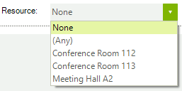

# Working with Resources

## Overview

For the end-user, RadScheduler resources can be company resources, such as conference rooms, vehicles, laptops, or AV equipment, which can be booked and assigned to a particular event.

## Binding the Resources Collection

See the [Using DataSource property]() and [Binding to Business Objects]() topics on how to bind the Resources Collection.
        

>If the data bound object is a list of appointments, set the __Resources__ property of the AppointmentMappingInfo object to "Resources". 
          Do not set the __Resources__ property of the AppointmentMappingInfo object to "Resources" if the data bound object has a property that has no Resources collection, but has only a __ResourceId__ property.
          

## Adding Resources Manually

To add resources to RadScheduler's Resource drop down (visible in the appointment dialog by default), you need to use the Resources collection's __Add()__ method and to pass a new Resource instance. Pass a unique ID and a description in the constructor:
        

>A Resource object also has an __Image__ property that is not displayed as of this writing. In the near future, resource images will be displayed by the scheduler in the resource selection control.
          

#### __[C#]__

{{source=..\SamplesCS\Scheduler\AppointmentsAndDialogues\WorkingWithResources.cs region=loadResources}}
	        private void LoadResources()
	        {
	            string[] descriptions = { "Conference Room 112", "Conference Room 113", "Meeting Hall A2" };
	            int count = 1;
	            foreach (string description in descriptions)
	            {
	                this.radScheduler1.Resources.Add(new Resource(count++, description));
	            }
	        }
	{{endregion}}

#### __[VB.NET]__

{{source=..\SamplesVB\Scheduler\AppointmentsAndDialogues\WorkingWithResources.vb region=loadResources}}
	    Private Sub LoadResources()
	        Dim descriptions() As String = {"Conference Room 112", "Conference Room 113", "Meeting Hall A2"}
	        Dim count As Integer = 1
	        For Each description As String In descriptions
	            Me.RadScheduler1.Resources.Add(New Telerik.WinControls.UI.Resource(count, description))
	            count += 1
	        Next description
	    End Sub
	{{endregion}}

